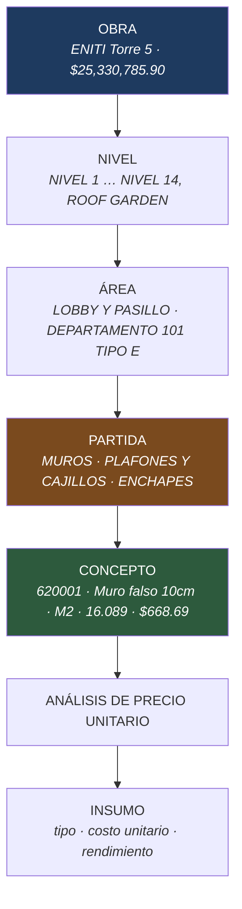
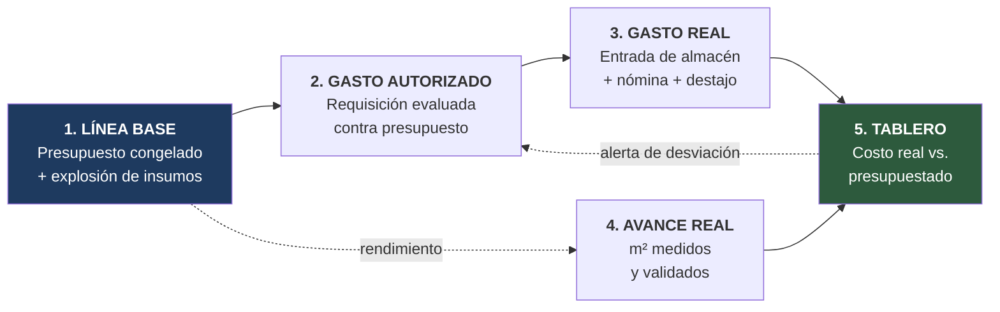

# CIMENTA · Descripción general del producto

> **Capa SDD:** *Specify*. Este documento responde **qué** se construye y **por qué**. No decide **cómo**: la arquitectura, el modelo de datos y el stack se deciden en los pasos 3 y 5, y cualquier decisión técnica que aparezca aquí es un error de capa.
>
> **Audiencia:** dirección del cliente, equipo técnico y los agentes de IA que van a implementar el sistema.
>
> **Trazabilidad:** cada afirmación sobre el negocio procede de documentación real del cliente —los archivos de `Doc de contexto/`, que no se versionan: ver [README · Fuentes de contexto](../README.md#fuentes-de-contexto)—. Lo que no está respaldado por evidencia se marca **(asumido)** y se recoge en §9.

**Vocabulario:** este documento usa el lenguaje del dominio definido en [`glosario.md`](glosario.md). *Concepto*, *partida*, *destajo*, *explosión de insumos* y *rendimiento* tienen ahí un significado preciso y no negociable.

---

## Índice

1. [El problema](#1-el-problema)
2. [Objetivo del producto](#2-objetivo-del-producto)
3. [Métricas de éxito](#3-métricas-de-éxito)
4. [Usuarios y roles](#4-usuarios-y-roles)
5. [Modelo de dominio](#5-modelo-de-dominio)
6. [Capacidades del producto](#6-capacidades-del-producto)
7. [Alcance: MVP y evolución](#7-alcance-mvp-y-evolución)
8. [Catálogo de reglas de negocio](#8-catálogo-de-reglas-de-negocio)
9. [Requisitos no funcionales](#9-requisitos-no-funcionales)
10. [Supuestos y preguntas abiertas](#10-supuestos-y-preguntas-abiertas)

---

## 1. El problema

Constructora Celsius es un subcontratista especializado en muros y plafones de tablaroca. Trabaja bajo contratos **a precio alzado máximo garantizado**: el importe se fija al firmar y cualquier sobrecosto lo absorbe la constructora. El ingreso es una constante. **El único margen que la empresa puede defender es el costo.**

Ese costo hoy no se conoce. Se administra en hojas de Excel desconectadas entre sí, y la evidencia del estado actual está en los propios archivos del cliente:

**El presupuesto vivo no calcula.** El catálogo de conceptos de Union Square Fase 2 —4,860 filas, el documento que gobierna la obra en curso— tiene `#REF!` en **todas** las columnas de precio unitario e importe. El archivo no puede ni siquiera sumar su propio total.

**El control de compras es un documento estático.** Las compras se autorizan contra la explosión de insumos: un listado de 27 materiales por $2,755,187.21. Ese listado dice cuánto material *debería* consumir la obra completa, pero nada lo confronta con lo que realmente se ha comprado. No hay forma de saber si la obra va al 40 % de avance con el 70 % del material gastado.

**La mano de obra, que es la mayor parte del costo, vive en otro archivo.** En los análisis de precios unitarios la mano de obra representa entre el **59 % y el 100 % del costo directo** de cada concepto. Está en un cuaderno de nómina semanal sin ninguna conexión con el presupuesto que debería estar consumiendo.

**El sobrecosto de volumen ya está ocurriendo y nadie lo suma.** La hoja de destajo registra `M2 CONTRATO` y `M2 REAL` lado a lado. En la semana del 27 de agosto, el departamento 212 se presupuestó a 81.87 m² y se ejecutó a 83.82 m². Son 1.95 m² de más en un solo departamento de 143. El dato existe, se captura, y nunca se agrega.

El resultado operativo lo declaró el propio cliente en el cuestionario, tres veces, con las mismas palabras: *"No se tiene nada de esto"*. No hay reporte de rentabilidad, no hay cálculo de costo real contra proyectado, y las pérdidas se descubren cuando el presupuesto ya se agotó.

---

## 2. Objetivo del producto

> **CIMENTA existe para que la dirección sepa, cualquier día de la semana y sin pedirle nada a nadie, cuánto lleva gastado cada obra contra lo que tenía presupuestado — y para impedir que ese gasto se desvíe sin una autorización explícita y registrada.**

Dos verbos, y el orden importa:

**Saber.** Convertir el costo de una obra en un dato consultable en tiempo real, no en un ejercicio de reconstrucción contable al cierre.

**Impedir.** Cuando una operación excede lo presupuestado o un tope pactado, el sistema la **detiene** y exige autorización. No la deja pasar con una advertencia que nadie lee. El cliente fue explícito: *"Bloquearla y solicitar la autorización de dirección"*.

El producto no pretende sustituir la contabilidad, ni facturar al SAT, ni reemplazar el software de presupuestación con el que se arman las licitaciones. Toma el presupuesto como entrada, lo congela como línea base, y gobierna todo lo que ocurre después.

---

## 3. Métricas de éxito

La línea base actual de cada métrica es desconocida porque hoy no se mide nada de esto. Las metas son el compromiso del producto; la primera medición real establece el punto de partida.

| # | Métrica | Estado hoy | Meta |
|---|---|---|---|
| **MS-1** | Antigüedad del dato de costo real por obra | Se conoce al cierre de obra | ≤ 24 h |
| **MS-2** | Gasto imputado a obra y partida | No se imputa: la explosión de insumos no se confronta con compras | 100 % |
| **MS-3** | Compras por encima de presupuesto sin autorización registrada | No se detectan | 0 |
| **MS-4** | Desviación de partida detectada antes de consumir el 80 % del presupuesto | No se detecta | ≥ 90 % de los casos |
| **MS-5** | Deuda por consignación conocida por proveedor | No se conoce | 100 %, actualizada al día |
| **MS-6** | Trazabilidad de pagos agrupados (a quién se pagó y por cuenta de quién) | Solo en la memoria del encargado | 100 % |
| **MS-7** | Tiempo de cierre de nómina semanal | No medido **(asumido: varias horas)** | ≤ 1 h |

---

## 4. Usuarios y roles

Seis roles internos. **Ningún actor externo —cliente final, proveedor, subcontratista— es usuario del sistema**: el cuestionario lo dice explícitamente para los contratistas (*"no se pueden cobrar ellos por medio del Sistema"*) y por coherencia se extiende a todos los externos. Lo que hace un externo lo captura alguien de dentro.

| Rol | Qué hace en CIMENTA | Qué necesita saber |
|---|---|---|
| **Dirección General** | Autoriza compras fuera de presupuesto, trabajos extra y excepciones de tope. Es el destinatario del tablero. | ¿Gano o pierdo en cada obra, hoy? |
| **Director de Proyectos** | Valida las mediciones de avance del residente. Programa trabajos extra. | ¿El avance cobrado es el avance real? |
| **Residente de obra** | Mide físicamente el avance ejecutado por cuadrilla y ubicación. Recibe material contra remisión. | ¿Qué se pidió, qué llegó y qué falta? |
| **Compras** | Levanta requisiciones, emite órdenes de compra, gestiona proveedores y anticipos. | ¿Cuánto presupuesto queda en esta partida? |
| **Almacén** | Da entrada al material, registra recepciones parciales, traspasos, mermas y herramienta. | ¿Qué hay, dónde está y qué saldo queda pendiente? |
| **Administración** | Captura nómina semanal, créditos de empleados y depósitos. | ¿Cuánto se le paga a quién esta semana y con qué descuentos? |

> **(asumido)** El cuestionario no nombra explícitamente a los responsables de Compras, Almacén y Administración como roles diferenciados; se derivan de las funciones descritas. En una empresa de este tamaño es posible que una misma persona acumule varios. El sistema debe permitir asignar varios roles a un usuario.

---

## 5. Modelo de dominio

### 5.1. La corrección de la jerarquía

El cuestionario declara la jerarquía de desglose como *"Proyecto > Fase > Material > Mano de obra > Insumos"*. **Esa jerarquía no es una jerarquía**: Material y Mano de Obra no son niveles de desglose del trabajo, son los dos bloques de costo dentro del análisis de precio unitario de cada concepto. Modelarlo como lo dice el cuestionario rompería el modelo de datos.

La estructura real, verificada contra los catálogos de **dos obras distintas** (Union Square Fase 2 y ENITI Torre 5) y contra 24 análisis de precios unitarios, es esta:

Dos precisiones que condicionan todo el diseño:

**El tipo de partida, agregado a toda la obra, es la unidad de control presupuestal** (PA-01). La jerarquía completa —nivel, área, partida— se conserva para el catálogo y para medir avance, pero el gasto se controla contra cuatro bolsas por obra: `MUROS`, `PLAFONES Y CAJILLOS`, `ENCHAPES` y `GENERALES`. Es como el cliente razona la compra: nadie pide tablaroca departamento por departamento.

**El rendimiento es el puente entre avance físico y costo.** El APU dice que un m² de `MURO STD-635-STD` consume 0.6734 tableros de yeso. Multiplicado por el avance real medido, da el consumo *esperado*; confrontado con las entradas de almacén, da la desviación. Sin rendimiento no hay control de costo real, solo contabilidad de facturas.

### 5.2. El ciclo de valor

Todo el producto es un único ciclo cerrado. Cada módulo existe porque cierra un tramo de este ciclo:

Cortar cualquier eslabón rompe el tablero. Esta es la razón por la que el MVP de §7 incluye nómina: sin ella el paso 3 solo captura materiales, que son la **minoría** del costo directo.

---

## 6. Capacidades del producto

Siete capacidades. Cada una lista sus funcionalidades y la evidencia que la justifica.

---

### C1 · Presupuesto y línea base

**Por qué.** Sin una línea base congelada no existe el concepto de "desviación". El cliente ya congela el presupuesto porque el contrato es a precio alzado; el sistema solo tiene que hacerlo explícito e inviolable.

**Funcionalidades**

- **F1.1** Importar el catálogo de conceptos desde Excel, respetando la jerarquía Obra › Nivel › Área › Partida › Concepto.
- **F1.2** Importar el análisis de precio unitario de cada concepto: insumos, costos unitarios, rendimientos y cargos porcentuales.
- **F1.3** Calcular la explosión de insumos de la obra agregando `cantidad × rendimiento` sobre todos los conceptos.
- **F1.4** Congelar el presupuesto de venta como **línea base inmutable**, con fecha y responsable. A partir de ese momento ninguna operación lo modifica.
- **F1.5** **Capturar** el **presupuesto de control** —el costo tope interno— por obra y tipo de partida. Es contra este contra el que se mide el gasto. Se captura, no se deriva del precio de venta (PA-03), aunque el sistema muestre el importe derivado como sugerencia. Un tope ya capturado se puede **recapturar**, pero solo con autorización registrada: es el único importe del sistema que Dirección puede cambiar después de que una regla haya bloqueado algo contra él.
- **F1.6** Versionar la línea base: si un trabajo extra la amplía, queda como una versión nueva que preserva la original y hace visible la diferencia.
- **F1.7** Gestionar **trabajos extra** como presupuesto separado, con su propio flujo de autorización, sin mezclarse con la línea base original.
- **F1.8** Calcular el **rendimiento observado** de cada insumo a partir del consumo real y el avance validado, y mostrar su divergencia contra el rendimiento congelado en la línea base (`RN-24`).

> **Evidencia.** *"Se congela porque es a precio alzado máximo garantizado"* · *"Solo se tiene presupuesto de ventas pero sí se requiere uno de control"* · Catálogos reales de ENITI T5 y Union Square F2 · 24 hojas de APU.

---

### C2 · Compras y autorizaciones

**Por qué.** Es el único punto donde el gasto se puede detener antes de producirse. Una vez que el material llega a obra, el costo ya está comprometido.

**Funcionalidades**

- **F2.1** Levantar una requisición de material siempre imputada a una obra y una partida. No existe requisición sin centro de costos.
- **F2.2** Evaluar automáticamente la requisición contra el presupuesto disponible de su tipo de partida en el conjunto de la obra, **en importe y en volumen**.
- **F2.3** **Bloquear** la requisición que excede el disponible y abrir una solicitud de autorización a Dirección General. El bloqueo es duro: sin autorización no avanza.
- **F2.4** Registrar la autorización o el rechazo con actor, momento y motivo, como parte permanente del expediente de la obra.
- **F2.5** Convertir la requisición autorizada en orden de compra a un proveedor.
- **F2.6** Consultar en cualquier momento el presupuesto disponible de una partida antes de pedir.
- **F2.7** Umbrales de autorización configurables por monto **(asumido: hoy no existen; el cliente declara que todo lo autoriza Dirección General, pero define un umbral de $50,000 para trabajos extra, lo que sugiere que el concepto de umbral le es natural)**.

> **Evidencia.** *"Bloquearla y solicitar la autorización de dirección"* · *"El 100 % de las compras deben ir etiquetadas directamente al centro de costos de una obra específica"* · *"Se basan en un archivo de explosión de insumos, se requiere poder saber cuánto va gastado por obra"*.

---

### C3 · Almacén y control de materiales

**Por qué.** Es donde el gasto autorizado se convierte en gasto real y donde hoy se pierde la trazabilidad.

**Funcionalidades**

- **F3.1** Dar entrada al material validando contra la **remisión del proveedor**, no contra la orden de compra.
- **F3.2** Registrar **recepciones parciales** manteniendo la orden en estado `PARCIAL` con su saldo pendiente, y **reprogramar** el faltante con una nueva fecha comprometida hasta que se entregue (`RN-06`).
- **F3.3** Rechazar una entrada que exceda lo ordenado, o exigir autorización para aceptarla.
- **F3.4** Registrar **traspasos de sobrantes entre obras**, moviendo el costo de la obra que envía a la que recibe.
- **F3.5** Documentar **mermas, desperdicios y robos** con motivo, responsable y evidencia, dando de baja el inventario y registrando el impacto en el costo de la obra.
- **F3.6** Controlar **consumibles** (escobas, trapeadores, papel) como categoría de insumo con su propio presupuesto.
- **F3.7** Llevar un inventario de **herramienta** (escaleras, andamios, rotomartillos, extensiones) con asignación a obra y responsable, distinguiéndola del material que se consume.

> **Evidencia.** *"Remisión del proveedor"* · *"Sí, pero no hay algo formal para poder controlar esto, hay que proponer algo"* · *"Actualmente no se documenta, proponer algo para cubrir esta parte"* · *"Se requiere un control de materiales de insumos… también un control de herramientas en general"*.

Las funcionalidades F3.2 y F3.5 son **diseño desde cero**: el cliente pidió expresamente que se propusiera un mecanismo porque hoy no existe ninguno.

---

### C4 · Destajo y avance de obra

**Por qué.** Es el mecanismo que convierte trabajo físico en costo, y el único lugar donde se mide lo que realmente se construyó.

**Funcionalidades**

- **F4.1** Definir precios de destajo por etapa (`METAL`, `TAPADO`, `PASTA`), por obra **y por tipo de partida**, separados del precio de venta al cliente. Es lo que permite que el costo de destajo llegue a la partida en el tablero (PA-08).
- **F4.2** Capturar el avance ejecutado por cuadrilla, nivel y ubicación, registrando **m² contrato** y **m² real** medidos.
- **F4.3** Flujo de validación en dos pasos: el residente mide, el Director de Proyectos valida. Sin validación no se paga.
- **F4.4** Calcular el pago de destajo aplicando la retención pactada.
- **F4.5** Registrar **descuentos ad-hoc** contra el pago de destajo (herramienta comprada, seguros, adelantos), con concepto y motivo.
- **F4.6** Liberar el fondo de garantía únicamente cuando el área esté liberada **y** cobrada al cliente.
- **F4.7** Reportar la desviación de volumen: m² reales contra m² de contrato, agregada por obra, nivel y cuadrilla.

> **Evidencia.** Hoja `DESTAJO 27.08.26`: precios METAL 105/80, TAPADO 70/60, PASTA 95/80; columnas `M2 CONTRATO` / `M2 REAL`; retención 15 %; descuentos `PISTOLA $2,756.16`, `SEGURO COCHE $4,400` · *"Audita el residente SR y valida director de proyectos"* · *"Es el 5 % y se les regresa hasta que esté el área liberada y cobrada"*.

---

### C5 · Personal y nómina semanal

**Por qué.** Porque la mano de obra es la mayor parte del costo directo. Un tablero de costo real que no la incluya es una cifra falsa.

**Funcionalidades**

- **F5.1** Catálogo de empleados con salario semanal, horario y **rol de oficio** (pastero, tablaroquero, ayudante, oficial).
- **F5.2** Catálogo de cuadrillas, con asignación de empleados y de un encargado.
- **F5.3** Capturar la **jornada diaria** de cada empleado: qué día trabajó, **en qué obra** y con qué horas extra. La semana de nómina va de viernes a jueves (`RN-23`).
- **F5.4** Gestionar **créditos activos** (Infonavit y préstamos) con monto total, saldo, descuento semanal y marca de liquidación automática al llegar a cero.
- **F5.5** Calcular la nómina semanal aplicando extras y descuentos.
- **F5.6** Registrar **pagos agrupados**: un depósito a una persona que cubre el salario de varias, dejando trazabilidad de a quién se pagó, cuánto y por cuenta de quién.
- **F5.7** Imputar el costo de nómina a cada obra **derivándolo de las jornadas diarias**, de modo que un empleado que trabajó tres días en una obra y dos en otra reparta su costo exactamente así.

> **Evidencia.** Hojas de nómina semanal con columnas `SALARIO`, `DÍAS TRABAJADOS`, `INFONAVIT`, `PRÉSTAMO`, `HRAS EXTRA` · Registros de pago agrupado reales: `OMAR Y JUAN`, `LUPE Y JULIO`, `TABLAROQUEROS TOÑO Y NERI` · *"Se le paga al líder para que este lo entregue y se pueda llevar cuánto se le pagó a quién y por qué y para quiénes"* · PA-04: *"se paga lo trabajado del día viernes al jueves aunque se trabaje en obras distintas; se tiene que tener cuándo y dónde trabajó el empleado"*.

---

### C6 · Proveedores, anticipos y consignación

**Por qué.** Porque hay dinero comprometido con proveedores que hoy no está registrado en ningún sitio: anticipos pagados y material a consignación.

**Funcionalidades**

- **F6.1** Catálogo de proveedores con condiciones comerciales.
- **F6.2** Carga de facturas por proveedor con **corte semanal en jueves** y pago en sábado.
- **F6.3** Registrar **anticipos a proveedor** pagados antes de recibir material, y amortizarlos automáticamente contra las facturas posteriores.
- **F6.4** Controlar el saldo de **material a consignación** por proveedor contra un **tope configurable**, bloqueando nuevos pedidos que lo superen.
- **F6.5** Consultar, por proveedor **y por obra**, qué se pidió y cuánto: *"si en la obra 1 se le pidieron a CoPanel 100 hojas de tablaroca y después 50 para la obra 2, poder saber cuánto y de qué se pidió por obra"*.

> **Evidencia.** *"Cortes a día jueves ya que se pagan los días sábados"* · *"CoPanel, el máximo a deber de consignación sea de 300 mil pesos"* · *"Hay veces que se les puede pagar por adelantado sin recibir aún el material"*.

---

### C7 · Tablero de costo real vs. presupuestado

**Por qué.** Es el entregable. Todo lo anterior existe para alimentar esto. El cliente lo pidió sin saber cómo: *"Si tuvieran que eliminar todos sus archivos de Excel y quedarse con un solo reporte, ¿cuál es el reporte diario que les indica si la constructora gana o pierde dinero?"* — *"No se tiene nada de esto, hay que proponer."*

**La propuesta: el Semáforo de Obra.** Una sola pantalla por obra, con **cuatro filas** —una por tipo de partida— y cinco columnas:

| Tipo de partida | Presupuestado | Comprometido | Ejercido | Avance físico | Desviación |
|---|---|---|---|---|---|
| MUROS | Tope de control capturado | OC emitidas sin recibir | Entradas + destajo | m² validados ÷ m² de alcance | Ejercido − (Presupuestado × Avance) |
| PLAFONES Y CAJILLOS | … | … | … | … | … |
| **Mano de obra de nómina** | — | — | Imputada desde las jornadas | — | *no imputada a partida* |

La columna que importa es la última. **Compara dinero gastado contra obra realmente construida**, no contra el calendario. Un tipo de partida al 40 % de avance con el 70 % del presupuesto ejercido está en rojo aunque falten meses de plazo — y hoy eso es invisible hasta el cierre.

**El avance físico se mide contra el alcance, no contra lo ya medido.** El denominador es el total de m² que la obra tiene comprometidos en ese tipo de partida, sumando todas sus áreas y todas sus etapas de destajo: un muro de 100 m² que pasa por `METAL`, `TAPADO` y `PASTA` aporta 300 m² de alcance, y solo está al 100 % cuando las tres etapas están medidas y validadas. Dividir los m² validados entre los m² de contrato **de las mediciones ya hechas** daría siempre cerca del 100 % —es el índice de desviación de volumen, no el avance— y la última columna dejaría de significar nada.

Ese alcance solo cubre los conceptos medibles en m². Una partida con conceptos en `ML` o `PZA` los deja fuera del avance aunque su material sí entre en el ejercido, lo que puede inflar su desviación; el cliente lo aceptó como tolerable y queda con disparador de revisión en §10.

La nómina va en fila aparte porque no llega a partida: un trabajador de sueldo fijo dedica el día a lo que haga falta (PA-10). El destajo sí llega, a través del tipo de partida de su etapa (PA-08).

**Funcionalidades**

- **F7.1** Semáforo por obra y partida con las cinco columnas, en tiempo real.
- **F7.2** Desglose desde la partida hasta el movimiento individual que generó el costo.
- **F7.3** Alerta cuando una partida supera un umbral de consumo configurable respecto de su avance físico.
- **F7.4** **Recálculo del costo proyectado** de la obra restante cuando cambia el precio de un insumo clave, con el impacto cuantificado sobre el margen.
- **F7.5** Vista consolidada multi-obra para Dirección General.
- **F7.6** Panel de deuda por consignación y anticipos pendientes de amortizar por proveedor.

> **Evidencia.** *"Si un insumo clave sube de precio a mitad de la obra, ¿el sistema debe recalcular automáticamente el costo proyectado de toda la obra restante para advertirles del impacto?"* — **"Sí."**

---

## 7. Alcance: MVP y evolución

El cuestionario describe siete dominios de negocio completos. Implementarlos todos es construir un ERP, y no cabe en un proyecto final ni entrega valor incremental. El criterio de recorte es uno solo:

> **Entra en el MVP lo que sea necesario para cerrar el ciclo de valor de §5.2. Sale todo lo demás.**

### MVP — el ciclo cerrado

| Capacidad | Alcance en MVP |
|---|---|
| **C1 Presupuesto** | F1.1 – F1.5. Importación, explosión, congelado, presupuesto de control |
| **C2 Compras** | F2.1 – F2.6. Requisición, bloqueo por presupuesto, autorización, orden de compra |
| **C3 Almacén** | F3.1 – F3.3. Entrada por remisión, recepción parcial con saldo, rechazo de excedente |
| **C4 Destajo** | F4.1 – F4.4, F4.7. Avance medido, doble validación, pago con retención, desviación de volumen |
| **C5 Nómina** | F5.1 – F5.7. Completa: es costo directo mayoritario |
| **C6 Proveedores** | F6.1 y F6.5. Catálogo mínimo y consulta de lo pedido por proveedor y obra. **Sin catálogo de proveedores no hay a quién emitir la orden de compra de F2.5** |
| **C7 Tablero** | F7.1 – F7.3. Semáforo, desglose y alerta |

Con esto la dirección puede responder *"¿gano o pierdo en esta obra?"* con datos de hoy. Es el mínimo que justifica el producto.

### Versión 1.1 — *should-have*

Amplían el control pero no son necesarias para que el ciclo cierre:

- **C6 restante** — facturas con corte semanal, anticipos y consignación con tope (F6.2 – F6.4). El catálogo de proveedores y la consulta por obra ya están en el MVP
- **F1.6, F1.7** — versionado de línea base y trabajos extra
- **F1.8** — rendimiento observado y su divergencia contra el congelado (`RN-24`). El MVP captura los datos que lo hacen calculable; el cálculo y su uso en proyecciones llegan aquí
- **F3.4, F3.5** — traspasos entre obras y baja documentada de mermas
- **F7.4** — recálculo por alza de precio de insumo, apoyado en F1.8
- **F4.5, F4.6** — descuentos ad-hoc y liberación de fondo de garantía

### Fuera de alcance

| Qué | Por qué |
|---|---|
| Cuentas por pagar y tesorería | *"N/A, no se hace actualmente."* No hay proceso que digitalizar; diseñarlo desde cero es otro proyecto |
| Facturación y timbrado ante el SAT | Fuera del objetivo; existe software especializado |
| Estimaciones de cobro al cliente final | El sistema mide avance para controlar costo, no para facturar |
| Portal para proveedores o subcontratistas | El cliente descartó explícitamente que los externos usen el sistema |
| Sustituir el software de presupuestación de licitaciones | CIMENTA consume el presupuesto, no lo genera |
| Contabilidad general | No es un ERP contable |
| **F3.6, F3.7** — consumibles y herramienta | Pedidos por el cliente, pero no cierran el ciclo de valor. Candidatos a v1.2 |
| **F2.7** — umbrales de autorización por monto | Hoy todo lo autoriza Dirección General; el umbral es una optimización posterior |

---

## 8. Catálogo de reglas de negocio

Estas son las reglas duras del negocio. Son la fuente de la que se derivan los criterios de aceptación del Paso 4, y **cada una necesita al menos un escenario de rechazo además del de éxito**.

| ID | Regla | Origen |
|---|---|---|
| **RN-01** | El presupuesto de venta se congela al firmar. Ninguna operación posterior lo modifica. | Cuestionario §1 |
| **RN-02** | Toda requisición, orden de compra y entrada de almacén está imputada a una obra y a un **tipo de partida**. No existe gasto sin centro de costos ni almacén central. | Cuestionario §2 + PA-01 |
| **RN-03** | Una requisición que excede el presupuesto disponible de su tipo de partida **en el conjunto de la obra** —en importe o en volumen— se **bloquea** y requiere autorización de Dirección General. | Cuestionario §2 + PA-01 |
| **RN-04** | Toda autorización y todo rechazo se registran con actor, momento y motivo, de forma permanente. | Principio de trazabilidad |
| **RN-05** | La entrada de material se valida contra la **remisión del proveedor**. | Cuestionario §3 |
| **RN-06** | Una recepción parcial deja la orden en estado `PARCIAL` con su saldo pendiente. El faltante se **reprograma** con una nueva fecha comprometida y la orden no se cierra hasta entregarse completa. No existe el cierre con saldo. | Cuestionario §3 + PA-07 |
| **RN-07** | No se puede recibir más cantidad de la ordenada sin autorización explícita. | **(asumido)** — derivado de RN-03 |
| **RN-08** | El traspaso de material entre obras mueve el costo de la obra origen a la obra destino. | Cuestionario §3 |
| **RN-09** | Toda baja de inventario por merma, desperdicio o robo requiere motivo y responsable. | Cuestionario §3 |
| **RN-10** | El avance de destajo lo mide el residente y lo valida el Director de Proyectos. Sin validación no se genera pago. | Cuestionario §4 |
| **RN-11** | Cada pago de destajo aplica la retención pactada de la obra. | Nómina real: 15 % |
| **RN-12** | El fondo de garantía se libera únicamente cuando el área está liberada **y** cobrada al cliente final. Ambas condiciones. | Cuestionario §4 |
| **RN-13** | Un crédito activo de empleado se descuenta de cada nómina semanal hasta que el saldo llegue a cero, momento en que se marca liquidado y deja de descontarse. | Cuestionario §7 |
| **RN-14** | Un pago agrupado registra el importe total, el receptor y el desglose nominal por cada trabajador cubierto. | Cuestionario §7 + nómina real |
| **RN-15** | La deuda por consignación de un proveedor no puede superar su tope configurado. Al alcanzarlo, se bloquean nuevos pedidos a ese proveedor. | Cuestionario §2 |
| **RN-16** | Los anticipos a proveedor se amortizan automáticamente contra sus facturas posteriores. | Cuestionario §2 |
| **RN-17** | El corte de facturación de proveedores es el jueves; el pago, el sábado. | Cuestionario §2 |
| **RN-18** | Un trabajo extra no se mezcla con la línea base: vive como presupuesto separado con su propia autorización. | Cuestionario §1 |
| **RN-19** | Un trabajo extra por debajo de $50,000 se ejecuta directamente; por encima, se licita antes de ejecutar. | Cuestionario §1 |
| **RN-20** | Si el cliente final se retrasa 15 días en un pago, se frena toda la actividad de esa obra. | Cuestionario §5 |
| **RN-21** | El costo real de una obra incluye materiales, nómina y destajo. Un cálculo que omita la mano de obra es inválido. | APU reales: 59–100 % del costo directo |
| **RN-22** | Una cuadrilla cobra por destajo **o** por nómina en una semana dada, nunca por ambas vías. El sistema impide generar la segunda. | Cuestionario §4 + PA-09 |
| **RN-23** | La semana de nómina va de **viernes a jueves**, con corte el jueves. Cada día trabajado se registra por empleado y obra, aunque el empleado cambie de obra dentro de la semana. El costo de nómina por obra se deriva de ese registro, no de un reparto estimado. | PA-04 |
| **RN-24** | El consumo esperado de cada insumo se recalibra con la ejecución real. La línea base conserva el rendimiento congelado para medir desviación; la proyección de costo usa el rendimiento observado. Los dos coexisten y nunca se sobrescriben entre sí. | PA-06 |
| **RN-25** | Cuando el IVA no es acreditable para una obra, forma parte del costo y permanece dentro del precio unitario. El tratamiento se configura **por obra**, no es una constante del sistema. | PA-05 |

> **RN-03 · Qué es exactamente el "presupuesto disponible".** `disponible = presupuestado − consumido`, y las dos mitades tienen definición fija. **Presupuestado** es el importe tope capturado por Dirección para ese tipo de partida, y la cantidad presupuestada de cada insumo en la explosión. **Consumido** es todo el gasto ya asignado a ese tipo de partida, contado **una sola vez** a lo largo de su ciclo: la requisición evaluada o autorizada que todavía no se convirtió en orden, el saldo aún no recibido de las órdenes abiertas y parciales, el material ya recibido en almacén, y los pagos de destajo de las etapas de esa partida. La fórmula computable está en el [modelo de datos §14](03-modelo-datos.md#14-la-consulta-del-semáforo) y es la misma que usan el bloqueo y el tablero: si divergieran, el semáforo mostraría un disponible que la regla no respeta.
>
> **Una requisición reserva presupuesto desde que se evalúa**, no desde que se emite la orden. Es lo que hace que de dos requisiciones simultáneas que juntas no caben, solo pase una. La reserva se libera al cancelar la requisición, **nunca por caducidad**: una requisición evaluada y olvidada retiene presupuesto hasta que alguien la cancele, y por eso Compras dispone de la consulta de requisiciones evaluadas sin convertir. Es una decisión consciente y su disparador de revisión está en §10.
>
> **El tope es una sola bolsa por tipo de partida**, compartida entre el material y la mano de obra de destajo. Una partida cuyo destajo se ha comido el presupuesto bloquea también sus compras de material: el control es sobre el costo de la partida, no sobre cada concepto de costo por separado. La nómina no entra, porque no llega a partida (PA-10).

> **RN-20** se implementa en v1.1: depende del control de cobranza, que está fuera del MVP. Se documenta aquí porque condiciona el diseño del bloqueo de compras y no debe descubrirse más tarde.

> **RN-22 no salió del cuestionario.** El cliente declaró que el pago está mezclado —*"hay a quien se le paga por destajo y a quienes se les paga por precio fijo (es decir nómina)"*— pero no dijo qué ocurre si ambas vías se cruzan. La regla apareció al analizar la relación entre las historias de destajo y de nómina: sin ella, la misma semana de trabajo puede pagarse y contabilizarse dos veces, y el costo real del tablero queda inflado sin que nadie lo detecte.
>
> **Confirmada por el cliente el 2026-09-18** (PA-09): las dos modalidades son excluyentes. La regla **bloquea**, no advierte.

---

## 9. Requisitos no funcionales

El catálogo anterior dice **qué debe impedir** el sistema. Esta sección dice **bajo qué condiciones eso sigue siendo cierto**. Si una sesión se puede robar, una contraseña se puede adivinar a fuerza bruta o la base de datos no se puede restaurar, las 25 reglas de negocio no protegen nada: alguien escribe por otra vía y el control de costos miente sin que nadie lo note.

Se declaran **aquí** y no en el documento de stack por la misma razón que las reglas de negocio: un requisito que aparece por primera vez al elegir una herramienta ya se decidió sin criterio. Cada uno lleva identificador `RNF-xx` para que un ticket pueda citarlo y para que se pueda comprobar si está cubierto.

### Seguridad

| ID | Requisito | Por qué no es opcional |
|---|---|---|
| **RNF-01** | La sesión tiene estado en el servidor y es **revocable**: cerrar sesión, desactivar un usuario o retirarle un rol surte efecto en la siguiente petición | `RN-04` exige poder responder quién autorizó qué. Una credencial que sobrevive a la baja de su dueño convierte esa respuesta en una suposición |
| **RNF-02** | La credencial de sesión **no es legible desde JavaScript** y viaja solo por canal cifrado | Es la única credencial del sistema: quien la obtiene hereda los permisos de autorización de su dueño |
| **RNF-03** | Las contraseñas se guardan con una función de derivación **lenta y con parámetros declarados en configuración**, nunca con un hash de propósito general | Seis roles con capacidad de autorizar gasto. Una filtración de la tabla de usuarios no puede ser además una filtración de contraseñas |
| **RNF-04** | Los intentos de acceso están **limitados por cuenta y por origen**, con bloqueo temporal y registro del intento | Sin límite, `RNF-03` protege la contraseña pero convierte el inicio de sesión en la operación más cara del servidor: cada intento cuesta memoria y tiempo deliberadamente |
| **RNF-05** | Toda operación que **muta estado** exige prueba de que la intención viene de la aplicación, no de un sitio de terceros | Un usuario de Dirección General con sesión abierta puede autorizar un sobregiro con un clic. Esa es exactamente la operación que un tercero querría provocar |
| **RNF-06** | Los archivos que sube el usuario se validan por **tipo, tamaño y nombre**, y se sirven siempre como descarga, nunca interpretados por el navegador | El sistema recibe dos flujos de archivos ajenos: el Excel de la línea base y la evidencia de mermas de `RN-09` |
| **RNF-07** | Ningún secreto —clave de firma, credencial de base de datos— vive en el repositorio ni en la imagen | El repositorio es el entregable del proyecto y se comparte |
| **RNF-08** | Una dependencia con vulnerabilidad conocida de severidad alta **falla el pipeline**, igual que un test roto | El código lo escriben agentes que añaden dependencias con facilidad. Sin puerta automática, nadie revisa el árbol |
| **RNF-09** | La base de datos aplica **privilegio mínimo con tres roles**: migración, aplicación y solo-lectura | La inmutabilidad de la bitácora (invariante 10) ya depende de esto. El mismo mecanismo hace verificable que `analitica` solo lee |

### Disponibilidad y recuperación

| ID | Requisito | Por qué no es opcional |
|---|---|---|
| **RNF-10** | Respaldo con **recuperación a un punto en el tiempo**. Pérdida máxima aceptable: **1 hora** de captura. Tiempo máximo de restauración: **8 horas** **(asumido, PA-12)** | El producto promete una línea base inmutable y una bitácora irrefutable. Las dos son promesas sobre datos que existen en un solo sitio |
| **RNF-11** | La restauración se **ensaya** sobre un entorno limpio y se mide, al menos una vez por trimestre | Una restauración que nunca se ha probado no es un respaldo: es un archivo del que se espera algo |
| **RNF-12** | La indisponibilidad planificada se tolera en horas, no en minutos. **No se construye alta disponibilidad** | La operación es semanal: corte de proveedores el jueves, nómina el sábado. Declararlo lo convierte en decisión en vez de en accidente |

### Observabilidad

| ID | Requisito | Por qué no es opcional |
|---|---|---|
| **RNF-13** | Registro técnico **estructurado**, con identificador de correlación por petición, **separado de la bitácora** | Responden preguntas distintas: la bitácora dice quién autorizó qué; el registro técnico dice por qué falló la petición de las 11:42. Fusionarlos deja las dos sin respuesta |
| **RNF-14** | Los errores no controlados se **agregan y son consultables**, no solo se escriben en la salida del proceso | Con un solo despliegue y un solo responsable, un fallo que nadie ve es un fallo que nadie corrige |

### Rendimiento y límites

| ID | Requisito | Por qué no es opcional |
|---|---|---|
| **RNF-15** | El semáforo de obra responde en **menos de 2 segundos** con el volumen real —~4,900 conceptos por obra—, verificado por una prueba automática | Es la meta `MS-1` llevada a la interfaz. Un tablero lento se deja de consultar, y un tablero que no se consulta no cambia ninguna decisión |
| **RNF-16** | **Ninguna espera de bloqueo es indefinida.** Toda transacción tiene tiempo máximo de espera y de ejecución, y el vencimiento se traduce al contrato de error con una acción, no a un fallo genérico | El bloqueo pesimista es la garantía central del producto. Una transacción olvidada abierta bloquea las cuatro bolsas de una obra para todo el mundo |
| **RNF-17** | Un trabajo en segundo plano interrumpido **no queda colgado**: se detecta y se marca como fallido | La importación es el único proceso largo. Si el servidor se reinicia mientras analiza, su fila queda en `ANALIZANDO` para siempre y la obra no admite otra importación |

### Operación sin conexión

| ID | Requisito | Por qué no es opcional |
|---|---|---|
| **RNF-18** | La **captura de campo** —avance de destajo y entrada de material— funciona **sin conexión** y se sincroniza al recuperarla, sin perder datos, sin duplicarlos y **sin saltarse ninguna regla**: lo encolado entra por los mismos casos de uso que lo capturado en línea | **En la obra no hay internet** (PA-13). Sin captura diferida, el residente y el almacén vuelven a apuntar en papel y teclear después — que es exactamente el doble trabajo y la pérdida de trazabilidad que este producto existe para eliminar. Y una captura que se hace horas después ya no responde *cuándo* se midió |

> **`RNF-18` no autoriza a evaluar reglas en el cliente.** `RN-03` se evalúa con bloqueo de fila contra el estado del servidor; nada capturado sin conexión puede darse por permitido. Por eso solo dos flujos son diferibles —los que no consumen presupuesto— y el resto exige conexión. El detalle está en [ADR-015](adr/20260919-captura-diferida-sin-conexion.md).

> **Ninguno de estos requisitos es exigente por sí mismo.** Son dieciocho líneas que describen la higiene mínima de una aplicación interna con seis roles que autorizan dinero. Están escritos porque lo que no se declara no se implementa, y porque el resto de esta especificación pone el listón lo bastante alto como para que improvisar aquí desentone.

---

## 10. Supuestos y preguntas abiertas

Todo lo marcado **(asumido)** en este documento está aquí. La regla es la del backlog AI-ready: **un supuesto declarado es barato; un supuesto invisible que llega al código cuesta semanas**.

### Preguntas resueltas

**Doce: once resueltas el 2026-09-18 y `PA-13` el 2026-09-19.** Se conservan aquí en lugar de borrarse: el rastro de qué se preguntó, qué se respondió y cuándo es parte de la especificación. Sin él, dentro de seis meses nadie podrá distinguir una regla que vino del cliente de un supuesto que nadie revisó.

| ID | Pregunta | Respuesta | Consecuencia en el diseño |
|---|---|---|---|
| **PA-01** | ¿A qué nivel se controla el presupuesto de compras? | **La partida a nivel de toda la obra**, no por ubicación | `RN-03` evalúa contra `obra + tipo de partida`. Cuatro bolsas por obra en lugar de ~572. La jerarquía de niveles y áreas se conserva para el catálogo, pero **no** para el control |
| **PA-02** | ¿La retención del destajo es 15 %, 5 % o las dos? | **Dos conceptos distintos** | 15 % de retención operativa en cada pago semanal (`RN-11`) **más** 5 % de fondo de garantía contractual (`RN-12`). Ambos configurables por obra |
| **PA-03** | ¿El presupuesto de control se calcula o se captura? | **Se captura** | ⚠ Cambia el supuesto. `F1.5` deja de ser un cálculo: Dirección captura el importe tope por obra y tipo de partida. `RN-03` evalúa contra ese importe capturado |
| **PA-04** | ¿Cómo se reparte la nómina de quien trabaja en varias obras? | **Corte el jueves; la semana va de viernes a jueves. Hay que saber cuándo y dónde trabajó cada empleado** | ⚠ Cambia el supuesto. Aparece el registro de **jornada diaria** por empleado y obra. El costo de nómina por obra deja de ser una aproximación: se deriva de los días efectivamente trabajados en cada una. Nueva regla `RN-23` |
| **PA-05** | ¿El IVA dentro del precio unitario es intencional? | **Sí, porque no es acreditable. Pero solo en algunas obras** | El tratamiento del IVA pasa a ser **configuración por obra**, no una constante del sistema. Nueva regla `RN-25` |
| **PA-06** | ¿Los rendimientos se corrigen con la realidad? | **Sí, el sistema aprende** | ⚠ Cambia el supuesto. Coexisten dos rendimientos: el **congelado** en la línea base, que sirve para medir desviación, y el **observado**, calculado con la ejecución real, que sirve para proyectar. Nueva regla `RN-24` |
| **PA-07** | ¿Qué pasa con una orden que nunca se completa? | **Se marca como parcialmente entregada y el faltante se reprograma hasta que lo entreguen** | ⚠ Cambia el supuesto. **No existe el cierre manual con saldo**: la orden permanece `PARCIAL` y el faltante recibe una nueva fecha comprometida. El presupuesto sigue comprometido. `RN-06` reescrita |
| **PA-08** | ¿Dónde aparece el costo de mano de obra en el tablero? | **(c)** Cada etapa de destajo pertenece a una partida concreta | El **destajo sí llega a partida** a través de su etapa: `etapa_destajo` se define por obra y tipo de partida, con precios propios. La **nómina no**: se muestra a nivel de obra en fila aparte |
| **PA-09** | ¿Destajo y nómina son excluyentes en la misma semana? | **Son excluyentes** | `RN-22` bloquea, no advierte. Invariante 15 del modelo de datos |
| **PA-10** | ¿Es aceptable que el costo de nómina se muestre solo a nivel de obra, sin repartir entre partidas? | **Sí** | Confirma el supuesto. La nómina se agrega por obra vía `imputacion_nomina_obra` y se muestra en fila propia marcada como no imputada a partida. El destajo sí llega a partida gracias a PA-08 |
| **PA-11** | ¿Basta calcular el rendimiento observado por obra e insumo, o hace falta por tipo de partida? | **Basta por el momento** | Confirma el supuesto. `rendimiento_observado` se mantiene a nivel de obra e insumo. Ver el disparador de revisión más abajo |
| **PA-13** | ¿Hay conexión a internet en la obra? | **No la hay. Los datos se actualizan cuando vuelve a haberla** | ⚠ Cambia el supuesto, y es el más caro de los que quedaban implícitos. La aplicación **no puede dar por hecho que siempre hay servidor**. Nace `RNF-18` y [ADR-015](adr/20260919-captura-diferida-sin-conexion.md): captura diferida acotada a `avance` y `entrada_almacen`, con cola local y sincronización idempotente. El diseño para móvil **deja de estar fuera de alcance**: quien captura sin conexión lo hace de pie en un departamento |

> **Seis de las once respuestas contradijeron mis supuestos** (PA-03, PA-04, PA-06, PA-07 y parcialmente PA-01 y PA-08). Ese es exactamente el valor de declararlos: cada supuesto invisible que hubiera llegado al código habría costado semanas de retrabajo. Los cambios están propagados al [modelo de datos](03-modelo-datos.md), a las [historias](04-historias-usuario.md) y a los [tickets](05-tickets-trabajo.md).

### Preguntas abiertas

**Una, y no bloquea la implementación.** Las doce anteriores están resueltas. La que sigue abierta nació en la revisión del stack del 2026-09-19, al declarar los requisitos no funcionales, y su respuesta no cambia una línea de código: cambia qué se contrata.

| ID | Pregunta | Por qué hay que preguntarla | Cuándo hace falta la respuesta |
|---|---|---|---|
| **PA-12** | Si se pierde la base de datos, **¿cuánta captura es aceptable rehacer, y cuánto tiempo puede estar el sistema caído mientras se restaura?** | `RNF-10` propone 1 hora de pérdida máxima y 8 horas de restauración. Es **mi propuesta, no un dato del cliente**: sale de que la operación es semanal, no de que nadie lo haya pedido. Los dos números fijan el precio de la base de datos gestionada, y la diferencia entre una hora y un día de pérdida no es un matiz técnico — es cuántas requisiciones, entradas y jornadas habría que volver a capturar a mano | **Antes de contratar la infraestructura**, que es TKT-058 en el sprint 7. No antes: hasta entonces no hay nada que perder |

**Cómo preguntarla.** No en términos de RPO y RTO, que no significan nada fuera de este documento. En términos de la operación: *"si el sistema se cae un jueves por la tarde, con el corte de proveedores a medias, ¿es aceptable rehacer la captura de esa mañana? ¿y la de toda la semana?"*. La respuesta a esa pregunta **es** el objetivo de recuperación, y se traduce después.

Mientras no haya respuesta, los números de `RNF-10` siguen marcados **(asumido)** y el sistema se diseña contra ellos. Son conservadores: si el cliente tolera más pérdida, la infraestructura sale más barata; si tolera menos, sube. En ningún caso cambia el diseño.

### Decisiones con disparador de revisión

No son preguntas abiertas —están decididas— pero llevan una condición que obliga a reconsiderarlas. Se registran aquí para que la revisión ocurra por diseño y no por accidente.

| Decisión | Origen | Cuándo revisarla |
|---|---|---|
| El rendimiento observado se calcula por obra e insumo, no por tipo de partida | PA-11, respondida *"basta por el momento"* | Cuando Dirección pida proyecciones por partida, o cuando la divergencia agregada por obra resulte demasiado gruesa para actuar sobre ella |
| La nómina se muestra a nivel de obra, sin repartir entre partidas | PA-10 | Si en el futuro se registra a qué trabajo dedicó el día cada empleado de nómina. Hoy ese dato no existe y capturarlo tendría un coste operativo que nadie ha pedido asumir |
| El tratamiento del IVA se configura por obra | PA-05, `RN-25` | Si cambia el régimen fiscal de la empresa y el IVA pasa a ser acreditable en todas las obras |
| El tope de control es **una sola bolsa** por tipo de partida: material y destajo comparten presupuesto **(asumido, pendiente de confirmar con Dirección General)** | `RN-03`, decidido el 2026-09-19 | Si Compras reporta bloqueos provocados por un consumo de mano de obra sobre el que no tiene control. La alternativa es un tope por concepto de costo dentro de cada tipo de partida, que duplica las filas de `presupuesto_control` y añade una columna al semáforo |
| Una requisición evaluada retiene presupuesto **hasta que alguien la cancele**, sin caducidad automática | `RN-03`, decidido el 2026-09-19 | Si el disponible de una partida se estrecha sin gasto real detrás, o si la consulta de requisiciones evaluadas sin convertir acumula antigüedad. La alternativa es un vencimiento con barrido, como el de las importaciones interrumpidas (`RNF-17`) |
| El % de avance físico solo cuenta los conceptos medibles en m² | `RN-21`, confirmado por el cliente el 2026-09-19 | Si una partida acumula gasto relevante en conceptos que se miden en `ML` o `PZA`: su avance se vería más bajo de lo real y su desviación saldría inflada |

### Supuestos asumidos sin bloqueo

- Compras, Almacén y Administración son roles diferenciados, aunque una persona pueda acumular varios.
- No hay usuarios externos: cliente, proveedor y subcontratista no acceden al sistema.
- Quien trabaja sin conexión es **el residente y el almacén, en la obra**. Dirección, Compras y Administración operan desde oficina con conexión, así que las autorizaciones y la nómina nunca necesitan diferirse.
- El sistema es multi-obra desde el día uno: hay al menos dos obras simultáneas (Union Square y ENITI).
- Los códigos de concepto (`620001`…) se reutilizan entre obras, pero el precio unitario es específico de cada obra.
- Los importes se manejan en pesos mexicanos, sin multi-moneda.
- **Los objetivos de recuperación de `RNF-10` —1 hora de pérdida máxima, 8 horas de restauración— son una propuesta, no una exigencia del cliente.** Salen de que la operación es semanal: perder la captura de una mañana obliga a recapturar requisiciones y entradas de un día, lo que es molesto y hacedero. Están planteados a Dirección General como **PA-12** y siguen abiertos.

---

## Fuentes

| Documento | Qué aporta |
|---|---|
| `Cuestionario_Requerimientos_SaaS_Construccion.docx` | Reglas de negocio, flujos de autorización y dolores declarados |
| `AP-058-25 SEGUNDA ETAPA P.U UNION SQUERE.xlsx` | Jerarquía real, catálogo de 4,860 filas y 24 análisis de precio unitario |
| `Presupuesto Base Tablaroca Eniti T5 AP 2.xlsx` | Segunda obra que valida que la jerarquía generaliza |
| `AP-058-25 EXPLOSION DE INSUMOS ... .xlsx` | Explosión de 27 insumos por $2,755,187.21 |
| `NOMINA FASE II.xlsx` | Nómina semanal, destajo por etapas, retención del 15 %, pagos agrupados y descuentos ad-hoc |
