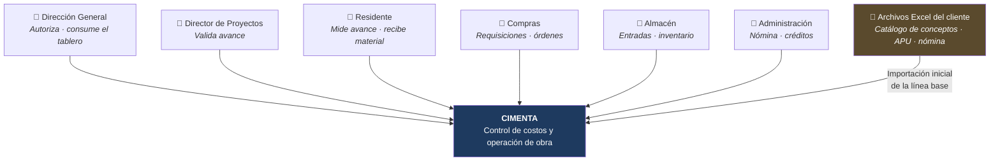
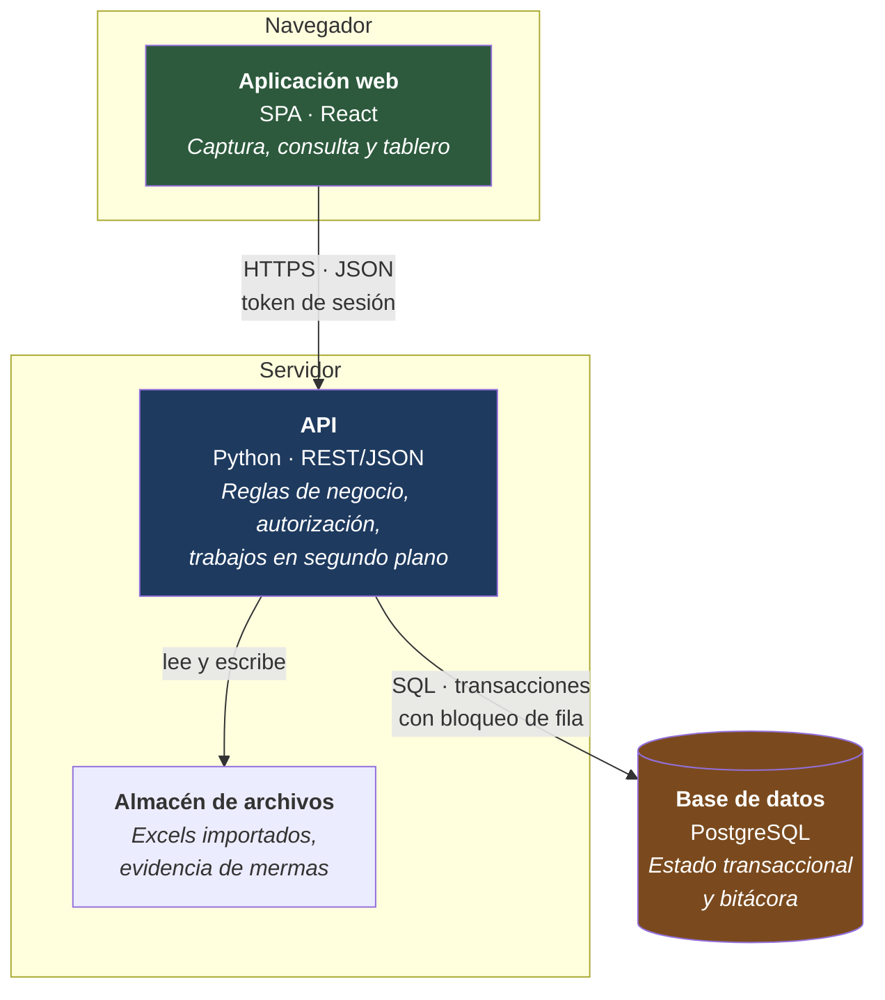
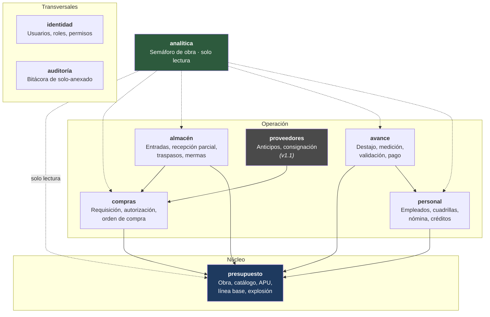
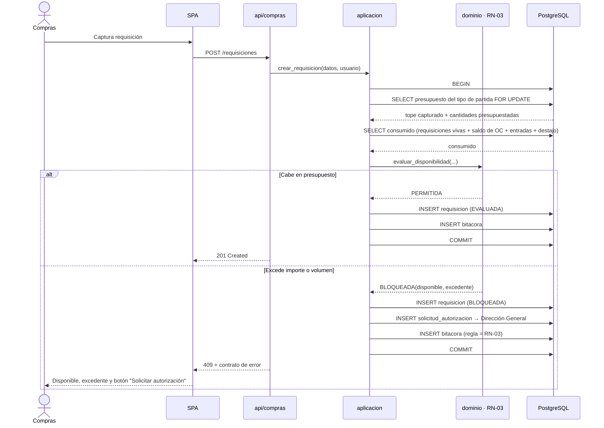
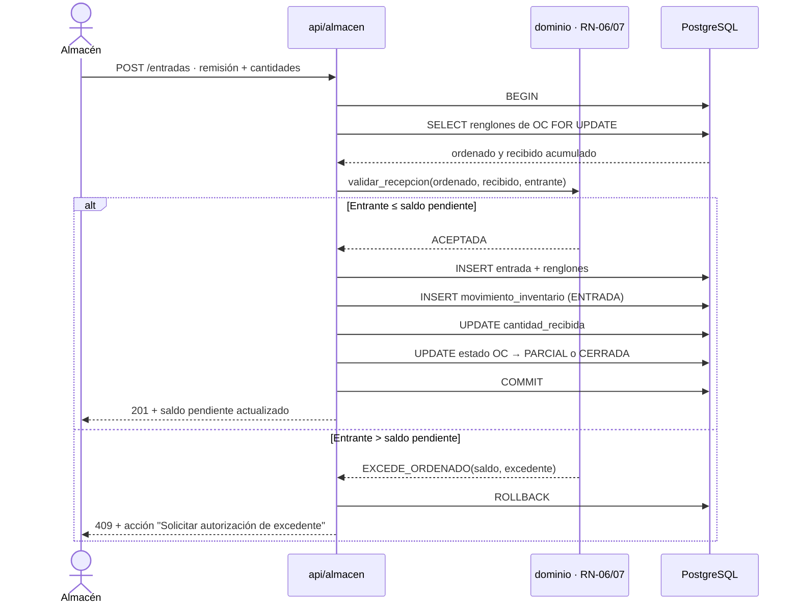
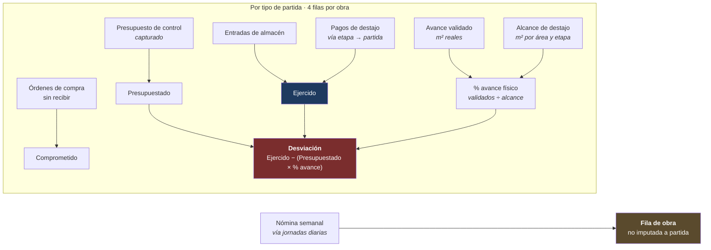
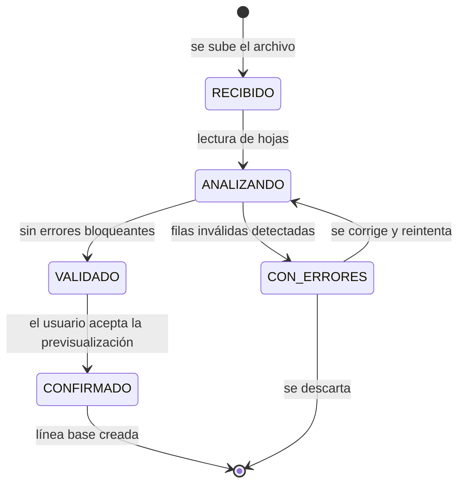

# CIMENTA · Arquitectura del sistema

> **Capa SDD:** *Plan*. Este documento responde **cómo** se construye lo que el [PRD](01-descripcion-producto.md) definió. Toda decisión aquí se justifica contra un requisito del PRD; si no se puede trazar a uno, sobra.
>
> **Dónde acaba este documento.** Decide la **forma**: estilo arquitectónico, contextos delimitados, capas, contratos y motor de base de datos. No decide las **herramientas** —framework web, ORM, librería de validación, testing, build, despliegue—: eso es el **Paso 5**.
>
> La base de datos es la excepción deliberada: se decide aquí porque varias decisiones estructurales dependen de garantías concretas del motor (bloqueo de filas, aritmética decimal exacta, restricciones declarativas). Elegirla en el Paso 5 sería decidirla después de haberla asumido.

---

## Índice

1. [Escala real del sistema](#1-escala-real-del-sistema)
2. [Drivers arquitectónicos](#2-drivers-arquitectónicos)
3. [Estilo: monolito modular](#3-estilo-monolito-modular)
4. [Vista C4](#4-vista-c4)
5. [Contextos delimitados](#5-contextos-delimitados)
6. [Capas dentro de un módulo](#6-capas-dentro-de-un-módulo)
7. [Aspectos transversales](#7-aspectos-transversales)
8. [Flujos clave](#8-flujos-clave)
9. [Importación del presupuesto](#9-importación-del-presupuesto)
10. [Atributos de calidad](#10-atributos-de-calidad)
11. [Riesgos arquitectónicos](#11-riesgos-arquitectónicos)
12. [Decisiones registradas](#12-decisiones-registradas)

---

## 1. Escala real del sistema

Dimensionar antes de decidir. Los números salen de los archivos reales del cliente, no de una estimación:

| Dimensión | Valor observado |
|---|---|
| Obras simultáneas | 2 (Union Square F2, ENITI T5) |
| Usuarios internos | 6 roles · **(asumido)** 10-30 personas |
| Conceptos por obra | ~4,900 filas de catálogo |
| Insumos distintos por obra | 27 |
| Ubicaciones por obra | 143 departamentos en 14 niveles |
| Empleados en nómina semanal | ~20 por semana |
| Ciclo operativo | Semanal: corte de proveedores jueves, nómina y destajo sábado |
| Escritura concurrente esperada | Muy baja. Decenas de operaciones por hora en el pico |

**Esto no es un sistema de alto volumen.** Es un sistema de alta exigencia en **integridad** y **trazabilidad**, con carga pequeña. Cualquier decisión que compre escalabilidad a costa de consistencia transaccional está optimizando el problema equivocado.

---

## 2. Drivers arquitectónicos

Los seis principios no negociables del [README](../README.md) no son declaraciones de intención: cada uno impone una restricción técnica concreta.

| Principio | Restricción arquitectónica que impone |
|---|---|
| **1 · La línea base es inmutable** | El congelado se materializa como *snapshot*, no como bandera sobre datos editables. Ninguna ruta de código puede escribir sobre una línea base congelada |
| **2 · Todo gasto tiene dueño** | `obra_id` es obligatorio en todo movimiento y `tipo_partida_id` en toda requisición, con restricción `NOT NULL` en la base de datos. No basta con validarlo en la aplicación |
| **3 · Los límites bloquean** | La evaluación de presupuesto y el registro del resultado ocurren en **una sola transacción con bloqueo de fila**. Sin esto, dos requisiciones concurrentes pasan ambas |
| **4 · Trazabilidad completa** | Bitácora de solo-anexado. El inventario es un libro mayor de movimientos, no un saldo mutable |
| **5 · El costo real se conoce hoy** | El tablero se calcula desde los movimientos, no desde un proceso nocturno. Latencia objetivo de consulta: < 2 s |
| **6 · La especificación precede al código** | Las reglas de negocio viven en un dominio puro, testeable sin HTTP ni base de datos. Cada regla `RN-xx` es una unidad de código localizable |

Añado un séptimo driver que no está en los principios pero que el dominio impone:

**7 · El dinero es exacto.** Todos los importes y rendimientos se manejan en decimal de precisión fija. Los archivos del cliente ya arrastran ruido de coma flotante (`295225.2012`, `2755187.2112`); el sistema no puede añadir más. Prohibido el tipo flotante en cualquier campo monetario o de cantidad.

---

## 3. Estilo: monolito modular

**Un backend desplegable, organizado internamente en módulos con fronteras explícitas.**

### Por qué no microservicios

La operación central del sistema —evaluar una requisición contra el presupuesto y registrar el resultado— tiene que ser **atómica**. Si `compras` y `presupuesto` fueran servicios separados, esa atomicidad exigiría transacciones distribuidas o consistencia eventual. Consistencia eventual significa que dos requisiciones concurrentes pueden pasar ambas y sobregirar la partida, que es exactamente lo que el principio 3 prohíbe.

A eso se suma que el equipo es de una persona y la carga es de decenas de operaciones por hora. Microservicios comprarían independencia de despliegue que nadie necesita, al precio de la garantía que el producto sí necesita.

### Por qué no un monolito sin fronteras

Porque las siete capacidades del PRD se reparten en nueve contextos con reglas propias que evolucionan a ritmos distintos, y porque el backlog se va a implementar en buena parte con agentes. Un agente que trabaja sobre un módulo con frontera explícita tiene un contexto acotado; uno que trabaja sobre un monolito plano acaba tocando lo que no debía. Las fronteras son tanto disciplina de diseño como reducción de la superficie sobre la que un agente puede equivocarse.

### La regla de fronteras

> Un módulo **solo** puede hablar con otro a través de su interfaz de aplicación publicada. Nunca a través de sus repositorios, sus modelos de persistencia ni sus tablas.

Esta regla es lo único que separa un monolito modular de un monolito con carpetas. Se verifica automáticamente en CI mediante análisis de dependencias entre paquetes.

---

## 4. Vista C4

### Nivel 1 · Contexto



El único sistema externo del MVP es la hoja de cálculo de la que se importa el presupuesto. No hay integración con SAT, bancos ni contabilidad: están fuera de alcance por decisión del PRD §7.

### Nivel 2 · Contenedores



**Cuatro contenedores, ni uno más.** No hay cola de mensajes, no hay caché distribuida, no hay servicio de búsqueda. La importación de Excel, que es la única operación pesada, se ejecuta como trabajo en segundo plano **dentro del propio proceso del API**, con su estado persistido en base de datos. El umbral que obligaría a introducir una cola externa está documentado en [ADR-001](adr/20260918-monolito-modular.md).

### Nivel 3 · Componentes del API



Las dependencias forman un grafo dirigido acíclico. `presupuesto` es el núcleo y no depende de nadie. `analítica` depende de todos pero **solo lee**: no puede escribir en ningún módulo, lo que garantiza que el tablero nunca altere el estado que reporta.

---

## 5. Contextos delimitados

| Módulo | Responsabilidad | Reglas que hace cumplir | Depende de |
|---|---|---|---|
| **identidad** | Autenticación, roles y permisos | — | — |
| **auditoría** | Bitácora inmutable de toda acción relevante | RN-04 | — |
| **presupuesto** | Obra, jerarquía, conceptos, APU, línea base, explosión por partida, presupuesto de control, rendimiento observado | RN-01, RN-18, RN-19, RN-24, RN-25 | — |
| **compras** | Requisición, evaluación presupuestal, solicitud de autorización, orden de compra | RN-02, RN-03, RN-04 | presupuesto |
| **almacén** | Entrada contra remisión, saldo de recepción parcial, traspasos, mermas, inventario | RN-05, RN-06, RN-07, RN-08, RN-09 | compras, presupuesto |
| **avance** | Alcance de destajo, etapas, medición, doble validación, pago con retención, fondo de garantía | RN-10, RN-11, RN-12 | presupuesto, personal |
| **personal** | Empleados, roles de oficio, cuadrillas, créditos, nómina semanal, pagos agrupados, **modalidad de pago de la semana** | RN-13, RN-14, RN-22, RN-23 | presupuesto |
| **proveedores** | Catálogo *(MVP)*; facturas con corte semanal, anticipos y amortización, tope de consignación *(v1.1)* | RN-15, RN-16, RN-17 | compras |
| **analítica** | Semáforo de obra, desglose, alertas, costo proyectado | RN-21 | todos *(lectura)* |

`RN-20` no aparece porque está fuera del MVP: depende de un control de cobranza que no existe todavía. Cuando llegue, su dueño será el módulo que gobierne el cobro al cliente final, no `compras`.

### Por qué `RN-22` vive en `personal`

La exclusividad de modalidad de pago se apoya en `modalidad_pago_semana`, una tabla que **escriben los dos módulos**: `avance` al generar un pago de destajo y `personal` al calcular la nómina. Que la tabla tenga un dueño no es un detalle de organización, es lo que decide si el pipeline pasa.

El grafo lo resuelve solo. `avance → personal` ya existe, así que si `avance` fuera el dueño, `personal` necesitaría la arista inversa y el grafo dejaría de ser acíclico — exactamente lo que `import-linter` rechaza.

> **`personal` es el dueño de `modalidad_pago_semana`.** `avance` reclama la modalidad `DESTAJO` llamando a la interfaz de aplicación publicada de `personal` antes de generar el pago; `personal` la reclama directamente al calcular la nómina. La regla de dominio y el contrato de error viven con la tabla.

### El módulo que no existe

No hay un módulo `costos` ni un `motor de reglas` central. **Cada regla vive en el módulo dueño del concepto que regula.** RN-03 (bloqueo por presupuesto) vive en `compras` y consulta a `presupuesto`; no vive en un servicio genérico de reglas.

Los motores de reglas centralizados son atractivos sobre el papel y se convierten en el sitio donde acaba toda la lógica que nadie sabe dónde poner. El PRD tiene 25 reglas conocidas y acotadas: no justifican un motor.

---

## 6. Capas dentro de un módulo

Cada módulo tiene la misma estructura interna de cuatro capas. La dependencia apunta **siempre hacia dentro**: la infraestructura conoce al dominio, el dominio no conoce a nadie.

```
compras/
├── api/              Rutas HTTP, serialización, códigos de estado
├── aplicacion/       Casos de uso. Orquesta, abre transacciones, no decide reglas
├── dominio/          Entidades, objetos de valor y REGLAS DE NEGOCIO. Python puro
└── infraestructura/  Repositorios, mapeo a tablas, adaptadores
```

### Por qué el dominio es puro

Porque el Paso 4 va a producir criterios de aceptación en Gherkin, cada uno con su escenario de rechazo, y esos criterios tienen que poder ejecutarse como tests sin levantar un servidor ni una base de datos. Una regla enterrada en un controlador solo se puede probar por HTTP: lento, frágil y con la regla mezclada con serialización y autenticación.

```python
# dominio/reglas.py — sin framework, sin ORM, sin HTTP
def evaluar_disponibilidad(presupuestado, consumido, solicitado) -> ResultadoEvaluacion:
    """Implementa RN-03. Sin efectos secundarios."""
```

La consecuencia práctica: **cada regla `RN-xx` del PRD es localizable en el código por su identificador**. Un agente al que se le pide "modifica RN-03" sabe exactamente dónde mirar, y la trazabilidad especificación ↔ código es verificable.

### Qué va en cada capa

| Capa | Sí | No |
|---|---|---|
| **api** | Validar forma de la petición, traducir resultados a códigos HTTP | Decidir si algo se permite |
| **aplicacion** | Abrir transacción, coordinar módulos, publicar a bitácora | Contener condicionales de negocio |
| **dominio** | Reglas, invariantes, cálculos | Saber que existe una base de datos |
| **infraestructura** | SQL, mapeo, bloqueos, archivos | Tomar decisiones de negocio |

---

## 7. Aspectos transversales

### 7.1. Autorización

Dos niveles, y hacen falta los dos:

**Permiso por rol** — qué operaciones puede invocar un usuario. Compras levanta requisiciones; solo Dirección General resuelve solicitudes de autorización.

**Autoridad sobre la excepción** — quién puede levantar un bloqueo. Es distinto del permiso: un usuario puede tener permiso para crear una requisición y no tenerlo para autorizarla aunque él mismo la haya creado. **Nadie autoriza su propia solicitud**, y eso se verifica en el dominio, no en la interfaz.

Un usuario puede acumular varios roles (PRD §4). El permiso efectivo es la unión de los roles, con la restricción de auto-autorización aplicada siempre.

### 7.2. Bitácora

Toda operación que crea, autoriza, rechaza o revierte escribe en la bitácora dentro de **la misma transacción** que el cambio. Si la bitácora falla, el cambio se deshace. Registrar después, o en un proceso aparte, produce huecos precisamente en los casos de error, que son los que importan.

Cada asiento guarda: entidad, acción, usuario, momento, estado anterior y posterior, motivo y —cuando aplica— la regla de negocio implicada. Esa última columna es la que permite responder *"enséñame todas las veces que se saltó RN-03 este mes"*.

La tabla es de **solo-anexado**: sin `UPDATE`, sin `DELETE`, garantizado por permisos de base de datos y no solo por disciplina.

### 7.3. Contrato de error de regla de negocio

Cuando el sistema bloquea algo, la interfaz tiene que poder explicar **por qué** y ofrecer **qué hacer**. Un `403 Forbidden` con un mensaje de texto no permite construir esa pantalla. Todas las violaciones de regla responden con la misma forma:

```json
{
  "tipo": "REGLA_NEGOCIO",
  "regla": "RN-03",
  "mensaje": "La requisición excede el presupuesto de control disponible del tipo de partida MUROS.",
  "detalle": {
    "obra": "AP-058-25 · Union Square F2",
    "tipo_partida": "MUROS",
    "presupuestado": "45000.0000",
    "consumido": "33000.0000",
    "disponible": "12000.0000",
    "solicitado": "15000.0000",
    "excedente": "3000.0000"
  },
  "acciones": [
    { "clave": "SOLICITAR_AUTORIZACION", "metodo": "POST", "ruta": "/requisiciones/1042/autorizacion" }
  ]
}
```

Tres propiedades deliberadas:

**`regla` es el identificador del PRD.** El error es trazable a la especificación desde la respuesta HTTP.

**`detalle` lleva las cifras.** La interfaz no recalcula nada ni interpreta un mensaje de texto.

**`acciones` dice qué se puede hacer.** El bloqueo no es un callejón sin salida: es una bifurcación con salida documentada.

Los importes viajan como **cadena**, no como número JSON, para que no pasen por un flotante de JavaScript en el camino.

### 7.4. Dinero y cantidades

| Concepto | Precisión | Ejemplo real |
|---|---|---|
| Importes | `DECIMAL(18,4)` | `2755187.2112` |
| Precios unitarios | `DECIMAL(14,4)` | `539.6300`, `0.2500` |
| Cantidades | `DECIMAL(14,4)` | `1459.5600`, `16.0890` |
| Rendimientos | `DECIMAL(18,6)` | `0.673400`, `0.017000` |
| Porcentajes | `DECIMAL(9,6)` | `0.050000`, `0.160000` |

**Regla de redondeo:** se calcula con la precisión completa y se redondea **solo al presentar**, nunca en cálculos intermedios. El redondeo intermedio en una explosión de 27 insumos sobre 4,900 conceptos acumula una desviación perfectamente visible.

### 7.5. Concurrencia

El riesgo real no es el volumen: es que dos personas de Compras capturen requisiciones contra el mismo tipo de partida a la vez. Sin control, ambas leen el mismo disponible y ambas pasan.

**Solución: bloqueo pesimista de fila.** La evaluación toma un bloqueo sobre las filas de presupuesto del tipo de partida —el importe tope en `presupuesto_control` y las cantidades en `explosion_presupuesto`—, calcula el consumido, decide y escribe, todo en una transacción. La segunda requisición espera y lee el estado ya actualizado.

Como el control es por obra y tipo de partida (PA-01), son cuatro filas por obra en lugar de una por ubicación: la contención potencial se concentra en muy pocas filas, lo que hace más importante tomar los bloqueos siempre en el mismo orden.

Se elige pesimista sobre optimista porque el conflicto es poco frecuente pero **su consecuencia es exactamente lo que el producto existe para impedir**. Un reintento optimista que falla deja al usuario con un error incomprensible; un bloqueo de milisegundos no se nota a esta escala. Detalle en [ADR-004](adr/20260918-bloqueo-pesimista-presupuesto.md).

**Ninguna espera es indefinida** (`RNF-16`). Toda transacción declara un tiempo máximo de espera de bloqueo y un tiempo máximo de ejecución. Sin ellos, una transacción olvidada abierta —una sesión de depuración, un proceso que murió sin confirmar— deja las cuatro bolsas de una obra bloqueadas para todos, y cada petición que espera consume un hilo del servidor hasta agotarlos. El vencimiento **se traduce al contrato de error** con la acción de reintentar, no a un fallo genérico: para quien captura, "vuelve a intentarlo" es información; un error interno no lo es.

### 7.6. Seguridad de la frontera

Los requisitos están en el [PRD §9](01-descripcion-producto.md#9-requisitos-no-funcionales). Aquí van las decisiones estructurales que imponen, que son cuatro.

**La sesión tiene estado en el servidor** (`RNF-01`). Existe una tabla de sesiones y la credencial del navegador no es más que un identificador opaco contra ella. La alternativa —una credencial autocontenida y firmada, sea un JWT o una cookie firmada— traslada al cliente la verdad sobre quién es y qué puede hacer, y entonces desactivar a un usuario o retirarle un rol no surte efecto hasta que su credencial caduca. En un sistema donde el permiso decide quién puede autorizar un sobregiro, esa ventana es la diferencia entre un control y un trámite. La decisión completa está en [ADR-014](adr/20260919-sesion-con-estado.md).

**La autorización se comprueba en dos capas distintas y ninguna sustituye a la otra.** El permiso por rol se comprueba en `api/`, porque es una propiedad de quién invoca. La **autoridad sobre la excepción** —nadie autoriza su propia solicitud— se comprueba en `dominio/`, porque es una regla del negocio y tiene que poder probarse sin HTTP. Una interfaz que oculta el botón no es un control de acceso: es una cortesía.

**Todo lo que muta estado exige prueba de origen** (`RNF-05`). No basta con que la credencial viaje: tiene que constar que la petición salió de la aplicación. La consecuencia de omitirlo no es abstracta — la operación más valiosa para un tercero es exactamente la que un solo clic de Dirección General ejecuta.

**El privilegio mínimo se aplica en el motor, no en el código** (`RNF-09`). Tres roles de base de datos:

| Rol | Permisos | Qué garantiza |
|---|---|---|
| **Migración** | Propietario del esquema | Solo Alembic altera estructura. La aplicación en marcha no puede |
| **Aplicación** | `SELECT`, `INSERT`, `UPDATE`, `DELETE` según tabla; sobre `bitacora` e `intento_acceso` solo `INSERT` y `SELECT`; sobre `linea_base_concepto` solo `SELECT` e `INSERT` | Invariante 10 y el principio 1 dejan de depender de que nadie se despiste |
| **Lectura** | `SELECT` y nada más | **Hace verificable que `analitica` solo lee.** import-linter comprueba quién importa a quién, no quién escribe: esa garantía no tenía forma de fallar el pipeline hasta ahora |

**El rol de aplicación sí tiene `UPDATE` sobre `explosion_presupuesto` y `presupuesto_control`, y hace falta.** Es contraintuitivo, porque las dos cuelgan de la línea base, así que conviene decir por qué:

- **`explosion_presupuesto`** es la fila que [ADR-004](adr/20260918-bloqueo-pesimista-presupuesto.md) bloquea para el control por volumen, y en PostgreSQL `SELECT … FOR UPDATE` **exige el privilegio `UPDATE`**, no basta con `SELECT`. Negárselo al rol de aplicación no protegería la línea base: impediría el bloqueo pesimista entero, con un error de permisos en tiempo de ejecución.
- **`presupuesto_control`** ni siquiera es una copia congelada. Se captura *después* de congelar, y `RN-03` la recaptura con autorización registrada.

La inmutabilidad de la línea base no descansa aquí, sino en el **disparador del invariante 14**, que rechaza `UPDATE` y `DELETE` sobre las copias congeladas venga de donde venga. El permiso protege lo que un disparador no puede proteger —`bitacora` e `intento_acceso`, donde el propio `INSERT` es el registro— y el disparador protege lo que el permiso no puede sin romper el bloqueo. Son dos mecanismos para dos problemas distintos, y confundirlos deja uno de los dos sin cubrir.

---

## 8. Flujos clave

### 8.1. Requisición evaluada contra presupuesto — RN-03

El flujo central del producto. La rama de bloqueo es tan importante como la de éxito.



*El diagrama muestra el envío directo.* La requisición nace en `BORRADOR` y la transición a `EVALUADA` o `BLOQUEADA` ocurre al enviarla; cuando se captura y se envía en un solo paso, las dos cosas pasan dentro de esta misma transacción. El guardado en borrador sin evaluar es el escenario 2 de HDU-002 y no toma ningún bloqueo.

**La requisición bloqueada se persiste.** No se descarta: queda registrada en estado `BLOQUEADA` con su solicitud de autorización asociada. RN-03 dice *bloquear y solicitar autorización*, no *rechazar*. Descartarla perdería la trazabilidad de cuántas veces se intentó sobregirar una partida, que es justamente el dato que le falta a la dirección.

**El `consumido` cuenta cada peso una sola vez a lo largo del ciclo del gasto.** Una requisición evaluada consume; al convertirse en orden deja de contar como requisición y pasa a contar como saldo pendiente; al recibirse el material deja de contar como saldo y pasa a contar como entrada. Sumar "órdenes + entradas" sin más contaría dos veces lo mismo, y omitir las requisiciones vivas dejaría pasar las dos peticiones concurrentes del escenario 9 de [HDU-002](04-historias-usuario.md#hdu-002--requisición-con-control-de-presupuesto), que es exactamente el fallo que este bloqueo existe para impedir. La fórmula está escrita una sola vez en el [modelo de datos §14](03-modelo-datos.md#14-la-consulta-del-semáforo) y la comparten la regla y el tablero.

### 8.2. Recepción parcial — RN-06 y RN-07



El estado de la orden de compra —`ABIERTA`, `PARCIAL`, `CERRADA`— se **deriva** de las cantidades, nunca se fija a mano. Es el mecanismo que responde a *"¿cuánto falta por llegar?"*, la pregunta que hoy no tiene respuesta formal.

### 8.3. Semáforo de obra



Se calcula **en tiempo de consulta** sobre los movimientos, sin proceso nocturno ni tabla de resumen que mantener sincronizada. A esta escala —4,900 conceptos y decenas de movimientos diarios— una agregación indexada responde de sobra. El umbral a partir del cual habría que introducir vistas materializadas está documentado en [ADR-005](adr/20260918-ledger-inventario.md).

**El costo de mano de obra entra por dos caminos distintos, y no es un detalle.** El destajo llega al tipo de partida a través de su etapa, que lleva `tipo_partida_id` (PA-08). La nómina no: un trabajador de sueldo fijo dedica el día a lo que haga falta, así que su costo se agrega a nivel de obra a partir de las jornadas diarias y se muestra en fila propia, marcada como no imputada a partida (PA-10).

Omitir cualquiera de los dos daría una cifra falsa: la mano de obra es entre el 59 % y el 100 % del costo directo (RN-21). Repartir la nómina entre partidas sin criterio daría una cifra que **parece** precisa sin serlo, que es peor.

---

## 9. Importación del presupuesto

Es la operación más pesada y la única con superficie real de fallo. Los archivos reales pesan hasta 8 MB, tienen 25 hojas y 5,988 filas, y **vienen rotos**: el catálogo de Union Square arrastra `#REF!` en todas las columnas de precio.

Por eso la importación no es un `POST` que devuelve éxito o error, sino un proceso en tres fases con estado persistido:



**Fase 1 · Análisis.** Se leen las hojas a una zona de preparación sin tocar los datos de producción. Se detectan filas con `#REF!`, unidades desconocidas, conceptos sin APU y rendimientos ausentes.

**Fase 2 · Previsualización.** El usuario ve qué se va a importar, qué se rechazó y por qué, con el total calculado. Nada se ha escrito todavía en el modelo real.

**Fase 3 · Confirmación.** Se materializa la línea base en una transacción única. O entra todo, o no entra nada.

> Una importación que escribe a medias deja la línea base corrupta, y sobre una línea base corrupta todo el control de costos posterior miente. La separación análisis/confirmación existe para que eso no pueda ocurrir.

**El análisis sobrevive a que el servidor no sobreviva** (`RNF-17`). El trabajo corre dentro del proceso del API, así que un reinicio a mitad de análisis deja la fila en `ANALIZANDO` y ahí se queda: no hay nadie que la mueva, y mientras tanto la obra no admite otra importación. La máquina de estados de arriba describe las transiciones que provoca el usuario; esta la provoca su ausencia.

La solución es la mínima: el trabajo **actualiza un latido** mientras analiza, y al arrancar la aplicación un barrido marca `CON_ERRORES` toda importación cuyo latido esté vencido, con un error de tipo `PROCESO_INTERRUMPIDO` que explica qué pasó. El usuario ve una importación fallida con su motivo y puede reintentar, que es un resultado; una fila congelada para siempre no lo es.

No hace falta más: la fase de análisis no escribe en el modelo real, así que una interrupción no puede dejar datos a medias. Solo puede dejar una fila mintiendo sobre su propio estado.

---

## 10. Atributos de calidad

| Atributo | Objetivo | Cómo lo sostiene la arquitectura |
|---|---|---|
| **Integridad transaccional** | Ninguna partida se sobregira sin autorización registrada | Transacción única con bloqueo de fila · restricciones en base de datos |
| **Trazabilidad** | Responder *quién autorizó qué y por qué* para cualquier movimiento | Bitácora de solo-anexado en la misma transacción · libro mayor de inventario |
| **Exactitud** | Cero desviación por redondeo | Decimal de precisión fija · redondeo solo en presentación |
| **Verificabilidad** | Cada `RN-xx` tiene un test que la ejecuta sin infraestructura | Dominio puro sin dependencias |
| **Latencia del dato** | Costo real por obra < 24 h *(MS-1)* | Cálculo sobre movimientos, sin proceso por lotes |
| **Comprensibilidad para agentes** | Un agente sabe dónde tocar sin leer todo el sistema | Módulos con frontera verificada en CI · reglas localizables por identificador |
| **Evolutividad** | Un módulo se puede extraer si hiciera falta | Grafo de dependencias acíclico · comunicación solo por interfaces publicadas |
| **Seguridad** | Quien no tiene el rol no ejecuta la operación, y quitarle el rol surte efecto de inmediato *(`RNF-01`…`RNF-09`)* | Sesión con estado en servidor · autoridad sobre la excepción en `dominio/` · privilegio mínimo en tres roles de base de datos · [§7.6](#76-seguridad-de-la-frontera) |
| **Recuperabilidad** | Restaurar a un punto en el tiempo con ≤ 1 h de pérdida, ensayado cada trimestre *(`RNF-10`, `RNF-11`)* | Respaldo continuo de PostgreSQL · ensayo de restauración como puerta de despliegue |
| **Operación sin conexión** | El residente y el almacén capturan en obra, donde no hay internet, y nada de lo que capturan se da por permitido sin pasar por el servidor *(`RNF-18`)* | Caché de lectura persistida y cola local acotada a `avance` y `entrada_almacen` · sincronización idempotente por los mismos casos de uso · [ADR-015](adr/20260919-captura-diferida-sin-conexion.md) |

**Los dos últimos son nuevos y llegan tarde a propósito de nada.** Faltaban: esta tabla describía siete atributos y ninguno cubría qué pasa si alguien entra sin permiso o si el disco se pierde. Un sistema cuya propuesta de valor es *"la línea base es inmutable y la bitácora es irrefutable"* hace dos afirmaciones que dependen por completo de estos dos atributos.

---

## 11. Riesgos arquitectónicos

| Riesgo | Impacto | Mitigación |
|---|---|---|
| **Una sola bolsa por tipo de partida** (PA-01 y `RN-03`): el destajo consume el mismo tope que el material | Compras queda bloqueada por un gasto de mano de obra que no controla | Declarado con disparador de revisión en el [PRD §10](01-descripcion-producto.md#10-supuestos-y-preguntas-abiertas). La alternativa —un tope por concepto de costo dentro de cada partida— es un cambio de consulta y de captura, no de estructura |
| **Una requisición evaluada reserva presupuesto y no caduca** | El disponible de una partida se estrecha sin gasto real detrás | La consulta de requisiciones evaluadas sin convertir de HDU-002 lo hace visible. Si no basta, el vencimiento con barrido ya tiene patrón en el sistema (`RNF-17`) |
| **Los datos de origen vienen rotos** | Una línea base corrupta invalida todo el control posterior | Importación en tres fases con previsualización obligatoria |
| **La frontera entre módulos se erosiona** | El monolito modular degenera en monolito plano | Verificación automática de dependencias en CI. Sin excepciones manuales |
| **El alcance de destajo se precarga de la línea base** y es el denominador del avance físico | Un alcance mal precargado desplaza la columna de desviación de todas las partidas a la vez, sin error visible | Solo el Director de Proyectos lo corrige, con motivo y bitácora. El `UNIQUE (area_id, etapa_destajo_id)` del invariante 22 impide la causa más probable: precargarlo dos veces |
| **Rendimientos congelados** que no reflejan la ejecución real | El consumo esperado se desvía del real sin que se sepa por qué | El tablero reporta la desviación por insumo, que hace visible el error de rendimiento |
| **Un único despliegue**: una caída deja al sistema entero fuera | Operación semanal interrumpida | Aceptado y declarado en `RNF-12`. La operación tolera horas de indisponibilidad; alta disponibilidad no está justificada a esta escala. Lo que **no** se acepta es perder datos: `RNF-10` exige recuperación a un punto en el tiempo |
| **La autenticación se construye a mano.** Es la consecuencia directa de [ADR-009](adr/20260918-fastapi.md): FastAPI no trae sesión, ni límite de intentos, ni pantallas | Un fallo aquí no rompe una regla de negocio: las deja todas sin efecto, porque el actor deja de ser confiable | `RNF-01`…`RNF-09` convierten la lista en requisitos citables, y TKT-057 en trabajo planificado. La superficie es pequeña —inicio de sesión, cierre, comprobación de rol— y se prueba entera |

---

## 12. Decisiones registradas

Las decisiones que un desarrollador nuevo se preguntaría *"¿por qué lo hicieron así?"* están en [`docs/adr/`](adr/) en formato MADR.

| ADR | Decisión |
|---|---|
| [ADR-001](adr/20260918-monolito-modular.md) | Monolito modular en lugar de microservicios |
| [ADR-002](adr/20260918-postgresql.md) | PostgreSQL como motor de base de datos |
| [ADR-003](adr/20260918-dominio-puro.md) | Reglas de negocio en un dominio sin dependencias |
| [ADR-004](adr/20260918-bloqueo-pesimista-presupuesto.md) | Bloqueo pesimista para la evaluación presupuestal |
| [ADR-005](adr/20260918-ledger-inventario.md) | Libro mayor de solo-anexado para el inventario |
| [ADR-006](adr/20260918-snapshot-linea-base.md) | Línea base como copia inmutable |
| [ADR-007](adr/20260918-contrato-error-negocio.md) | Contrato de error estructurado para reglas de negocio |
| [ADR-008](adr/20260918-despliegue-single-tenant.md) | Despliegue de un solo inquilino con `empresa_id` desde el día uno |
| [ADR-014](adr/20260919-sesion-con-estado.md) | Sesión con estado en servidor, en lugar de credencial autocontenida |
| [ADR-015](adr/20260919-captura-diferida-sin-conexion.md) | Captura diferida sin conexión, acotada a `avance` y `entrada_almacen` |

Las decisiones de herramienta —framework, ORM, modo de ejecución— viven en el [stack tecnológico](06-stack-tecnologico.md) y en [ADR-009](adr/20260918-fastapi.md) … [ADR-013](adr/20260919-sqlalchemy-sincrono.md).
