# CIMENTA · Modelo de datos

> **Capa SDD:** *Plan*. Traduce el modelo de dominio del [PRD §5](01-descripcion-producto.md#5-modelo-de-dominio) y las decisiones de la [arquitectura](02-arquitectura.md) a un esquema relacional concreto.
>
> **Motor:** PostgreSQL ([ADR-002](adr/20260918-postgresql.md)). El esquema se apoya deliberadamente en garantías del motor —restricciones `CHECK`, índices únicos parciales, bloqueo de fila, decimal exacto— porque un invariante que solo vive en el código de aplicación se rompe el día que alguien escribe por otra vía.

---

## Índice

1. [Principios de modelado](#1-principios-de-modelado)
2. [Convenciones](#2-convenciones)
3. [Mapa general](#3-mapa-general)
4. [Presupuesto y línea base](#4-presupuesto-y-línea-base)
5. [Compras](#5-compras)
6. [Almacén](#6-almacén)
7. [Avance y destajo](#7-avance-y-destajo)
8. [Personal y nómina](#8-personal-y-nómina)
9. [Proveedores](#9-proveedores--v11)
10. [Identidad y auditoría](#10-identidad-y-auditoría)
11. [Importación](#11-importación)
12. [Invariantes en base de datos](#12-invariantes-en-base-de-datos)
13. [Máquinas de estado](#13-máquinas-de-estado)
14. [La consulta del semáforo](#14-la-consulta-del-semáforo)
15. [Trazabilidad reglas ↔ esquema](#15-trazabilidad-reglas--esquema)

---

## 1. Principios de modelado

Cinco decisiones que atraviesan todo el esquema:

**El dinero nunca es flotante.** Todos los importes, cantidades y rendimientos son `NUMERIC` de precisión fija. Los archivos del cliente ya arrastran ruido (`2755187.2112`); el sistema no añade más.

**Lo congelado se copia, no se marca.** La línea base es una copia física de los conceptos y su explosión, no una bandera sobre filas que siguen siendo editables. Un `estado = 'CONGELADA'` depende de que nadie escriba por otra ruta; una copia no depende de nada.

**El inventario es un libro mayor, no un saldo.** No existe una columna `stock`. La existencia se calcula sumando movimientos. Un saldo mutable pierde el *por qué* de cada cambio, que es exactamente lo que el principio de trazabilidad exige conservar.

**Todo movimiento de costo lleva `obra_id`.** No por conveniencia de consulta, sino como restricción `NOT NULL`: el principio 2 dice que no existe gasto sin obra, y el sitio donde eso se garantiza es el esquema.

**El estado derivable se deriva.** El estado de una orden de compra (`ABIERTA` / `PARCIAL` / `CERRADA`) sale de comparar cantidades ordenadas y recibidas. No se fija a mano, porque una columna de estado que alguien puede escribir es una columna que se desincroniza.

---

## 2. Convenciones

| Aspecto | Convención |
|---|---|
| **Nombres** | `snake_case`, tablas en singular, en español. El esquema habla el idioma del [glosario](glosario.md) |
| **Clave primaria** | `id UUID` generado por la aplicación. Evita colisiones al importar y no filtra volumen de negocio |
| **Claves foráneas** | `<entidad>_id`, siempre con restricción declarada |
| **Enumeraciones** | Tipos `ENUM` de PostgreSQL cuando el conjunto es cerrado y estable; tabla de catálogo cuando el cliente puede ampliarlo |
| **Columnas de auditoría** | `creado_en`, `creado_por_id`, `actualizado_en`, `actualizado_por_id` en toda tabla transaccional |
| **Borrado** | Lógico (`activo BOOLEAN`) en catálogos. **Prohibido** en tablas de movimiento: se corrige con un movimiento de signo contrario |
| **Importes** | `NUMERIC(18,4)` |
| **Precios y cantidades** | `NUMERIC(14,4)` |
| **Rendimientos** | `NUMERIC(18,6)` |
| **Porcentajes** | `NUMERIC(9,6)` — `0.050000` es 5 % |
| **Fechas** | `TIMESTAMPTZ` siempre. `DATE` solo para fechas de negocio sin hora (corte semanal) |

---

## 3. Mapa general

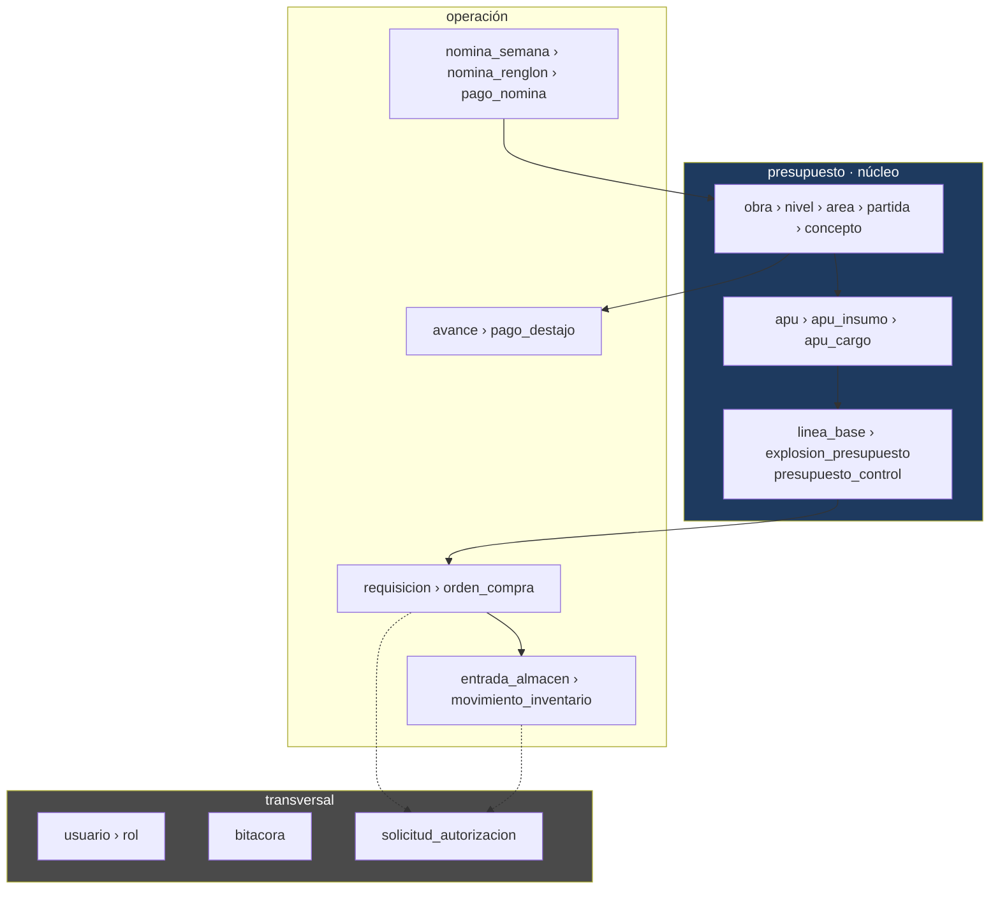
```mermaid
graph TB
    subgraph NUC["presupuesto · núcleo"]
        OBRA["obra › nivel › area › partida › concepto"]
        APU["apu › apu_insumo › apu_cargo"]
        LB["linea_base › explosion_presupuesto<br/>presupuesto_control"]
    end

    subgraph OPE["operación"]
        CMP["requisicion › orden_compra"]
        ALM["entrada_almacen › movimiento_inventario"]
        AVA["avance › pago_destajo"]
        PER["nomina_semana › nomina_renglon › pago_nomina"]
    end

    subgraph TRA["transversal"]
        IDE["usuario › rol"]
        BIT["bitacora"]
        AUT["solicitud_autorizacion"]
    end

    OBRA --> APU --> LB
    LB --> CMP --> ALM
    OBRA --> AVA
    PER --> OBRA
    CMP -.-> AUT
    ALM -.-> AUT

    style NUC fill:#1e3a5f,color:#fff
    style TRA fill:#4a4a4a,color:#fff
```

---

## 4. Presupuesto y línea base

### 4.1. Jerarquía y catálogo

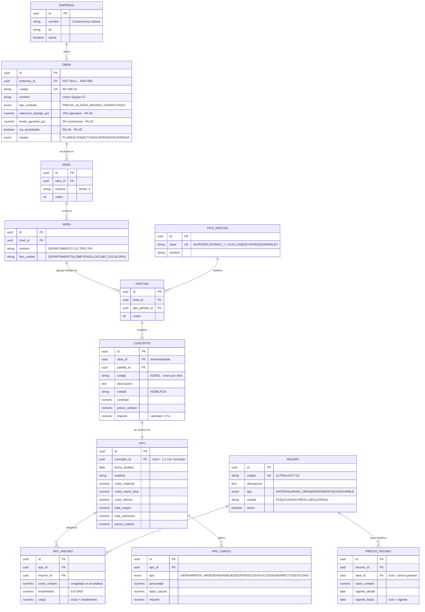
```mermaid
erDiagram
    EMPRESA ||--o{ OBRA : "opera"
    OBRA ||--o{ NIVEL : "se divide en"
    NIVEL ||--o{ AREA : "contiene"
    AREA ||--o{ PARTIDA : "agrupa trabajo en"
    TIPO_PARTIDA ||--o{ PARTIDA : "clasifica"
    PARTIDA ||--o{ CONCEPTO : "contiene"
    CONCEPTO ||--|| APU : "se costea con"
    APU ||--o{ APU_INSUMO : "desglosa"
    APU ||--o{ APU_CARGO : "aplica"
    INSUMO ||--o{ APU_INSUMO : "participa en"
    INSUMO ||--o{ PRECIO_INSUMO : "tiene histórico"

    EMPRESA {
        uuid id PK
        string nombre "Constructora Celsius"
        string rfc
        boolean activa
    }
    OBRA {
        uuid id PK
        uuid empresa_id FK "NOT NULL · ADR-008"
        string codigo UK "AP-058-25"
        string nombre "Union Square F2"
        enum tipo_contrato "PRECIO_ALZADO_MAXIMO_GARANTIZADO"
        numeric retencion_destajo_pct "15% operativo · PA-02"
        numeric fondo_garantia_pct "5% contractual · PA-02"
        boolean iva_acreditable "RN-25 · PA-05"
        enum estado "PLANEACION|ACTIVA|SUSPENDIDA|CERRADA"
    }
    NIVEL {
        uuid id PK
        uuid obra_id FK
        string nombre "NIVEL 3"
        int orden
    }
    AREA {
        uuid id PK
        uuid nivel_id FK
        string nombre "DEPARTAMENTO 312 TIPO 2R+"
        string tipo_unidad "DEPARTAMENTO|LOBBY|PASILLO|CUBO_ESCALERAS"
    }
    TIPO_PARTIDA {
        uuid id PK
        string clave UK "MUROS|PLAFONES_Y_CAJILLOS|ENCHAPES|GENERALES"
        string nombre
    }
    PARTIDA {
        uuid id PK
        uuid area_id FK
        uuid tipo_partida_id FK
        int orden
    }
    CONCEPTO {
        uuid id PK
        uuid obra_id FK "denormalizado"
        uuid partida_id FK
        string codigo "620001 · único por obra"
        text descripcion
        string unidad "M2|ML|PZA"
        numeric cantidad
        numeric precio_unitario
        numeric importe "cantidad × P.U."
    }
    INSUMO {
        uuid id PK
        string codigo UK "ULTRALIGHT-1/2"
        text descripcion
        enum tipo "MATERIAL|MANO_OBRA|HERRAMIENTA|CONSUMIBLE"
        string unidad "PZA|CAJA|SACO|ROLLO|KG|JORNAL"
        boolean activo
    }
    PRECIO_INSUMO {
        uuid id PK
        uuid insumo_id FK
        uuid obra_id FK "nulo = precio general"
        numeric costo_unitario
        date vigente_desde
        date vigente_hasta "nulo = vigente"
    }
    APU {
        uuid id PK
        uuid concepto_id FK "único · 1:1 con concepto"
        date fecha_analisis
        string analista
        numeric costo_material
        numeric costo_mano_obra
        numeric costo_directo
        numeric total_cargos
        numeric total_indirectos
        numeric precio_unitario
    }
    APU_INSUMO {
        uuid id PK
        uuid apu_id FK
        uuid insumo_id FK
        numeric costo_unitario "congelado en el análisis"
        numeric rendimiento "0.673400"
        numeric cargo "costo × rendimiento"
    }
    APU_CARGO {
        uuid id PK
        uuid apu_id FK
        enum tipo "HERRAMIENTA_MENOR|ANDAMIAJE|DESPERDICIO|VIATICOS|IVA|INDIRECTOS|UTILIDAD"
        numeric porcentaje
        numeric base_calculo
        numeric importe
    }
```

**Tres decisiones que conviene explicar.**

*El código de concepto no es global.* `620001` describe un muro estándar en las dos obras analizadas, pero **con textos y precios distintos**. Modelarlo como catálogo maestro obligaría a reconciliar descripciones que el cliente no reconcilia. El código es único **por obra**, y el cliente confirmó que hoy *"no hay un catálogo base"*. Si algún día lo hay, se añade un catálogo maestro y una referencia opcional, sin tocar lo existente.

*El insumo sí es global.* Un tablero de yeso Ultra Light es el mismo material en todas las obras; lo que cambia es su precio. Por eso el precio vive en `precio_insumo` con vigencia, no como columna del insumo. Esa tabla es la que hace posible F7.4: detectar que un insumo clave subió y recalcular el costo proyectado.

*`concepto.obra_id` está denormalizado.* Es derivable subiendo cuatro niveles, pero aparece en casi toda consulta de costo. Se mantiene coherente con una restricción que verifica que coincide con el `obra_id` alcanzable por la jerarquía.

*`empresa` existe con una sola fila y nadie filtra por ella.* Es deliberado y lo razona [ADR-008](adr/20260918-despliegue-single-tenant.md): cada despliegue atiende a una empresa, pero `obra.empresa_id` está desde el día uno porque añadir la columna después obligaría a migrar cada tabla, cada consulta y cada índice. La fila se carga con los datos semilla, antes de que exista ninguna obra: con la clave foránea obligatoria, dar de alta una obra sin empresa sembrada falla.

### 4.2. Línea base

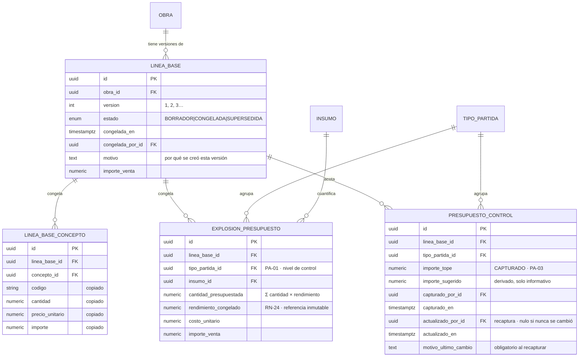
```mermaid
erDiagram
    OBRA ||--o{ LINEA_BASE : "tiene versiones de"
    LINEA_BASE ||--o{ LINEA_BASE_CONCEPTO : "congela"
    LINEA_BASE ||--o{ EXPLOSION_PRESUPUESTO : "congela"
    LINEA_BASE ||--o{ PRESUPUESTO_CONTROL : "acota"
    TIPO_PARTIDA ||--o{ EXPLOSION_PRESUPUESTO : "agrupa"
    TIPO_PARTIDA ||--o{ PRESUPUESTO_CONTROL : "agrupa"
    INSUMO ||--o{ EXPLOSION_PRESUPUESTO : "cuantifica"

    LINEA_BASE {
        uuid id PK
        uuid obra_id FK
        int version "1, 2, 3…"
        enum estado "BORRADOR|CONGELADA|SUPERSEDIDA"
        timestamptz congelada_en
        uuid congelada_por_id FK
        text motivo "por qué se creó esta versión"
        numeric importe_venta
    }
    LINEA_BASE_CONCEPTO {
        uuid id PK
        uuid linea_base_id FK
        uuid concepto_id FK
        string codigo "copiado"
        numeric cantidad "copiado"
        numeric precio_unitario "copiado"
        numeric importe "copiado"
    }
    EXPLOSION_PRESUPUESTO {
        uuid id PK
        uuid linea_base_id FK
        uuid tipo_partida_id FK "PA-01 · nivel de control"
        uuid insumo_id FK
        numeric cantidad_presupuestada "Σ cantidad × rendimiento"
        numeric rendimiento_congelado "RN-24 · referencia inmutable"
        numeric costo_unitario
        numeric importe_venta
    }
    PRESUPUESTO_CONTROL {
        uuid id PK
        uuid linea_base_id FK
        uuid tipo_partida_id FK
        numeric importe_tope "CAPTURADO · PA-03"
        numeric importe_sugerido "derivado, solo informativo"
        uuid capturado_por_id FK
        timestamptz capturado_en
        uuid actualizado_por_id FK "recaptura · nulo si nunca se cambió"
        timestamptz actualizado_en
        text motivo_ultimo_cambio "obligatorio al recapturar"
    }
```

**El nivel de control es `obra + tipo de partida`** (PA-01). La jerarquía nivel › área › partida sigue existiendo para el catálogo y para medir avance, pero el gasto se controla contra **cuatro bolsas por obra**: `MUROS`, `PLAFONES Y CAJILLOS`, `ENCHAPES` y `GENERALES`. Es como el cliente razona la compra, y reduce de ~572 filas de control a 4 por obra.

**Dos tablas, porque los dos controles de `RN-03` tienen orígenes distintos:**

| Control | Tabla | Origen del dato |
|---|---|---|
| **Por importe** | `presupuesto_control.importe_tope` | **Capturado** por Dirección (PA-03). El sistema calcula un `importe_sugerido` quitando utilidad e indirectos, pero es solo una sugerencia en pantalla |
| **Por volumen** | `explosion_presupuesto.cantidad_presupuestada` | **Derivado**: `Σ cantidad_concepto × rendimiento` de todos los conceptos del tipo de partida |

Antes eran una sola tabla porque se asumía que el control se derivaba del precio de venta. Al confirmarse que se captura, separarlos es obligado: un importe capturado por una persona y una cantidad derivada de un cálculo no pueden compartir fila sin que quede ambiguo cuál es la fuente de verdad de cada uno.

`presupuesto_control` es la fila que se bloquea con `FOR UPDATE` durante la evaluación de importe ([ADR-004](adr/20260918-bloqueo-pesimista-presupuesto.md)); `explosion_presupuesto`, la de volumen.

**El tope se puede recapturar; la línea base no se puede tocar.** Son dos cosas distintas que conviene no confundir. `explosion_presupuesto` y `linea_base_concepto` son copias congeladas y el disparador del invariante 14 rechaza cualquier escritura sobre ellas. `presupuesto_control` **no es una copia**: se captura después de congelar y es un juicio de Dirección, no un dato del contrato. Un tope mal tecleado tiene que poder corregirse, o el error queda vivo hasta que haya una versión nueva de línea base — que es v1.1.

La corrección **no es una edición silenciosa**: exige motivo, la ejecuta únicamente Dirección General, y el valor anterior queda en `bitacora.datos_antes` con la regla `RN-03`. `actualizado_por_id` y `motivo_ultimo_cambio` dejan el último cambio visible en la propia fila sin tener que consultar la bitácora; el historial completo está en ella.

> **Subir un tope es una vía alternativa a autorizar una excepción, y hay que verlo.** Si una requisición se bloqueó contra un tope de $450,000 y Dirección sube el tope a $500,000 en lugar de resolver la solicitud, la requisición pasa sin dejar rastro en `solicitud_autorizacion`. Por eso la recaptura escribe en la bitácora **con la misma regla `RN-03`** que el bloqueo: la consulta de excepciones del escenario 11 de [HDU-003](04-historias-usuario.md#hdu-003--resolución-de-una-requisición-bloqueada) devuelve las dos cosas juntas, y un mes con muchas subidas de tope es tan visible como uno con muchas autorizaciones.

**`rendimiento_congelado` vive aquí y nunca cambia.** Es la referencia contra la que se mide la desviación. El rendimiento observado —el que aprende de la ejecución real (`RN-24`)— vive en otra tabla y no toca esta.

### 4.3. Rendimiento observado

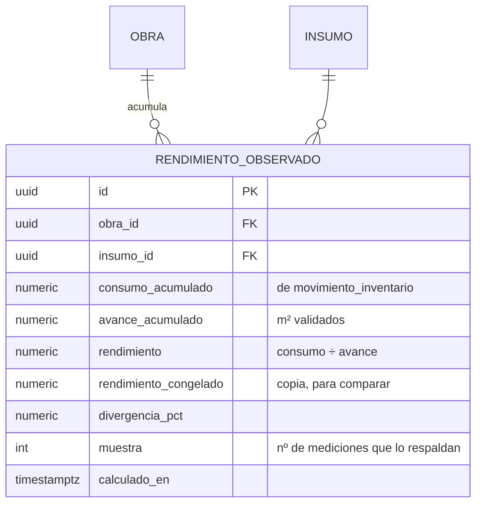
```mermaid
erDiagram
    OBRA ||--o{ RENDIMIENTO_OBSERVADO : "acumula"
    INSUMO ||--o{ RENDIMIENTO_OBSERVADO : ""

    RENDIMIENTO_OBSERVADO {
        uuid id PK
        uuid obra_id FK
        uuid insumo_id FK
        numeric consumo_acumulado "de movimiento_inventario"
        numeric avance_acumulado "m² validados"
        numeric rendimiento "consumo ÷ avance"
        numeric rendimiento_congelado "copia, para comparar"
        numeric divergencia_pct
        int muestra "nº de mediciones que lo respaldan"
        timestamptz calculado_en
    }
```

`RN-24` dice que el sistema aprende. La forma de hacerlo sin violar el principio de línea base inmutable es que **los dos rendimientos coexistan en tablas distintas**:

- El **congelado** vive en `explosion_presupuesto` y no se toca jamás. Responde a *"¿cuánto debía haberse consumido según lo presupuestado?"*
- El **observado** vive aquí, se recalcula con cada entrada de almacén y cada avance validado, y responde a *"¿cuánto se está consumiendo de verdad?"*

La desviación de costo se mide contra el congelado. La proyección del costo restante usa el observado. Sobrescribir uno con otro perdería justamente la comparación que da valor a los dos.

**Granularidad: obra e insumo.** No por tipo de partida, porque el avance físico se mide por área y etapa y el consumo por obra e insumo: cruzarlos a un nivel más fino exigiría un reparto que los datos no soportan. El cliente lo confirmó como suficiente (PA-11), con el disparador de revisión registrado en el PRD.

**`muestra` existe para no mentir con dos datos.** Un rendimiento calculado sobre 3 m² de avance no es información, es ruido. La interfaz no muestra divergencia hasta que la muestra supere un umbral configurable.

---

## 5. Compras

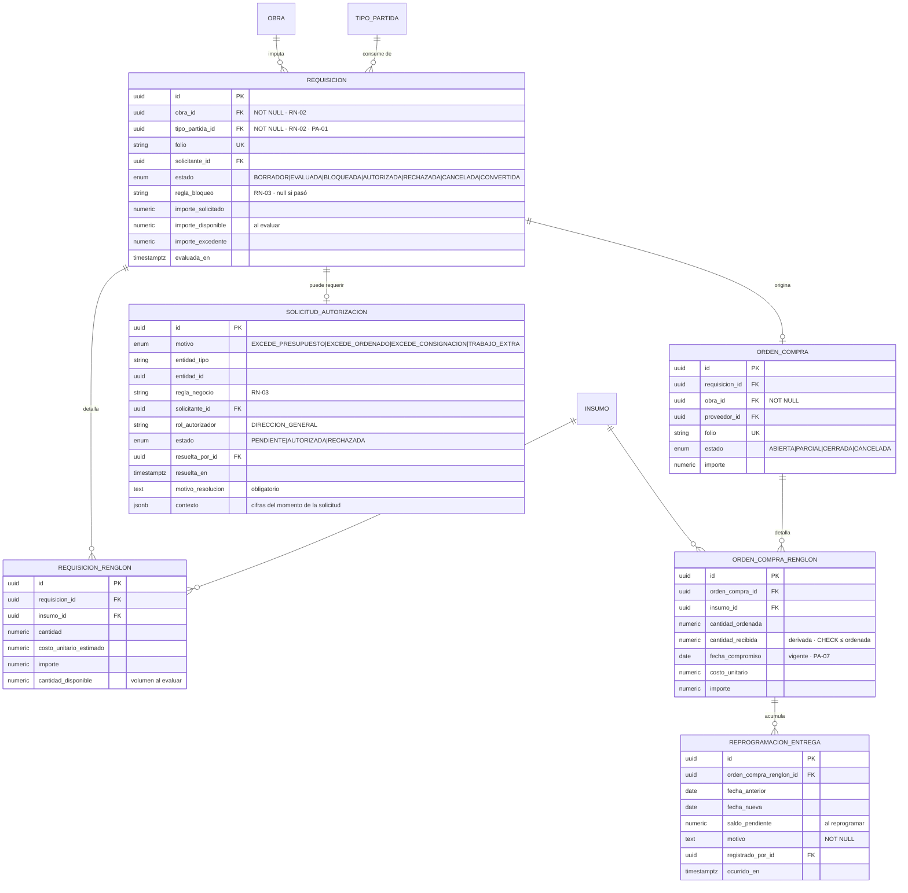
```mermaid
erDiagram
    OBRA ||--o{ REQUISICION : "imputa"
    TIPO_PARTIDA ||--o{ REQUISICION : "consume de"
    REQUISICION ||--o{ REQUISICION_RENGLON : "detalla"
    REQUISICION ||--o| SOLICITUD_AUTORIZACION : "puede requerir"
    REQUISICION ||--o| ORDEN_COMPRA : "origina"
    ORDEN_COMPRA ||--o{ ORDEN_COMPRA_RENGLON : "detalla"
    ORDEN_COMPRA_RENGLON ||--o{ REPROGRAMACION_ENTREGA : "acumula"
    INSUMO ||--o{ REQUISICION_RENGLON : ""
    INSUMO ||--o{ ORDEN_COMPRA_RENGLON : ""

    REQUISICION {
        uuid id PK
        uuid obra_id FK "NOT NULL · RN-02"
        uuid tipo_partida_id FK "NOT NULL · RN-02 · PA-01"
        string folio UK
        uuid solicitante_id FK
        enum estado "BORRADOR|EVALUADA|BLOQUEADA|AUTORIZADA|RECHAZADA|CANCELADA|CONVERTIDA"
        string regla_bloqueo "RN-03 · null si pasó"
        numeric importe_solicitado
        numeric importe_disponible "al evaluar"
        numeric importe_excedente
        timestamptz evaluada_en
    }
    REQUISICION_RENGLON {
        uuid id PK
        uuid requisicion_id FK
        uuid insumo_id FK
        numeric cantidad
        numeric costo_unitario_estimado
        numeric importe
        numeric cantidad_disponible "volumen al evaluar"
    }
    SOLICITUD_AUTORIZACION {
        uuid id PK
        enum motivo "EXCEDE_PRESUPUESTO|EXCEDE_ORDENADO|EXCEDE_CONSIGNACION|TRABAJO_EXTRA"
        string entidad_tipo
        uuid entidad_id
        string regla_negocio "RN-03"
        uuid solicitante_id FK
        string rol_autorizador "DIRECCION_GENERAL"
        enum estado "PENDIENTE|AUTORIZADA|RECHAZADA"
        uuid resuelta_por_id FK
        timestamptz resuelta_en
        text motivo_resolucion "obligatorio"
        jsonb contexto "cifras del momento de la solicitud"
    }
    ORDEN_COMPRA {
        uuid id PK
        uuid requisicion_id FK
        uuid obra_id FK "NOT NULL"
        uuid proveedor_id FK
        string folio UK
        enum estado "ABIERTA|PARCIAL|CERRADA|CANCELADA"
        numeric importe
    }
    ORDEN_COMPRA_RENGLON {
        uuid id PK
        uuid orden_compra_id FK
        uuid insumo_id FK
        numeric cantidad_ordenada
        numeric cantidad_recibida "derivada · CHECK ≤ ordenada"
        date fecha_compromiso "vigente · PA-07"
        numeric costo_unitario
        numeric importe
    }
    REPROGRAMACION_ENTREGA {
        uuid id PK
        uuid orden_compra_renglon_id FK
        date fecha_anterior
        date fecha_nueva
        numeric saldo_pendiente "al reprogramar"
        text motivo "NOT NULL"
        uuid registrado_por_id FK
        timestamptz ocurrido_en
    }
```

**La requisición bloqueada se guarda con las cifras del momento.** `importe_disponible` y `importe_excedente` se persisten en la propia fila. Recalcularlos después daría un número distinto —el presupuesto sigue consumiéndose— y el registro dejaría de explicar por qué se bloqueó. La solicitud de autorización guarda lo mismo en `contexto` como JSON.

**`solicitud_autorizacion` es genérica.** Sirve a RN-03 (excede presupuesto), RN-07 (excede lo ordenado), RN-15 (excede consignación) y a los trabajos extra. Un flujo de autorización por módulo multiplicaría el mismo código cuatro veces.

**`motivo_resolucion` es obligatorio también al autorizar.** No solo al rechazar. Sin eso, la bitácora responde *quién autorizó* pero no *por qué*, que es la mitad de RN-04.

**No existe el cierre de una orden con saldo pendiente** (PA-07). Si el proveedor no entrega, el faltante **se reprograma**: la orden permanece en `PARCIAL`, el renglón recibe una `fecha_compromiso` nueva y `reprogramacion_entrega` guarda el rastro de cuántas veces se ha aplazado y por qué. El presupuesto sigue comprometido, porque el material sigue debiéndose.

> El historial de reprogramaciones es el dato que hoy no existe y que permite responder *"¿cuántas veces nos ha aplazado este proveedor y cuánto lleva pendiente?"*. Con un cierre manual, esa información se perdería en el momento de cerrar.

---

## 6. Almacén

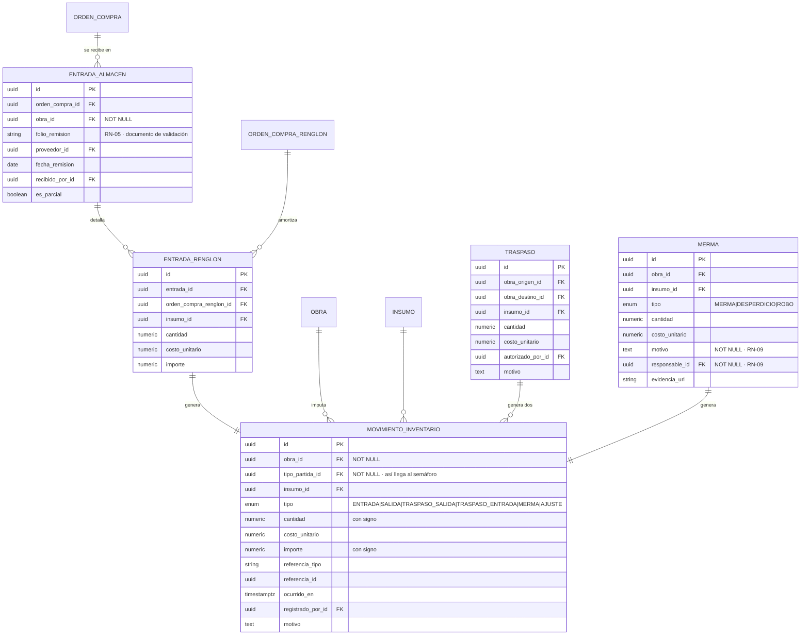
```mermaid
erDiagram
    ORDEN_COMPRA ||--o{ ENTRADA_ALMACEN : "se recibe en"
    ENTRADA_ALMACEN ||--o{ ENTRADA_RENGLON : "detalla"
    ORDEN_COMPRA_RENGLON ||--o{ ENTRADA_RENGLON : "amortiza"
    ENTRADA_RENGLON ||--|| MOVIMIENTO_INVENTARIO : "genera"
    OBRA ||--o{ MOVIMIENTO_INVENTARIO : "imputa"
    INSUMO ||--o{ MOVIMIENTO_INVENTARIO : ""
    TRASPASO ||--o{ MOVIMIENTO_INVENTARIO : "genera dos"
    MERMA ||--|| MOVIMIENTO_INVENTARIO : "genera"

    ENTRADA_ALMACEN {
        uuid id PK
        uuid orden_compra_id FK
        uuid obra_id FK "NOT NULL"
        string folio_remision "RN-05 · documento de validación"
        uuid proveedor_id FK
        date fecha_remision
        uuid recibido_por_id FK
        boolean es_parcial
    }
    ENTRADA_RENGLON {
        uuid id PK
        uuid entrada_id FK
        uuid orden_compra_renglon_id FK
        uuid insumo_id FK
        numeric cantidad
        numeric costo_unitario
        numeric importe
    }
    MOVIMIENTO_INVENTARIO {
        uuid id PK
        uuid obra_id FK "NOT NULL"
        uuid tipo_partida_id FK "NOT NULL · así llega al semáforo"
        uuid insumo_id FK
        enum tipo "ENTRADA|SALIDA|TRASPASO_SALIDA|TRASPASO_ENTRADA|MERMA|AJUSTE"
        numeric cantidad "con signo"
        numeric costo_unitario
        numeric importe "con signo"
        string referencia_tipo
        uuid referencia_id
        timestamptz ocurrido_en
        uuid registrado_por_id FK
        text motivo
    }
    TRASPASO {
        uuid id PK
        uuid obra_origen_id FK
        uuid obra_destino_id FK
        uuid insumo_id FK
        numeric cantidad
        numeric costo_unitario
        uuid autorizado_por_id FK
        text motivo
    }
    MERMA {
        uuid id PK
        uuid obra_id FK
        uuid insumo_id FK
        enum tipo "MERMA|DESPERDICIO|ROBO"
        numeric cantidad
        numeric costo_unitario
        text motivo "NOT NULL · RN-09"
        uuid responsable_id FK "NOT NULL · RN-09"
        string evidencia_url
    }
```

**`movimiento_inventario` es de solo-anexado.** No hay columna de existencia en ninguna parte: el stock de un insumo en una obra es `SUM(cantidad)` sobre sus movimientos. Un error se corrige con un movimiento `AJUSTE` de signo contrario y motivo, nunca borrando ni editando. Justificación en [ADR-005](adr/20260918-ledger-inventario.md).

**`tipo_partida_id` viaja en el propio movimiento, y no es redundancia.** Un movimiento de `ENTRADA` podría alcanzar su partida subiendo por `entrada_renglon → orden_compra → requisicion`, pero **un `AJUSTE`, una `MERMA` o un `TRASPASO` no cuelgan de ninguna orden**: no tienen esa escalera. Sin la columna, la corrección de −20 bultos del escenario 8 de [HDU-005](04-historias-usuario.md#hdu-005--entrada-de-material-con-recepción-parcial) desaparecería del ejercido y la partida seguiría cargando las 70 unidades que nunca llegaron. Se copia del `tipo_partida_id` de la requisición de origen cuando lo hay, y se captura cuando no.

**Un traspaso genera dos movimientos**, `TRASPASO_SALIDA` en la obra origen y `TRASPASO_ENTRADA` en la destino, en la misma transacción. Así el costo se mueve de una obra a otra (RN-08) y ambas obras quedan cuadradas.

**El saldo pendiente de una orden es derivado**: `cantidad_ordenada − cantidad_recibida` por renglón. `cantidad_recibida` se mantiene denormalizada para poder declarar la restricción `CHECK (cantidad_recibida <= cantidad_ordenada)`, que es RN-07 aplicada por el motor y no por confianza en la aplicación.

*`traspaso` y `merma` son de la versión 1.1; el modelo se define ahora porque `movimiento_inventario` tiene que contemplar sus tipos desde el principio.*

---

## 7. Avance y destajo

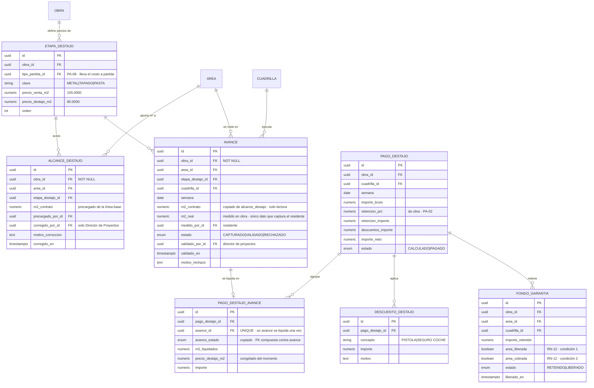
```mermaid
erDiagram
    OBRA ||--o{ ETAPA_DESTAJO : "define precios de"
    ETAPA_DESTAJO ||--o{ ALCANCE_DESTAJO : "acota"
    AREA ||--o{ ALCANCE_DESTAJO : "aporta m² a"
    AREA ||--o{ AVANCE : "se mide en"
    ETAPA_DESTAJO ||--o{ AVANCE : ""
    CUADRILLA ||--o{ AVANCE : "ejecuta"
    AVANCE ||--o| PAGO_DESTAJO_AVANCE : "se liquida en"
    PAGO_DESTAJO ||--o{ PAGO_DESTAJO_AVANCE : "agrupa"
    PAGO_DESTAJO ||--o{ DESCUENTO_DESTAJO : "aplica"
    PAGO_DESTAJO ||--o{ FONDO_GARANTIA : "retiene"

    ALCANCE_DESTAJO {
        uuid id PK
        uuid obra_id FK "NOT NULL"
        uuid area_id FK
        uuid etapa_destajo_id FK
        numeric m2_contrato "precargado de la línea base"
        uuid precargado_por_id FK
        uuid corregido_por_id FK "solo Director de Proyectos"
        text motivo_correccion
        timestamptz corregido_en
    }
    PAGO_DESTAJO_AVANCE {
        uuid id PK
        uuid pago_destajo_id FK
        uuid avance_id FK "UNIQUE · un avance se liquida una vez"
        enum avance_estado "copiado · FK compuesta contra avance"
        numeric m2_liquidados
        numeric precio_destajo_m2 "congelado del momento"
        numeric importe
    }
    ETAPA_DESTAJO {
        uuid id PK
        uuid obra_id FK
        uuid tipo_partida_id FK "PA-08 · lleva el costo a partida"
        string clave "METAL|TAPADO|PASTA"
        numeric precio_venta_m2 "105.0000"
        numeric precio_destajo_m2 "80.0000"
        int orden
    }
    AVANCE {
        uuid id PK
        uuid obra_id FK "NOT NULL"
        uuid area_id FK
        uuid etapa_destajo_id FK
        uuid cuadrilla_id FK
        date semana
        numeric m2_contrato "copiado de alcance_destajo · solo lectura"
        numeric m2_real "medido en obra · único dato que captura el residente"
        uuid medido_por_id FK "residente"
        enum estado "CAPTURADO|VALIDADO|RECHAZADO"
        uuid validado_por_id FK "director de proyectos"
        timestamptz validado_en
        text motivo_rechazo
    }
    PAGO_DESTAJO {
        uuid id PK
        uuid obra_id FK
        uuid cuadrilla_id FK
        date semana
        numeric importe_bruto
        numeric retencion_pct "de obra · PA-02"
        numeric retencion_importe
        numeric descuentos_importe
        numeric importe_neto
        enum estado "CALCULADO|PAGADO"
    }
    DESCUENTO_DESTAJO {
        uuid id PK
        uuid pago_destajo_id FK
        string concepto "PISTOLA|SEGURO COCHE"
        numeric importe
        text motivo
    }
    FONDO_GARANTIA {
        uuid id PK
        uuid obra_id FK
        uuid area_id FK
        uuid cuadrilla_id FK
        numeric importe_retenido
        boolean area_liberada "RN-12 · condición 1"
        boolean area_cobrada "RN-12 · condición 2"
        enum estado "RETENIDO|LIBERADO"
        timestamptz liberado_en
    }
```

**`m2_contrato` y `m2_real` conviven en la misma fila.** Es el modelo que el cliente ya usa en su hoja de destajo, y su diferencia es la desviación de volumen que hoy se captura y nunca se agrega. Guardarlos juntos convierte esa desviación en un `SUM` (F4.7).

**Pero el residente no teclea `m2_contrato`.** Se copia de `alcance_destajo` al abrir la captura y se muestra bloqueado; el residente solo introduce `m2_real`. La razón es que la desviación de volumen —los +1.95 m² del departamento 212 que motivan F4.7— es el hallazgo que justifica medir: si quien mide escribe también el número contra el que se compara, la desviación deja de ser auditable y mide lo que el residente quiera que mida. Se copia en lugar de referenciarse para que una corrección posterior del alcance no reescriba mediciones ya validadas, igual que `nomina_renglon.salario_semanal`.

**`alcance_destajo` es el contrato de volumen por área y etapa.** Se precarga al configurar las etapas de la obra, sumando los conceptos medibles en `M2` de las partidas de ese tipo en cada área. Sirve para dos cosas y las dos importan: es el `m2_contrato` que hereda cada medición, y es el **denominador del porcentaje de avance físico** del semáforo. Solo el Director de Proyectos puede corregirlo, con motivo y bitácora: es quien valida las mediciones, así que es quien responde de la cifra contra la que se validan.

> Los conceptos que no se miden en `M2` —los que vienen en `ML` o `PZA`— no entran en el alcance. Su material sí entra en el ejercido, así que una partida con mucho trabajo no medible en m² mostrará un avance más bajo del real y una desviación inflada. El cliente lo aceptó; el disparador de revisión está en el [PRD §10](01-descripcion-producto.md#10-supuestos-y-preguntas-abiertas).

**Solo el avance en estado `VALIDADO` genera pago.** RN-10 exige que el residente mida y el Director de Proyectos valide. `pago_destajo_avance` es la tabla puente que liquida mediciones concretas en un pago, y lleva `avance_estado` copiado para poder declarar una **clave foránea compuesta** contra `avance (id, estado)`: un avance en `CAPTURADO` o `RECHAZADO` no tiene fila a la que apuntar. Es el invariante 11, y es de motor, no de disciplina. El `UNIQUE` sobre `avance_id` impide además liquidar dos veces la misma medición.

**El fondo de garantía necesita dos banderas, no una.** RN-12 exige área liberada **y** cobrada. Con un solo campo de estado, la condición doble se pierde y alguien acabará liberando garantías de un área entregada pero no cobrada.

**`etapa_destajo.tipo_partida_id` es lo que hace que el destajo llegue al tablero por partida** (PA-08). Cada etapa se define por obra **y** tipo de partida, con sus propios precios: `METAL · MUROS` y `METAL · PLAFONES Y CAJILLOS` son dos etapas distintas aunque compartan nombre. Sin esa columna, el costo de destajo se quedaría a nivel de obra igual que la nómina, y la columna de desviación por partida seguiría cubriendo solo materiales.

**Retención y fondo de garantía son dos cosas distintas** (PA-02). `pago_destajo.retencion_pct` es la retención operativa del 15 % que se aplica en cada pago semanal; `fondo_garantia` es el 5 % contractual que se libera al entregar y cobrar el área. Ambos porcentajes viven en `obra`, no en el código.

---

## 8. Personal y nómina

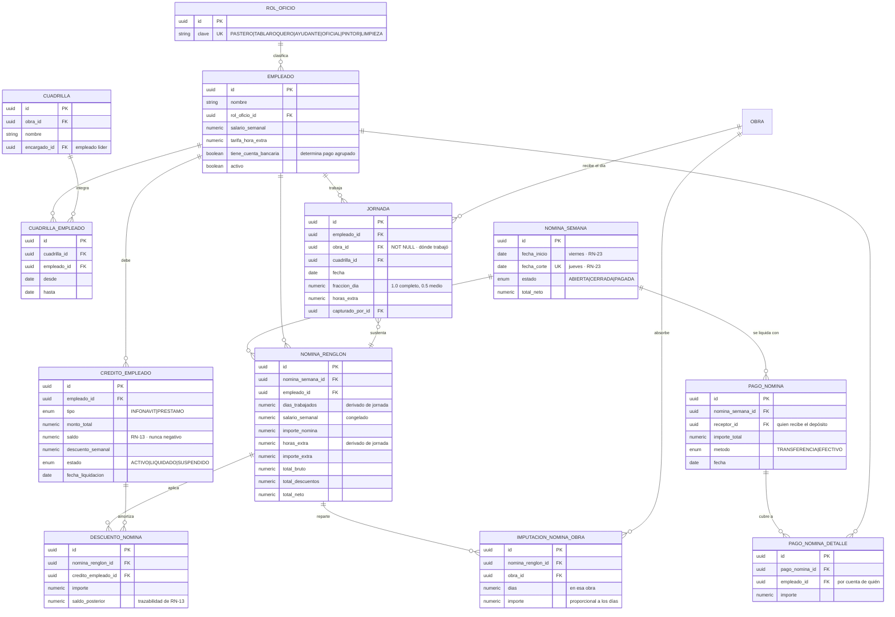
```mermaid
erDiagram
    ROL_OFICIO ||--o{ EMPLEADO : "clasifica"
    EMPLEADO ||--o{ CUADRILLA_EMPLEADO : ""
    CUADRILLA ||--o{ CUADRILLA_EMPLEADO : "integra"
    EMPLEADO ||--o{ CREDITO_EMPLEADO : "debe"
    EMPLEADO ||--o{ JORNADA : "trabaja"
    OBRA ||--o{ JORNADA : "recibe el día"
    NOMINA_SEMANA ||--o{ NOMINA_RENGLON : "detalla"
    EMPLEADO ||--o{ NOMINA_RENGLON : ""
    JORNADA }o--|| NOMINA_RENGLON : "sustenta"
    NOMINA_RENGLON ||--o{ IMPUTACION_NOMINA_OBRA : "reparte"
    OBRA ||--o{ IMPUTACION_NOMINA_OBRA : "absorbe"
    NOMINA_RENGLON ||--o{ DESCUENTO_NOMINA : "aplica"
    CREDITO_EMPLEADO ||--o{ DESCUENTO_NOMINA : "amortiza"
    NOMINA_SEMANA ||--o{ PAGO_NOMINA : "se liquida con"
    PAGO_NOMINA ||--o{ PAGO_NOMINA_DETALLE : "cubre a"
    EMPLEADO ||--o{ PAGO_NOMINA_DETALLE : ""

    ROL_OFICIO {
        uuid id PK
        string clave UK "PASTERO|TABLAROQUERO|AYUDANTE|OFICIAL|PINTOR|LIMPIEZA"
    }
    EMPLEADO {
        uuid id PK
        string nombre
        uuid rol_oficio_id FK
        numeric salario_semanal
        numeric tarifa_hora_extra
        boolean tiene_cuenta_bancaria "determina pago agrupado"
        boolean activo
    }
    CUADRILLA {
        uuid id PK
        uuid obra_id FK
        string nombre
        uuid encargado_id FK "empleado líder"
    }
    CUADRILLA_EMPLEADO {
        uuid id PK
        uuid cuadrilla_id FK
        uuid empleado_id FK
        date desde
        date hasta
    }
    CREDITO_EMPLEADO {
        uuid id PK
        uuid empleado_id FK
        enum tipo "INFONAVIT|PRESTAMO"
        numeric monto_total
        numeric saldo "RN-13 · nunca negativo"
        numeric descuento_semanal
        enum estado "ACTIVO|LIQUIDADO|SUSPENDIDO"
        date fecha_liquidacion
    }
    JORNADA {
        uuid id PK
        uuid empleado_id FK
        uuid obra_id FK "NOT NULL · dónde trabajó"
        uuid cuadrilla_id FK
        date fecha
        numeric fraccion_dia "1.0 completo, 0.5 medio"
        numeric horas_extra
        uuid capturado_por_id FK
    }
    NOMINA_SEMANA {
        uuid id PK
        date fecha_inicio "viernes · RN-23"
        date fecha_corte UK "jueves · RN-23"
        enum estado "ABIERTA|CERRADA|PAGADA"
        numeric total_neto
    }
    NOMINA_RENGLON {
        uuid id PK
        uuid nomina_semana_id FK
        uuid empleado_id FK
        numeric dias_trabajados "derivado de jornada"
        numeric salario_semanal "congelado"
        numeric importe_nomina
        numeric horas_extra "derivado de jornada"
        numeric importe_extra
        numeric total_bruto
        numeric total_descuentos
        numeric total_neto
    }
    IMPUTACION_NOMINA_OBRA {
        uuid id PK
        uuid nomina_renglon_id FK
        uuid obra_id FK
        numeric dias "en esa obra"
        numeric importe "proporcional a los días"
    }
    DESCUENTO_NOMINA {
        uuid id PK
        uuid nomina_renglon_id FK
        uuid credito_empleado_id FK
        numeric importe
        numeric saldo_posterior "trazabilidad de RN-13"
    }
    PAGO_NOMINA {
        uuid id PK
        uuid nomina_semana_id FK
        uuid receptor_id FK "quien recibe el depósito"
        numeric importe_total
        enum metodo "TRANSFERENCIA|EFECTIVO"
        date fecha
    }
    PAGO_NOMINA_DETALLE {
        uuid id PK
        uuid pago_nomina_id FK
        uuid empleado_id FK "por cuenta de quién"
        numeric importe
    }
```

**El pago agrupado se modela separando *quién recibe* de *por quién*.** `PAGO_NOMINA.receptor_id` es el líder de cuadrilla al que se deposita; `PAGO_NOMINA_DETALLE` desglosa a qué trabajador corresponde cada peso. Es la única forma de responder a *"cuánto se le pagó a quién y por qué y para quiénes"* (RN-14) cuando el registro real dice `OMAR Y JUAN` en una sola línea.

Una restricción cierra el modelo: **la suma del detalle tiene que igualar el importe del pago**. Sin ella, el desglose se desincroniza del depósito y la trazabilidad se vuelve decorativa.

**`saldo_posterior` en cada descuento** deja el rastro completo de la amortización de un crédito: qué semana, cuánto se descontó y cómo quedó. RN-13 exige marcar el crédito como liquidado al llegar a cero, y esta columna permite auditar que la transición ocurrió cuando debía.

**`salario_semanal` se copia en el renglón.** Si el salario del empleado cambia, las nóminas anteriores no pueden cambiar con él.

### 8.1. La jornada: por qué existe

`RN-23` cambió el modelo. El cliente lo dijo así: *"se paga lo trabajado del día viernes al jueves aunque se trabaje en obras distintas; se tiene que tener cuándo y dónde trabajó el empleado."*

Tres consecuencias, y ninguna es cosmética:

**La semana no es natural.** Va de **viernes a jueves**, con corte el jueves y pago el sábado — el mismo día de corte que los proveedores (`RN-17`). `nomina_semana` guarda `fecha_inicio` y `fecha_corte` explícitas en lugar de un número de semana, porque ningún estándar de semana ISO coincide con este calendario.

**`nomina_semana` dejó de colgar de una obra.** Antes tenía `obra_id`, lo que presuponía que un empleado trabajaba en una sola obra por semana. Es falso. Ahora la semana de nómina es de la empresa; la obra entra por la jornada.

**El costo por obra se deriva, no se estima.** Cada día trabajado se registra con su obra. `imputacion_nomina_obra` reparte el neto del empleado en proporción a los días efectivamente trabajados en cada obra: tres días en Union Square y dos en ENITI reparten 3/5 y 2/5. Es lo que lee el semáforo.

> El supuesto anterior —*"imputación por cuadrilla-semana-obra, con reparto manual si hay varias"*— habría producido un costo de mano de obra por obra que era una estimación presentada como dato. En un producto cuyo propósito es que la dirección confíe en la cifra, esa diferencia lo es todo.

`UNIQUE (empleado_id, fecha)` impide que un empleado tenga dos jornadas el mismo día, que es la única forma de que el reparto sumara más del 100 %.

---

## 9. Proveedores · v1.1

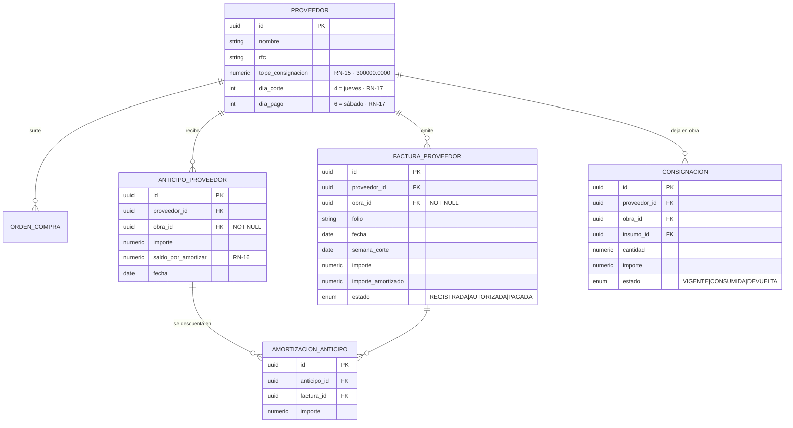
```mermaid
erDiagram
    PROVEEDOR ||--o{ ORDEN_COMPRA : "surte"
    PROVEEDOR ||--o{ FACTURA_PROVEEDOR : "emite"
    PROVEEDOR ||--o{ ANTICIPO_PROVEEDOR : "recibe"
    ANTICIPO_PROVEEDOR ||--o{ AMORTIZACION_ANTICIPO : "se descuenta en"
    FACTURA_PROVEEDOR ||--o{ AMORTIZACION_ANTICIPO : ""
    PROVEEDOR ||--o{ CONSIGNACION : "deja en obra"

    PROVEEDOR {
        uuid id PK
        string nombre
        string rfc
        numeric tope_consignacion "RN-15 · 300000.0000"
        int dia_corte "4 = jueves · RN-17"
        int dia_pago "6 = sábado · RN-17"
    }
    FACTURA_PROVEEDOR {
        uuid id PK
        uuid proveedor_id FK
        uuid obra_id FK "NOT NULL"
        string folio
        date fecha
        date semana_corte
        numeric importe
        numeric importe_amortizado
        enum estado "REGISTRADA|AUTORIZADA|PAGADA"
    }
    ANTICIPO_PROVEEDOR {
        uuid id PK
        uuid proveedor_id FK
        uuid obra_id FK "NOT NULL"
        numeric importe
        numeric saldo_por_amortizar "RN-16"
        date fecha
    }
    AMORTIZACION_ANTICIPO {
        uuid id PK
        uuid anticipo_id FK
        uuid factura_id FK
        numeric importe
    }
    CONSIGNACION {
        uuid id PK
        uuid proveedor_id FK
        uuid obra_id FK
        uuid insumo_id FK
        numeric cantidad
        numeric importe
        enum estado "VIGENTE|CONSUMIDA|DEVUELTA"
    }
```

**El tope de consignación vive en el proveedor, no en una constante.** El cliente dio un ejemplo (`CoPanel · $300,000`) pero es evidentemente configurable por proveedor.

**`orden_compra.proveedor_id` existe desde el MVP** aunque el módulo completo sea v1.1: la orden de compra necesita saber a quién se le pide desde el primer día. En MVP el proveedor es un catálogo mínimo (nombre y RFC); las funcionalidades de anticipos y consignación llegan después.

---

## 10. Identidad y auditoría

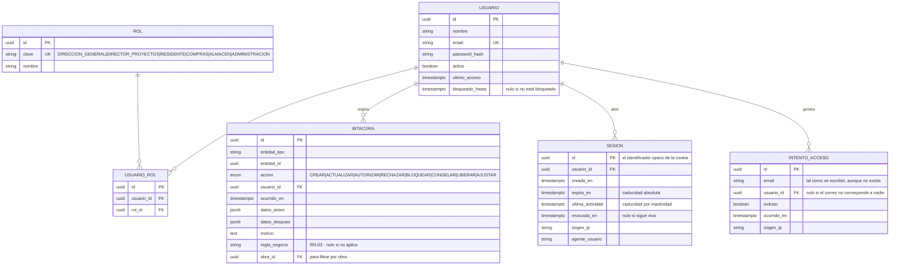
```mermaid
erDiagram
    USUARIO ||--o{ USUARIO_ROL : ""
    ROL ||--o{ USUARIO_ROL : ""
    USUARIO ||--o{ BITACORA : "origina"
    USUARIO ||--o{ SESION : "abre"
    USUARIO ||--o{ INTENTO_ACCESO : "genera"

    USUARIO {
        uuid id PK
        string nombre
        string email UK
        string password_hash
        boolean activo
        timestamptz ultimo_acceso
        timestamptz bloqueado_hasta "nulo si no está bloqueado"
    }
    SESION {
        uuid id PK "el identificador opaco de la cookie"
        uuid usuario_id FK
        timestamptz creada_en
        timestamptz expira_en "caducidad absoluta"
        timestamptz ultima_actividad "caducidad por inactividad"
        timestamptz revocada_en "nulo si sigue viva"
        string origen_ip
        string agente_usuario
    }
    INTENTO_ACCESO {
        uuid id PK
        string email "tal como se escribió, aunque no exista"
        uuid usuario_id FK "nulo si el correo no corresponde a nadie"
        boolean exitoso
        timestamptz ocurrido_en
        string origen_ip
    }
    ROL {
        uuid id PK
        string clave UK "DIRECCION_GENERAL|DIRECTOR_PROYECTOS|RESIDENTE|COMPRAS|ALMACEN|ADMINISTRACION"
        string nombre
    }
    USUARIO_ROL {
        uuid id PK
        uuid usuario_id FK
        uuid rol_id FK
    }
    BITACORA {
        uuid id PK
        string entidad_tipo
        uuid entidad_id
        enum accion "CREAR|ACTUALIZAR|AUTORIZAR|RECHAZAR|BLOQUEAR|CONGELAR|LIBERAR|AJUSTAR"
        uuid usuario_id FK
        timestamptz ocurrido_en
        jsonb datos_antes
        jsonb datos_despues
        text motivo
        string regla_negocio "RN-03 · nulo si no aplica"
        uuid obra_id FK "para filtrar por obra"
    }
```

La relación `usuario_rol` es de muchos a muchos porque el PRD asume que en una empresa de este tamaño una persona puede acumular roles.

**`bitacora.regla_negocio`** es la columna que convierte la bitácora en algo consultable. Permite responder *"¿cuántas veces se intentó sobregirar una partida este mes y quién lo autorizó?"* con una consulta, que es exactamente el tipo de pregunta que hoy no tiene respuesta.

La tabla se protege a nivel de motor: el rol de aplicación tiene permiso de `INSERT` y `SELECT`, no de `UPDATE` ni `DELETE`.

### `sesion` — por qué es una tabla y no una firma

**La cookie no lleva información, lleva un identificador.** Todo lo que decide qué puede hacer alguien —si sigue activo, qué roles tiene, si la sesión sigue viva— se resuelve contra la base de datos en cada petición.

La alternativa es una credencial autocontenida y firmada, sea un JWT o una cookie de sesión firmada. Las dos funcionan y las dos tienen el mismo defecto aquí: **quitarle el rol a alguien no surte efecto hasta que su credencial caduca**. En un sistema donde el rol decide quién puede autorizar un sobregiro, esa ventana convierte un control en un trámite. Razonado en [ADR-014](adr/20260919-sesion-con-estado.md).

Consecuencia operativa: una sesión se cierra escribiendo `revocada_en`, **nunca borrando la fila**. Quién estuvo conectado y desde dónde es un dato de auditoría, no basura que limpiar. Las filas caducadas se purgan por antigüedad, no al cerrar sesión.

### `intento_acceso` — el bloqueo necesita memoria

`RNF-04` exige limitar los intentos, y para limitarlos hay que contarlos. La tabla guarda todos los intentos, **también los que fallan por un correo que no existe**: son la forma habitual de sondear qué cuentas hay.

**`usuario.bloqueado_hasta` es la decisión; `intento_acceso` es la evidencia.** Separarlas permite que el bloqueo se compruebe con una lectura de la fila del usuario, sin contar nada, y que el recuento viva en una tabla que crece y se purga sin tocar el catálogo de usuarios.

> **El bloqueo es temporal y nunca permanente.** Una cuenta bloqueada para siempre por intentos fallidos es una denegación de servicio que cualquiera puede provocar contra el Director de Proyectos un viernes por la tarde.

---

## 11. Importación

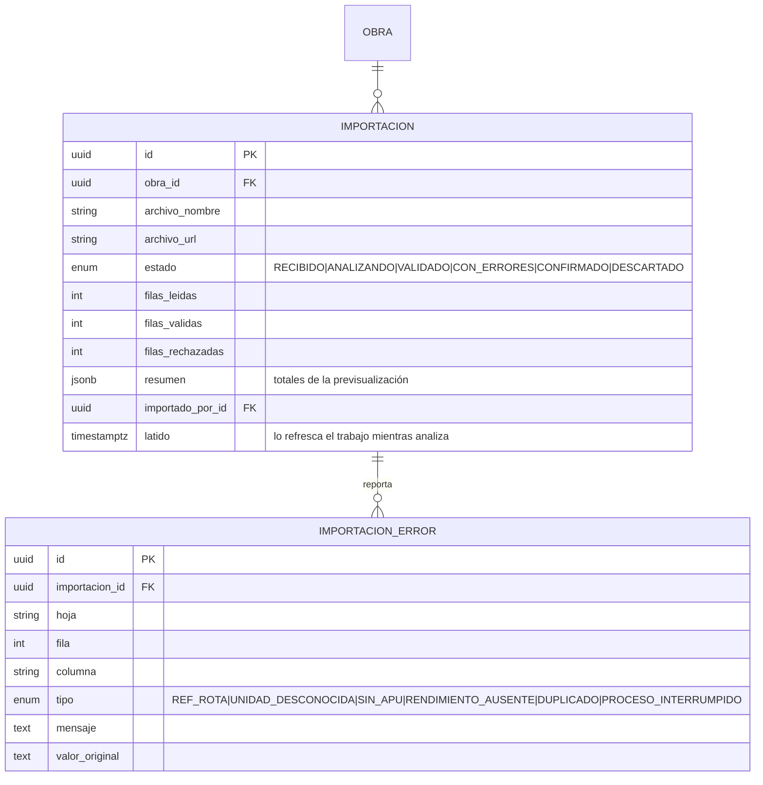
```mermaid
erDiagram
    IMPORTACION ||--o{ IMPORTACION_ERROR : "reporta"
    OBRA ||--o{ IMPORTACION : ""

    IMPORTACION {
        uuid id PK
        uuid obra_id FK
        string archivo_nombre
        string archivo_url
        enum estado "RECIBIDO|ANALIZANDO|VALIDADO|CON_ERRORES|CONFIRMADO|DESCARTADO"
        int filas_leidas
        int filas_validas
        int filas_rechazadas
        jsonb resumen "totales de la previsualización"
        uuid importado_por_id FK
        timestamptz latido "lo refresca el trabajo mientras analiza"
    }
    IMPORTACION_ERROR {
        uuid id PK
        uuid importacion_id FK
        string hoja
        int fila
        string columna
        enum tipo "REF_ROTA|UNIDAD_DESCONOCIDA|SIN_APU|RENDIMIENTO_AUSENTE|DUPLICADO|PROCESO_INTERRUMPIDO"
        text mensaje
        text valor_original
    }
```

El tipo `REF_ROTA` no es hipotético: el catálogo de Union Square tiene `#REF!` en todas sus columnas de precio. El importador tiene que reportarlo fila por fila, no fallar en bloque.

**`latido` y `PROCESO_INTERRUMPIDO` existen para un fallo que no es del archivo, sino del servidor** (`RNF-17`). El análisis corre dentro del proceso del API; si ese proceso se reinicia a mitad, la fila se queda en `ANALIZANDO` y no hay nadie que la mueva — y mientras tanto la obra no admite otra importación. Al arrancar, la aplicación barre las importaciones en `ANALIZANDO` con el latido vencido, las pasa a `CON_ERRORES` y les añade un error de este tipo.

Es el mínimo que hace falta: la fase de análisis no escribe en el modelo real, así que una interrupción no puede dejar datos a medias. Solo puede dejar una fila mintiendo sobre su propio estado, y eso sí necesita quien lo corrija.

---

## 12. Invariantes en base de datos

Estos invariantes se declaran en el esquema porque **un invariante que solo vive en el código se rompe el día que alguien escribe por otra vía** — un script de migración, una corrección manual, un endpoint nuevo que olvidó la validación.

| # | Invariante | Mecanismo | Regla |
|---|---|---|---|
| 1 | Todo movimiento de costo tiene obra, y requisición y movimiento de inventario además tipo de partida | `NOT NULL` en `obra_id` de requisición, orden, entrada, movimiento, jornada, avance · `NOT NULL` en `requisicion.tipo_partida_id` y `movimiento_inventario.tipo_partida_id` | RN-02 |
| 2 | No se recibe más de lo ordenado | `CHECK (cantidad_recibida <= cantidad_ordenada)` | RN-07 |
| 3 | El saldo de un crédito nunca es negativo | `CHECK (saldo >= 0)` | RN-13 |
| 4 | Un crédito liquidado tiene saldo cero | `CHECK (estado <> 'LIQUIDADO' OR saldo = 0)` | RN-13 |
| 5 | Una sola línea base congelada vigente por obra | Índice único parcial `WHERE estado = 'CONGELADA'` | RN-01 |
| 6 | Un presupuesto de control por línea base y tipo de partida | `UNIQUE (linea_base_id, tipo_partida_id)` | RN-03 |
| 7 | El desglose de un pago agrupado suma el total | Restricción diferida verificada al confirmar | RN-14 |
| 8 | Cantidades y precios no negativos | `CHECK (cantidad >= 0)`, `CHECK (costo_unitario >= 0)` | — |
| 9 | Una resolución de autorización exige motivo | `CHECK (estado = 'PENDIENTE' OR motivo_resolucion IS NOT NULL)` | RN-04 |
| 10 | La bitácora no se modifica | Permisos: sin `UPDATE` ni `DELETE` para el rol de aplicación | RN-04 |
| 11 | Un avance pagado está validado | Clave foránea compuesta que incluye el estado | RN-10 |
| 12 | El fondo se libera solo con las dos condiciones | `CHECK (estado <> 'LIBERADO' OR (area_liberada AND area_cobrada))` | RN-12 |
| 13 | Un concepto es único por obra | `UNIQUE (obra_id, codigo)` | — |
| 14 | Una línea base congelada no se altera | Disparador que rechaza `UPDATE`/`DELETE` sobre sus copias | RN-01 |
| 15 | Una cuadrilla cobra por destajo **o** por nómina en una semana, nunca por ambas | `UNIQUE (obra_id, cuadrilla_id, semana)` sobre `modalidad_pago_semana` | RN-22 |
| 16 | Un empleado no tiene dos jornadas el mismo día | `UNIQUE (empleado_id, fecha)` sobre `jornada` | RN-23 |
| 17 | El reparto de nómina entre obras suma el neto del renglón | Restricción diferida sobre `imputacion_nomina_obra` | RN-23 |
| 18 | Una semana de nómina va de viernes a jueves | `CHECK (fecha_corte = fecha_inicio + 6 AND EXTRACT(DOW FROM fecha_corte) = 4)` | RN-23 |
| 19 | El rendimiento congelado nunca se sobrescribe con el observado | Viven en tablas distintas: `explosion_presupuesto` y `rendimiento_observado` | RN-24 |
| 20 | El registro de intentos de acceso no se altera desde la aplicación | Permisos: el rol de aplicación tiene `INSERT` y `SELECT` sobre `intento_acceso`, no `UPDATE` ni `DELETE` | `RNF-04` |
| 21 | Las consultas de analítica no pueden escribir | Rol de PostgreSQL con solo `SELECT`, que es con el que `analitica` se conecta | `RNF-09` |
| 22 | El alcance de destajo es único por área y etapa: precargarlo dos veces duplicaría el denominador del avance | `UNIQUE (area_id, etapa_destajo_id)` sobre `alcance_destajo` | RN-21 |

**El invariante 15 se apoya en una tabla que existe solo para sostenerlo.** `modalidad_pago_semana` guarda una fila por obra, cuadrilla y semana con la modalidad reclamada (`DESTAJO` o `NOMINA`). El primer pago de la semana la inserta; el segundo, si es de la otra modalidad, choca contra la restricción única y falla. Sin ella la regla dependería de una comprobación en la aplicación que cualquier ruta nueva podría saltarse, y la consecuencia —contabilizar dos veces el mismo trabajo en el semáforo— es silenciosa.

```
modalidad_pago_semana
  id UUID PK · obra_id FK · cuadrilla_id FK · semana DATE
  modalidad ENUM('DESTAJO','NOMINA')
  UNIQUE (obra_id, cuadrilla_id, semana)
```

El invariante 14 merece una nota: es el único que necesita un disparador en lugar de una restricción declarativa, porque PostgreSQL no permite marcar filas como inmutables de forma nativa. Dado que el principio 1 es el más importante del producto, el disparador está justificado.

**Los invariantes 10, 20 y 21 no son restricciones: son permisos.** Los tres dicen lo mismo desde ángulos distintos —hay escrituras que el rol de aplicación simplemente no puede hacer— y los tres se crean en la migración inicial, no a mano en el servidor. El 21 es el que cierra un hueco viejo: que `analitica` solo lea era hasta ahora una propiedad dibujada en un diagrama, porque `import-linter` comprueba quién importa a quién y no quién escribe.

Para que sirvan de algo, **las pruebas de integración se conectan con el rol de aplicación**, no con el propietario del esquema. Con el propietario, el `UPDATE` sobre la bitácora funcionaría y la prueba que lo intenta quedaría verde por no tener nada que verificar.

---

## 13. Máquinas de estado

### Requisición

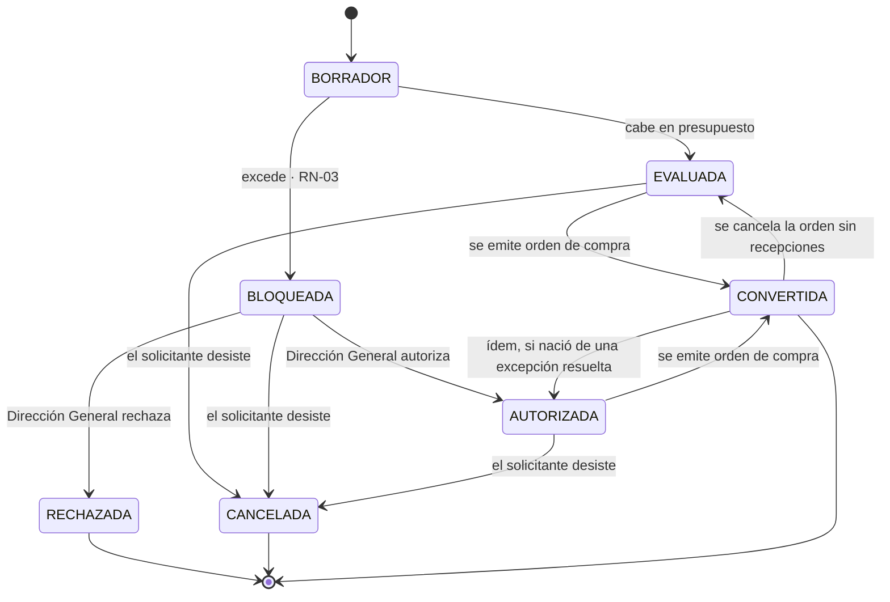
```mermaid
stateDiagram-v2
    [*] --> BORRADOR
    BORRADOR --> EVALUADA: cabe en presupuesto
    BORRADOR --> BLOQUEADA: excede · RN-03
    BLOQUEADA --> AUTORIZADA: Dirección General autoriza
    BLOQUEADA --> RECHAZADA: Dirección General rechaza
    EVALUADA --> CONVERTIDA: se emite orden de compra
    AUTORIZADA --> CONVERTIDA: se emite orden de compra
    CONVERTIDA --> EVALUADA: se cancela la orden sin recepciones
    CONVERTIDA --> AUTORIZADA: ídem, si nació de una excepción resuelta
    EVALUADA --> CANCELADA: el solicitante desiste
    BLOQUEADA --> CANCELADA: el solicitante desiste
    AUTORIZADA --> CANCELADA: el solicitante desiste
    RECHAZADA --> [*]
    CANCELADA --> [*]
    CONVERTIDA --> [*]
```

`BLOQUEADA` es un estado persistido, no un error transitorio: es lo que permite contar cuántas veces se intentó sobregirar cada partida.

**`RECHAZADA` y `CANCELADA` no son lo mismo y separarlas importa.** `RECHAZADA` es una decisión de Dirección General sobre una excepción: forma parte del expediente de `RN-04` y responde a *"¿cuántos sobregiros se pidieron y cuántos se negaron?"*. `CANCELADA` es que el solicitante desistió, y no dice nada sobre ninguna autorización. Con un solo estado para las dos cosas, la consulta de excepciones del mes mezclaría negativas de Dirección con requisiciones que nadie llegó a pedir.

**Cancelar es la única forma de liberar presupuesto reservado.** Una requisición `EVALUADA` o `AUTORIZADA` consume desde que se evalúa y **no caduca sola**, así que las tres transiciones a `CANCELADA` son el único desagüe del sistema. Por eso HDU-002 ofrece la consulta de requisiciones evaluadas sin convertir: sin ella la reserva es invisible y nadie sabe qué cancelar.

**`CONVERTIDA` no es terminal.** Cancelar una orden de compra sin recepciones devuelve la requisición a su estado anterior —`EVALUADA` o `AUTORIZADA` según tuviera o no una excepción resuelta detrás— para que pueda volver a convertirse. Volver siempre a `EVALUADA` perdería la autorización de Dirección y obligaría a pedirla otra vez para el mismo gasto ya aprobado.

### Orden de compra

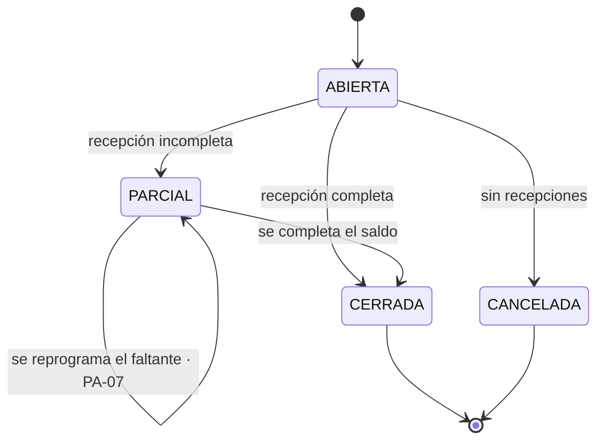
```mermaid
stateDiagram-v2
    [*] --> ABIERTA
    ABIERTA --> PARCIAL: recepción incompleta
    PARCIAL --> PARCIAL: nueva recepción parcial
    PARCIAL --> PARCIAL: se reprograma el faltante · PA-07
    ABIERTA --> CERRADA: recepción completa
    PARCIAL --> CERRADA: se completa el saldo
    ABIERTA --> CANCELADA: sin recepciones
    CERRADA --> [*]
    CANCELADA --> [*]
```

**Una orden solo llega a `CERRADA` cuando se entrega completa** (PA-07). No existe transición de cierre con saldo: si el proveedor no entrega, el faltante se reprograma y la orden permanece en `PARCIAL` indefinidamente. Cancelar solo es posible mientras no haya ninguna recepción.

### Avance

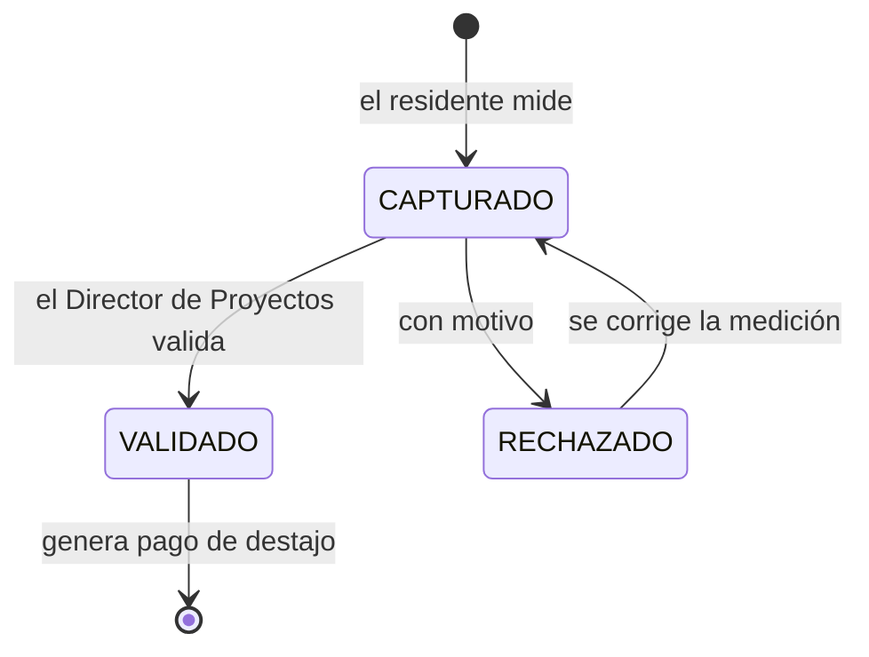
```mermaid
stateDiagram-v2
    [*] --> CAPTURADO: el residente mide
    CAPTURADO --> VALIDADO: el Director de Proyectos valida
    CAPTURADO --> RECHAZADO: con motivo
    RECHAZADO --> CAPTURADO: se corrige la medición
    VALIDADO --> [*]: genera pago de destajo
```

### Línea base

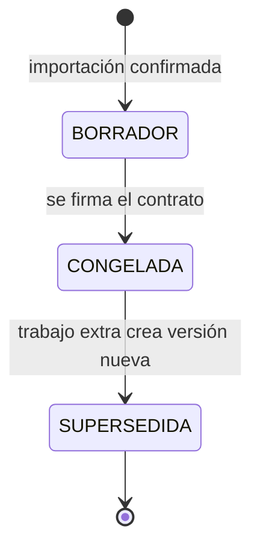
```mermaid
stateDiagram-v2
    [*] --> BORRADOR: importación confirmada
    BORRADOR --> CONGELADA: se firma el contrato
    CONGELADA --> SUPERSEDIDA: trabajo extra crea versión nueva
    SUPERSEDIDA --> [*]
```

Una línea base `CONGELADA` **nunca vuelve a `BORRADOR`**. Solo puede ser sustituida por una versión posterior, y la anterior se conserva íntegra.

---

## 14. La consulta del semáforo

El entregable del producto se resuelve con una consulta por obra, agrupada por **tipo de partida** (PA-01). Expresada conceptualmente:

```sql
WITH presupuestado AS (           -- CAPTURADO por Dirección · PA-03
    SELECT pc.tipo_partida_id, pc.importe_tope AS importe
    FROM presupuesto_control pc
    JOIN linea_base lb ON lb.id = pc.linea_base_id
    WHERE lb.obra_id = :obra_id AND lb.estado = 'CONGELADA'
),
comprometido AS (                 -- ordenado y aún no recibido
    SELECT r.tipo_partida_id,
           SUM((ocr.cantidad_ordenada - ocr.cantidad_recibida) * ocr.costo_unitario) AS importe
    FROM orden_compra_renglon ocr
    JOIN orden_compra oc ON oc.id = ocr.orden_compra_id
    JOIN requisicion r   ON r.id  = oc.requisicion_id
    WHERE oc.obra_id = :obra_id AND oc.estado IN ('ABIERTA','PARCIAL')
    GROUP BY r.tipo_partida_id
),
ejercido_materiales AS (          -- directo del libro mayor, sin pasar por la orden
    SELECT mi.tipo_partida_id, SUM(mi.importe) AS importe
    FROM movimiento_inventario mi
    WHERE mi.obra_id = :obra_id
      AND mi.tipo IN ('ENTRADA', 'AJUSTE', 'MERMA',
                      'TRASPASO_SALIDA', 'TRASPASO_ENTRADA')
    GROUP BY mi.tipo_partida_id
),
ejercido_destajo AS (             -- llega a partida vía la etapa · PA-08
    SELECT ed.tipo_partida_id, SUM(pd.importe_bruto) AS importe
    FROM pago_destajo pd
    JOIN pago_destajo_avance pda ON pda.pago_destajo_id = pd.id
    JOIN avance a                ON a.id = pda.avance_id
    JOIN etapa_destajo ed        ON ed.id = a.etapa_destajo_id
    WHERE pd.obra_id = :obra_id
    GROUP BY ed.tipo_partida_id
),
alcance AS (                      -- DENOMINADOR: m² comprometidos, todas las áreas y etapas
    SELECT ed.tipo_partida_id, SUM(ad.m2_contrato) AS m2
    FROM alcance_destajo ad
    JOIN etapa_destajo ed ON ed.id = ad.etapa_destajo_id
    WHERE ad.obra_id = :obra_id
    GROUP BY ed.tipo_partida_id
),
ejecutado AS (                    -- NUMERADOR: solo lo VALIDADO
    SELECT ed.tipo_partida_id, SUM(a.m2_real) AS m2
    FROM avance a
    JOIN etapa_destajo ed ON ed.id = a.etapa_destajo_id
    WHERE a.obra_id = :obra_id AND a.estado = 'VALIDADO'
    GROUP BY ed.tipo_partida_id
),
avance_fisico AS (
    SELECT al.tipo_partida_id,
           ej.m2 / al.m2 AS porcentaje   -- NULL mientras no haya nada validado
    FROM alcance al
    LEFT JOIN ejecutado ej ON ej.tipo_partida_id = al.tipo_partida_id
    WHERE al.m2 > 0
)
SELECT tp.id,
       tp.nombre                                              AS partida,
       pr.importe                                             AS presupuestado,
       COALESCE(cm.importe, 0)                                AS comprometido,
       COALESCE(em.importe, 0) + COALESCE(ed.importe, 0)      AS ejercido,
       av.porcentaje                                          AS avance,
       CASE WHEN av.porcentaje IS NULL THEN NULL              -- «sin avance medido»
            ELSE COALESCE(em.importe, 0) + COALESCE(ed.importe, 0)
                 - pr.importe * av.porcentaje
       END                                                    AS desviacion
FROM tipo_partida tp
JOIN presupuestado pr ON pr.tipo_partida_id = tp.id
LEFT JOIN comprometido        cm ON cm.tipo_partida_id = tp.id
LEFT JOIN ejercido_materiales em ON em.tipo_partida_id = tp.id
LEFT JOIN ejercido_destajo    ed ON ed.tipo_partida_id = tp.id
LEFT JOIN avance_fisico       av ON av.tipo_partida_id = tp.id;
```

**La última columna es todo el producto.** Compara dinero gastado contra obra realmente construida, no contra el calendario. Una partida al 40 % de avance con el 70 % ejercido sale en rojo aunque falten meses de plazo.

Cuatro filas por obra en lugar de ~572. Es lo que cambió `PA-01`, y de paso hizo la consulta trivial de leer.

### El avance se divide entre el alcance, no entre lo ya medido

Es el detalle del que depende que la última columna signifique algo, y es fácil equivocarlo.

**El denominador es `alcance_destajo`**: los m² que la obra tiene comprometidos en ese tipo de partida, sumando todas sus áreas y todas sus etapas. Un muro de 100 m² que pasa por `METAL`, `TAPADO` y `PASTA` aporta 300 m² y solo llega al 100 % cuando las tres etapas están validadas.

**Lo que no puede ser el denominador es `SUM(avance.m2_contrato)`.** Sumar los m² de contrato *de las mediciones ya hechas* da el cociente entre lo medido y lo que se esperaba medir — el índice de desviación de volumen, 83.82 ÷ 81.87 ≈ 1.02 en el departamento 212 — y por tanto un avance próximo al 100 % desde la primera medición de la obra. La desviación se calcularía contra el presupuesto entero y una partida recién empezada saldría en verde. Es el mismo dato que F4.7 reporta, y tiene su sitio, pero no es este.

**`porcentaje` es `NULL`, no cero, mientras no haya nada validado.** Un cero haría que `desviacion = ejercido`, que es justo lo que el escenario 9 de [HDU-006](04-historias-usuario.md#hdu-006--semáforo-de-obra) prohíbe: una partida sin medir se marcaría como desviada por todo lo que lleva gastado. El `CASE` propaga el `NULL` a la desviación y la interfaz lo presenta como *"sin avance medido"*, que es distinto de una desviación de cero.

### El consumido de `RN-03`

`RN-03` evalúa contra `disponible = presupuestado − consumido`, y **el consumido reutiliza las columnas del propio semáforo**. No es una consulta paralela: si el tablero y el bloqueo calcularan distinto, el disponible que Compras ve en pantalla no sería el que la regla aplica.

```sql
requisiciones_vivas AS (          -- evaluadas o autorizadas, aún sin orden de compra
    SELECT r.tipo_partida_id, SUM(r.importe_solicitado) AS importe
    FROM requisicion r
    WHERE r.obra_id = :obra_id
      AND r.estado IN ('EVALUADA', 'AUTORIZADA')
    GROUP BY r.tipo_partida_id
)
-- consumido = requisiciones_vivas + comprometido + ejercido
--             (comprometido y ejercido son las CTE de arriba, sin cambios)
```

Tres propiedades deliberadas:

**Cada peso se cuenta una sola vez.** Una requisición consume mientras está viva; al convertirse en orden deja de contar como requisición y pasa a contar en `comprometido` como saldo no recibido; al llegar el material deja el saldo y pasa a `ejercido`. Sumar órdenes y entradas sin restar lo recibido contaría dos veces el mismo material.

**Las requisiciones vivas cuentan, y por eso el bloqueo funciona.** Sin ellas, las dos requisiciones simultáneas de $8,000 contra $12,000 del escenario 9 de HDU-002 pasarían las dos: ninguna habría consumido nada todavía. El bloqueo pesimista serializa las transacciones, pero serializar dos lecturas que ven cero consumido no impide nada.

**La reserva se libera cancelando, nunca por caducidad.** Una requisición evaluada y olvidada retiene presupuesto indefinidamente. Es una decisión consciente, con su disparador de revisión en el [PRD §10](01-descripcion-producto.md#10-supuestos-y-preguntas-abiertas), y su contrapeso es la consulta de requisiciones evaluadas sin convertir que Compras tiene en HDU-002.

**El control por volumen es la misma fórmula con otra unidad**: en lugar de importes, cantidades por insumo, contra `explosion_presupuesto.cantidad_presupuestada`. Los renglones de las requisiciones vivas, los saldos de orden y las entradas se suman por `insumo_id` en vez de por `tipo_partida_id`.

### La nómina va aparte

PA-08 resolvió el destajo: cada etapa pertenece a un tipo de partida, así que su costo llega al semáforo agrupado como el material. **La nómina no.** Un tablaroquero de sueldo fijo trabaja el día en lo que haga falta; exigirle imputar su jornada a una partida produciría un dato inventado.

```sql
-- Mano de obra de nómina: derivada de las jornadas diarias · RN-23
nomina_obra AS (
    SELECT SUM(ino.importe) AS importe
    FROM imputacion_nomina_obra ino
    JOIN nomina_renglon nr ON nr.id = ino.nomina_renglon_id
    JOIN nomina_semana ns  ON ns.id = nr.nomina_semana_id
    WHERE ino.obra_id = :obra_id AND ns.estado IN ('CERRADA','PAGADA')
)
```

Se presenta como **fila propia al nivel de la obra**, marcada como no imputada a partida. Entra en el total, queda fuera de las desviaciones por partida. El cliente lo confirmó como aceptable (PA-10) y lo verifica el escenario 5 de [HDU-006](04-historias-usuario.md#hdu-006--semáforo-de-obra).

**El importe ya no es una estimación.** `imputacion_nomina_obra` reparte el neto de cada empleado en proporción a los días que efectivamente trabajó en cada obra, tomados de `jornada`. Antes de `RN-23` esto era un reparto manual; ahora es un dato derivado.

> Prorratear la nómina entre partidas según el avance produciría una cifra que **parece** precisa sin serlo. Para un producto cuyo propósito es que la dirección confíe en el número, una aproximación silenciosa es peor que un dato declarado como no imputado.

### Índices que la sostienen

| Tabla | Índice |
|---|---|
| `presupuesto_control` | `(linea_base_id, tipo_partida_id)` único |
| `explosion_presupuesto` | `(linea_base_id, tipo_partida_id, insumo_id)` |
| `requisicion` | `(obra_id, tipo_partida_id, estado)` |
| `movimiento_inventario` | `(obra_id, tipo_partida_id, ocurrido_en)` · `(obra_id, insumo_id, ocurrido_en)` |
| `orden_compra_renglon` | `(orden_compra_id)` con `cantidad_recibida < cantidad_ordenada` parcial |
| `avance` | `(obra_id, estado, semana)` · `(etapa_destajo_id, estado)` · `(id, estado)` único, para la clave foránea compuesta del invariante 11 |
| `alcance_destajo` | `(area_id, etapa_destajo_id)` único — invariante 22 · `(obra_id)` |
| `pago_destajo_avance` | `(avance_id)` único · `(pago_destajo_id)` |
| `jornada` | `(empleado_id, fecha)` único · `(obra_id, fecha)` |
| `imputacion_nomina_obra` | `(obra_id)` |
| `bitacora` | `(obra_id, ocurrido_en DESC)` · `(regla_negocio)` parcial donde no es nulo |

> **Cuándo dejará de bastar.** Con 4,900 conceptos y decenas de movimientos diarios, esta consulta responde en milisegundos. El umbral para introducir vistas materializadas está documentado en [ADR-005](adr/20260918-ledger-inventario.md): cuando el libro mayor supere el millón de filas por obra o la consulta exceda 2 s en el percentil 95.

---

## 15. Trazabilidad reglas ↔ esquema

Cada regla del [PRD §8](01-descripcion-producto.md#8-catálogo-de-reglas-de-negocio) y dónde se hace cumplir.

| Regla | Tablas implicadas | Dónde se garantiza |
|---|---|---|
| RN-01 | `linea_base`, `linea_base_concepto`, `explosion_presupuesto` | Copia física + índice único parcial + disparador de inmutabilidad |
| RN-02 | Todas las de movimiento | `NOT NULL` en `obra_id` y en `requisicion.tipo_partida_id` |
| RN-03 | `presupuesto_control`, `explosion_presupuesto`, `requisicion`, `solicitud_autorizacion`, `bitacora` | Dominio + bloqueo de fila en transacción sobre las dos tablas de presupuesto · `consumido` definido en §14 y compartido con el semáforo · la recaptura de un tope se asienta con esta misma regla |
| RN-04 | `bitacora`, `solicitud_autorizacion` | Escritura en la misma transacción + permisos + `CHECK` de motivo |
| RN-05 | `entrada_almacen.folio_remision` | `NOT NULL` |
| RN-06 | `orden_compra_renglon`, `entrada_renglon`, `reprogramacion_entrega` | Estado derivado de cantidades · sin transición de cierre con saldo |
| RN-07 | `orden_compra_renglon` | `CHECK (cantidad_recibida <= cantidad_ordenada)` |
| RN-08 | `traspaso`, `movimiento_inventario` | Dos movimientos en una transacción |
| RN-09 | `merma` | `NOT NULL` en motivo y responsable |
| RN-10 | `avance`, `pago_destajo_avance` | Estado `VALIDADO` + clave foránea compuesta |
| RN-11 | `pago_destajo`, `obra.retencion_destajo_pct` | Cálculo en dominio con porcentaje por obra |
| RN-12 | `fondo_garantia` | `CHECK` sobre las dos banderas |
| RN-13 | `credito_empleado`, `descuento_nomina` | `CHECK (saldo >= 0)` + `CHECK` de coherencia con el estado |
| RN-14 | `pago_nomina`, `pago_nomina_detalle` | Restricción diferida de suma |
| RN-15 | `proveedor.tope_consignacion`, `consignacion` | Dominio + `solicitud_autorizacion` · v1.1 |
| RN-16 | `anticipo_proveedor`, `amortizacion_anticipo` | Dominio · v1.1 |
| RN-17 | `proveedor.dia_corte`, `factura_proveedor.semana_corte` | Configuración por proveedor · v1.1 |
| RN-18 | `linea_base.version`, `trabajo_extra` | Versionado · v1.1 |
| RN-19 | `trabajo_extra.requiere_licitacion` | Dominio con umbral configurable · v1.1 |
| RN-20 | *(fuera de MVP)* | Requiere control de cobranza |
| RN-21 | `movimiento_inventario`, `nomina_renglon`, `pago_destajo` | Las tres fuentes entran en `ejercido` |
| RN-22 | `modalidad_pago_semana` | `UNIQUE (obra_id, cuadrilla_id, semana)` — invariante 15 |
| RN-23 | `jornada`, `nomina_semana`, `imputacion_nomina_obra` | `UNIQUE (empleado_id, fecha)` — invariante 16 · `CHECK` de viernes a jueves — invariante 18 · reparto derivado, no estimado |
| RN-24 | `explosion_presupuesto.rendimiento_congelado`, `rendimiento_observado` | Tablas separadas: ninguna escribe sobre la otra — invariante 19 |
| RN-25 | `obra.iva_acreditable`, `apu_cargo` | Configuración por obra. **`iva_acreditable = false` significa que el IVA es costo y el cargo `IVA` permanece dentro del precio unitario**; con `true` el IVA se recupera y no forma parte del costo. La regla está redactada en negativo en el PRD, así que conviene leer el booleano dos veces antes de implementarlo |
