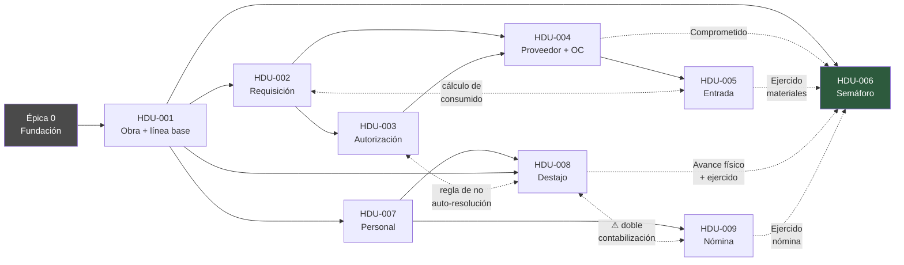

# CIMENTA · Historias de usuario

> **Capa SDD:** *Tasks*. Deriva del [PRD](01-descripcion-producto.md) y se apoya en la [arquitectura](02-arquitectura.md) y el [modelo de datos](03-modelo-datos.md).

---

## Regla de aceptación

> **Una historia se acepta únicamente si *todos* sus escenarios pasan en verde — los de éxito y los de error por igual.** Un escenario de rechazo que no se ejecuta, o que se ejecuta en rojo, invalida la historia completa. No hay aceptación parcial ni escenarios "opcionales".

Esto no es rigor por gusto. En CIMENTA el valor del sistema está en buena medida en lo que **rechaza**: compras que exceden el presupuesto, recepciones mayores a lo ordenado, pagos sin validación de avance, descuentos que superan el saldo de un crédito. Una suite que solo cubre el camino feliz no prueba el producto: prueba la parte del producto que no importa.

Cada escenario de rechazo verifica además que la respuesta cumple el [contrato de error estructurado](02-arquitectura.md#73-contrato-de-error-de-regla-de-negocio): identificador de la regla, cifras del momento y acciones disponibles.

---

## Auditoría de suficiencia

Este conjunto es el resultado de una segunda pasada sobre un borrador previo de siete historias. La revisión buscó **huecos de cadena**: puntos donde una historia da por supuesto un dato que ninguna otra crea. Encontró tres, y los tres habrían aparecido como bloqueos en pleno sprint:

| Hueco detectado | Consecuencia si no se corrige | Corrección |
|---|---|---|
| Ninguna historia emitía la **orden de compra** | La entrada de almacén parte de *"dado que existe una orden de compra abierta"*, y nada la crea. La cadena requisición → recepción queda partida | Nueva **HDU-004**, que por eso sube `F6.1` y `F6.5` al MVP |
| Ninguna historia daba de alta **empleados, roles de oficio ni cuadrillas** | Destajo y nómina no tienen a quién asignar trabajo ni a quién pagar. Sin cuadrillas no hay avance físico, y sin avance físico la columna de desviación —el producto entero— no calcula | Nueva **HDU-007** |
| Ninguna historia daba de alta **obras ni proveedores** | Solo existían como datos semilla. En operación real nadie puede abrir una obra nueva ni registrar un proveedor | Absorbido en **HDU-001** y **HDU-004** |

Se añadieron además escenarios que la operación diaria exige y que el borrador no contemplaba: corrección de capturas erróneas, cancelación de documentos, baja de catálogos con historial asociado, y la consulta de *qué y cuánto se le pidió a cada proveedor por obra* — que el cliente describió con detalle en el cuestionario y no estaba en ninguna historia.

### Lo que sigue deliberadamente fuera

La suficiencia también se declara por exclusión. Estas necesidades **están reconocidas y no se cubren aquí**:

| Necesidad | Por qué queda fuera |
|---|---|
| **Salidas y consumo de almacén** | El costo se imputa a la obra al dar entrada, así que el semáforo es correcto sin ellas. Hacen falta para saber sobrantes y habilitar traspasos: entran con `RN-08` en v1.1 |
| **Herramienta y consumibles** | El cliente los pidió expresamente (escaleras, andamios, rotomartillos; escobas, papel). No cierran el ciclo de valor. Candidatos inmediatos a v1.2 |
| **Trabajos extra** | Flujo real y bien descrito por el cliente, con umbral de $50,000. Requiere versionado de línea base (`RN-18`): v1.1 |
| **Traspasos entre obras y mermas** | `RN-08` y `RN-09`. Dependen de salidas de almacén |
| **Anticipos y consignación** | `RN-15` y `RN-16`. El catálogo de proveedores de HDU-004 deja el terreno preparado |
| **Freno por impago del cliente** | `RN-20`. Requiere control de cobranza, fuera del MVP |

---

## El conjunto

Nueve historias que recorren el ciclo de valor completo: alta de obra → línea base congelada → gasto controlado → gasto real → avance físico → tablero.

| # | Historia | Prioridad | Cap. | Complejidad | SP |
|---|---|---|---|---|---|
| HDU-001 | [Alta de obra e importación de la línea base](#hdu-001--alta-de-obra-e-importación-de-la-línea-base) | **Must** | C1 | Alta | 13 |
| HDU-002 | [Requisición con control de presupuesto](#hdu-002--requisición-con-control-de-presupuesto) | **Must** | C2 | Alta | 8 |
| HDU-003 | [Resolución de una requisición bloqueada](#hdu-003--resolución-de-una-requisición-bloqueada) | **Must** | C2 | Media | 5 |
| HDU-004 | [Proveedores y emisión de órdenes de compra](#hdu-004--proveedores-y-emisión-de-órdenes-de-compra) | **Must** | C2/C6 | Media | 5 |
| HDU-005 | [Entrada de material con recepción parcial](#hdu-005--entrada-de-material-con-recepción-parcial) | **Must** | C3 | Media-Alta | 8 |
| HDU-006 | [Semáforo de obra](#hdu-006--semáforo-de-obra) | **Must** | C7 | Media | 5 |
| HDU-007 | [Catálogo de personal y cuadrillas](#hdu-007--catálogo-de-personal-y-cuadrillas) | *Should* | C5 | Baja-Media | 5 |
| HDU-008 | [Avance de destajo medido y validado](#hdu-008--avance-de-destajo-medido-y-validado) | *Should* | C4 | Media-Alta | 8 |
| HDU-009 | [Nómina semanal](#hdu-009--nómina-semanal) | *Should* | C5 | Alta | 13 |

**Total: 70 SP · 137 escenarios, cerca de la mitad de ellos de rechazo, error o borde.**

> **Segunda revisión, 2026-09-18.** El cliente respondió las once preguntas abiertas y **cinco respuestas contradijeron los supuestos**. Las historias están reescritas en consecuencia:
>
> - **HDU-001** gana la captura del presupuesto de control, que deja de derivarse del precio de venta (PA-03), y el indicador de IVA acreditable por obra (PA-05).
> - **HDU-002** controla por **obra y tipo de partida**, no por ubicación (PA-01). Cuatro bolsas por obra en lugar de ~572.
> - **HDU-005** cambia el cierre manual de órdenes por **reprogramación del faltante** (PA-07): una orden solo se cierra al entregarse completa.
> - **HDU-008** define las etapas de destajo **por tipo de partida** (PA-08), que es lo que hace que su costo llegue al tablero agrupado.
> - **HDU-009** pasa de 8 a 13 puntos: aparece el **registro de jornada diaria** por empleado y obra, la semana de **viernes a jueves**, y el reparto de costo entre obras deja de ser una estimación para ser un dato derivado (PA-04).

### Dónde está la línea entre *must* y *should*

No es una intuición: es una propiedad observable del semáforo.

**Las seis *must* cierran el ciclo.** Al terminar HDU-006 la dirección ve, por obra y partida, cuánto se presupuestó y cuánto se lleva gastado **en materiales**, con desglose hasta el movimiento. Eso ya es infinitamente más de lo que tienen hoy.

**Las tres *should* completan la cifra.** La mano de obra es entre el 59 % y el 100 % del costo directo (`RN-21`), así que sin HDU-007 a HDU-009 el semáforo es **honesto pero parcial**: reporta correctamente lo que sabe y marca como "sin medir" lo que no. Con ellas, la cifra deja de tener agujeros.

> Son *should* porque el producto entrega valor sin ellas, no porque sean prescindibles a medio plazo. Entregar el MVP sin HDU-009 y presentar su semáforo como "el costo real de la obra" sería mentir.

### Complejidad fijada antes de escribir criterios

El material del Módulo 4 advierte de la *homogeneización*: pedir "descompón este PRD en historias" produce historias con la misma forma y el mismo tono, lo que esconde que unas son CRUD trivial y otras cargan complejidad real. La complejidad se fijó **antes** de redactar los escenarios.

| Historia | Dónde está la complejidad real |
|---|---|
| HDU-001 | Leer Excel del mundo real, que viene roto. Transaccionalidad todo-o-nada sobre ~4,900 filas. Cálculo de la explosión |
| HDU-002 | Concurrencia con bloqueo pesimista. Doble control simultáneo: importe **y** volumen |
| HDU-003 | Reglas de autoridad, incluida la prohibición de auto-autorización. Idempotencia de la resolución |
| HDU-004 | Poca. Transición de estados de la requisición y una consulta cruzada proveedor × obra |
| HDU-005 | Estado derivado de cantidades. Libro mayor de solo-anexado. Saldo acumulado entre entregas. Corrección sin borrado |
| HDU-006 | Agregación sobre cinco fuentes. Distinguir "sin medir" de "cero". Nada de lógica dura |
| HDU-007 | Baja. La única sutileza es la baja lógica con historial asociado |
| HDU-008 | Flujo de doble actor con estados. Precarga del alcance de contrato desde la línea base, que es el denominador del avance físico de todo el tablero. Aritmética sencilla |
| HDU-009 | Registro de jornada diaria por obra y reparto derivado del costo entre obras. Semana de viernes a jueves. Amortización de créditos con transición a liquidado. Pago agrupado con invariante de suma |

---

## Historias relacionadas

Cada historia declara con qué otras se relaciona. La relación tiene que ser **verificable**: no basta con *"ambas son de compras"*. Se admiten cinco tipos, y cada uno exige una evidencia concreta —una tabla, una regla, un estado, un componente—:

| Tipo | Qué significa | Evidencia exigida |
|---|---|---|
| **Bloquea / Bloqueada por** | No se puede construir ni probar sin la otra | El escenario que falla o el dato que no existe |
| **Continúa** | Retoma el flujo exactamente donde la otra lo deja | El estado de la entidad que se hereda |
| **Alimenta / Se alimenta de** | Le aporta datos, pero la otra funciona sin ella en modo degradado | La columna o el cálculo que recibe el dato |
| **Comparte contrato** | Comparten una regla, tabla o componente; cambiar uno rompe al otro | El artefacto compartido |
| **Riesgo cruzado** | Pueden contradecirse si no se coordinan | El estado inconsistente que puede producirse |

### Mapa de relaciones

Flechas continuas: bloqueo. Punteadas dirigidas: fuentes de datos. Punteadas bidireccionales: contratos compartidos y riesgos cruzados.

### Matriz completa

| Desde | Hacia | Tipo | Evidencia |
|---|---|---|---|
| HDU-001 | HDU-002 | Bloquea | HDU-002 esc. 7 rechaza requisiciones sin línea base congelada. `presupuesto_control` y `explosion_presupuesto` las crea HDU-001 |
| HDU-001 | HDU-006 | Bloquea | HDU-006 esc. 8 rechaza el semáforo sin línea base. La columna "Presupuestado" sale de `presupuesto_control` |
| HDU-001 | HDU-007 | Bloquea | `cuadrilla.obra_id` es obligatorio. Basta el alta de obra, **no** hace falta la línea base |
| HDU-001 | HDU-008 | Bloquea | El avance se captura sobre `area`, y `m2_contrato` sale del concepto presupuestado. Además `obra.retencion_destajo_pct` |
| HDU-002 | HDU-003 | Continúa | HDU-002 deja la `solicitud_autorizacion` en `PENDIENTE`; HDU-003 la resuelve. Sin HDU-003, toda requisición bloqueada es un callejón sin salida |
| HDU-002 | HDU-004 | Bloquea | La orden de compra nace de una requisición en estado `EVALUADA` |
| HDU-003 | HDU-004 | Bloquea | HDU-004 esc. 5 emite orden desde requisición `AUTORIZADA`, estado que solo existe si HDU-003 está implementada |
| HDU-003 | HDU-005 | Comparte contrato | `solicitud_autorizacion` es genérica: HDU-005 la reutiliza para el excedente de recepción (`RN-07`). Acoplarla a requisiciones rompería HDU-005 |
| HDU-003 | HDU-008 | Comparte contrato | La regla de dominio "nadie resuelve lo suyo" es la misma en HDU-003 esc. 8 (no autorizar tu solicitud) y HDU-008 esc. 7 (no validar tu medición) |
| HDU-004 | HDU-005 | Bloquea | La entrada se registra contra una orden de compra. Sin ella, HDU-005 no tiene contra qué validar |
| HDU-004 | HDU-005 | Comparte contrato | El estado de la orden: HDU-004 lo crea (`ABIERTA`) y lo cancela; HDU-005 lo deriva (`PARCIAL`/`CERRADA`) y lo cierra con saldo. Dos caminos sobre la misma máquina de estados |
| HDU-004 | HDU-006 | Alimenta | Columna "Comprometido": `(cantidad_ordenada − cantidad_recibida) × costo_unitario` |
| HDU-005 | HDU-002 | Comparte contrato | HDU-005 esc. 10 reprograma el faltante y **mantiene** comprometido el presupuesto. Cancelar la orden (HDU-004 esc. 9) tampoco lo libera: lo devuelve a requisición viva. **La única transición que suelta la reserva es cancelar la requisición** (HDU-002 esc. 11). Las tres tocan el mismo "consumido" con el que HDU-002 evalúa `RN-03` |
| HDU-005 | HDU-006 | Alimenta | Columna "Ejercido", parte de materiales |
| HDU-007 | HDU-008 | Bloquea | El avance se captura por cuadrilla. HDU-008 esc. 10 rechaza cuadrillas ajenas a la obra |
| HDU-007 | HDU-009 | Bloquea | La nómina necesita empleados, cuadrillas y créditos dados de alta |
| HDU-007 | HDU-009 | Comparte contrato | `credito_empleado.saldo`: HDU-007 lo crea y valida el alta; HDU-009 lo amortiza y dispara la transición a `LIQUIDADO`. El invariante `saldo >= 0` se reparte entre ambas |
| HDU-008 | HDU-006 | Alimenta | Columna "Avance físico" (solo avance `VALIDADO`) y parte de "Ejercido" |
| HDU-008 | HDU-009 | **Riesgo cruzado** | Ver hallazgo 2 más abajo |
| HDU-009 | HDU-006 | Alimenta | Columna "Ejercido", parte de nómina |

**HDU-006 no bloquea a nadie y nadie la bloquea salvo HDU-001.** Es la propiedad que la mantiene entregable en el sprint 4 aunque sus fuentes lleguen después: muestra lo que tiene y avisa de lo que falta (esc. 6).

### Tres hallazgos de este análisis

Revisar las relaciones no fue un trámite de formato: sacó tres problemas que no estaban documentados.

**Hallazgo 1 · El grafo de dependencias estaba mal.** La versión anterior colgaba HDU-007 directamente de la Épica 0. Es incorrecto: `cuadrilla.obra_id` es obligatorio, así que HDU-007 necesita que HDU-001 haya dado de alta al menos una obra. La dependencia es real pero **parcial**: basta con el alta de obra, no con la línea base congelada. Corregido en el mapa.

**Hallazgo 2 · Nada impide contabilizar dos veces la mano de obra.** El cliente declaró que el pago está mezclado: *"hay a quien se le paga por destajo y a quienes se les paga por precio fijo (es decir nómina)"*. Pero ninguna historia impide que una cuadrilla cobre destajo por una semana **y** sus integrantes aparezcan además en la nómina de esa misma semana. Si ocurre, el "Ejercido" del semáforo suma dos veces el mismo trabajo y la desviación miente al alza.

→ Se incorpora **`RN-22`** al PRD —exclusividad de modalidad de pago por cuadrilla y semana— y sus escenarios de rechazo a HDU-008 y HDU-009.

**Hallazgo 3 · La mano de obra no tenía partida, pero el semáforo agrupa por partida.** La nómina se imputa a obra vía cuadrilla; el destajo, a área y etapa. Ninguna de las dos llegaba al nivel al que el semáforo agrupa y al que `RN-03` bloquea. La consulta de [§14 del modelo de datos](03-modelo-datos.md#14-la-consulta-del-semáforo) dejaba esas dos ramas sin resolver.

→ Se planteó como **`PA-08`** y el cliente lo resolvió: **cada etapa de destajo pertenece a un tipo de partida concreto**, así que `etapa_destajo` se define por obra y tipo de partida con precios propios. El destajo sí llega al tablero agrupado. La nómina no —un tablaroquero de sueldo fijo trabaja el día en lo que haga falta— y se muestra en fila propia a nivel de obra, algo que el cliente confirmó como aceptable en `PA-10`. Recogido en HDU-006 esc. 5.

---

## HDU-001 · Alta de obra e importación de la línea base

**Título de la Historia de Usuario: HDU-001 - Alta de obra, importación del presupuesto y congelado de la línea base**

*Como* Director de Proyectos *quiero* dar de alta una obra, importar desde Excel su catálogo de conceptos con los análisis de precios unitarios, revisarlo antes de aceptarlo y congelarlo *para* que exista una referencia inmutable contra la que medir toda desviación de costo.

### Criterios de aceptación

**Escenario 1: Apertura del formulario de obra**
- **Dado que** el usuario quiere registrar una obra nueva
- **Cuando** hace clic en el botón de +
- **Entonces** se abre el formulario de alta de obra
- **Y** el cursor se posiciona sobre el campo de código de obra.

**Escenario 2: Alta de obra con sus parámetros**
- **Dado que** el usuario está en el formulario de alta
- **Cuando** captura código, nombre, domicilio, tipo de contrato, porcentaje de retención de destajo, porcentaje de fondo de garantía y si el IVA es acreditable en esa obra, y guarda
- **Entonces** la obra queda registrada en estado "PLANEACION"
- **Y** el 15 % de retención operativa y el 5 % de fondo de garantía quedan almacenados **en la obra** como dos parámetros distintos, no como constantes del sistema
- **Y** el indicador de IVA acreditable queda almacenado en la obra, porque su tratamiento varía de una obra a otra según la regla "RN-25"
- **Y** la obra aparece disponible para importar su presupuesto.

**Escenario 3: Código de obra duplicado**
- **Dado que** ya existe una obra con el código "AP-058-25"
- **Cuando** el usuario intenta dar de alta otra con el mismo código
- **Entonces** el sistema lo rechaza indicando el conflicto
- **Y** muestra qué obra existente usa ese código
- **Y** no se crea ningún registro.

**Escenario 4: Carga del archivo de presupuesto**
- **Dado que** existe una obra sin línea base
- **Cuando** el usuario selecciona el archivo Excel del catálogo de conceptos y confirma la carga
- **Entonces** el sistema registra la importación en estado "ANALIZANDO"
- **Y** muestra el progreso de lectura sin bloquear la pantalla.

**Escenario 5: Previsualización antes de confirmar**
- **Dado que** el análisis del archivo terminó sin errores bloqueantes
- **Cuando** el sistema pasa la importación a estado "VALIDADO"
- **Entonces** muestra la jerarquía leída con el número de niveles, áreas, partidas y conceptos
- **Y** muestra el importe total calculado
- **Y** ningún dato se ha escrito todavía en el modelo real.

**Escenario 6: Archivo con celdas de fórmula rota**
- **Dado que** el archivo contiene celdas con `#REF!` en las columnas de precio unitario e importe
- **Cuando** el sistema analiza el archivo
- **Entonces** la importación pasa a estado "CON_ERRORES"
- **Y** se genera un renglón de error por cada fila afectada con hoja, fila, columna y tipo "REF_ROTA"
- **Y** el sistema **no** permite confirmar la importación
- **Y** las filas válidas se conservan en la zona de preparación para no repetir el análisis completo.

**Escenario 7: Concepto sin análisis de precio unitario**
- **Dado que** el catálogo incluye un concepto cuyo código no tiene hoja de análisis de precio unitario asociada
- **Cuando** el sistema analiza el archivo
- **Entonces** registra un error de tipo "SIN_APU" indicando el código del concepto
- **Y** la importación no se puede confirmar
- **Y** el mensaje explica que sin análisis de precio unitario no se puede calcular la explosión de insumos de ese concepto.

**Escenario 8: Unidad de medida desconocida**
- **Dado que** una fila del catálogo trae una unidad que no está en el catálogo de unidades del sistema
- **Cuando** el sistema analiza esa fila
- **Entonces** registra un error de tipo "UNIDAD_DESCONOCIDA" con el valor original encontrado
- **Y** la importación no se puede confirmar.

**Escenario 9: Código de concepto duplicado dentro de la misma obra**
- **Dado que** el archivo repite el mismo código de concepto con descripciones distintas dentro de la misma obra
- **Cuando** el sistema analiza el archivo
- **Entonces** registra un error de tipo "DUPLICADO" señalando las filas en conflicto
- **Y** la importación no se puede confirmar.

**Escenario 10: Insumo del análisis que no existe en el catálogo**
- **Dado que** un análisis de precio unitario referencia un insumo que no está dado de alta
- **Cuando** el sistema analiza el archivo
- **Entonces** da de alta el insumo con la descripción y la unidad leídas del archivo
- **Y** lo marca como "creado durante importación" para que el usuario lo revise en la previsualización.

**Escenario 11: Confirmación de la importación**
- **Dado que** la importación está en estado "VALIDADO"
- **Cuando** el usuario confirma
- **Entonces** el sistema crea la jerarquía completa de niveles, áreas, partidas y conceptos en una sola transacción
- **Y** crea los análisis de precio unitario con sus insumos y cargos
- **Y** la importación queda en estado "CONFIRMADO"
- **Y** la línea base resultante queda en estado "BORRADOR".

**Escenario 12: Fallo a mitad de la confirmación**
- **Dado que** la confirmación está en curso y ocurre un error al escribir el registro 3,000 de 4,900
- **Cuando** la transacción se interrumpe
- **Entonces** ningún dato de esa importación queda persistido en el modelo real
- **Y** la importación vuelve a estado "VALIDADO"
- **Y** el sistema informa del fallo sin dejar la obra en estado intermedio.

**Escenario 13: Reimportación sobre una línea base en borrador**
- **Dado que** la obra ya tiene una línea base en estado "BORRADOR" procedente de una importación anterior
- **Cuando** el usuario confirma una importación nueva para esa misma obra
- **Entonces** el sistema advierte de que va a reemplazar la línea base en borrador
- **Y** solo tras la confirmación explícita descarta la anterior y crea la nueva
- **Y** la importación descartada queda registrada en la bitácora.

**Escenario 14: Congelado de la línea base**
- **Dado que** existe una línea base en estado "BORRADOR"
- **Cuando** el Director de Proyectos la congela indicando el motivo
- **Entonces** el sistema copia todos los conceptos con su cantidad, precio unitario e importe a la línea base
- **Y** calcula y copia la explosión agregada **por tipo de partida**, con la cantidad presupuestada de cada insumo y su rendimiento congelado
- **Y** la línea base queda en estado "CONGELADA" con fecha, usuario y motivo
- **Y** la obra pasa a estado "ACTIVA"
- **Y** el asiento correspondiente aparece en la bitácora.

**Escenario 15: Captura del presupuesto de control**
- **Dado que** la línea base está congelada
- **Cuando** Dirección General abre la captura del presupuesto de control
- **Entonces** ve una fila por tipo de partida con el importe de venta y un **importe sugerido** calculado quitando utilidad e indirectos
- **Y** puede capturar su propio importe tope, que puede diferir del sugerido
- **Y** al guardar, ese importe capturado queda como presupuesto de control con su autor y fecha
- **Y** es ese importe, y no el sugerido, el que la regla "RN-03" usa para evaluar requisiciones.

**Escenario 16: Requisición contra una obra sin presupuesto de control capturado**
- **Dado que** la línea base está congelada pero Dirección no ha capturado el presupuesto de control
- **Cuando** alguien intenta levantar una requisición contra esa obra
- **Entonces** el sistema la rechaza con código 409
- **Y** el mensaje explica que falta capturar el tope de control del tipo de partida
- **Y** las acciones disponibles incluyen ir a capturarlo.

**Escenario 17: Importe de control mayor que el de venta**
- **Dado que** el usuario captura un importe tope superior al importe de venta de ese tipo de partida
- **Cuando** guarda
- **Entonces** el sistema lo advierte porque implicaría vender por debajo del costo tope
- **Y** exige confirmación explícita con motivo
- **Y** si se confirma, el motivo queda en la bitácora.

**Escenario 18: Intento de modificar una línea base congelada**
- **Dado que** existe una línea base en estado "CONGELADA"
- **Cuando** cualquier operación intenta modificar o eliminar uno de sus conceptos o filas de explosión
- **Entonces** la base de datos rechaza la operación
- **Y** el sistema responde con el contrato de error indicando la regla "RN-01"
- **Y** el intento queda registrado en la bitácora.

**Escenario 19: Intento de congelar una segunda línea base vigente**
- **Dado que** la obra ya tiene una línea base en estado "CONGELADA"
- **Cuando** el usuario intenta congelar otra línea base en "BORRADOR" para la misma obra
- **Entonces** el sistema rechaza la operación indicando la regla "RN-01"
- **Y** el mensaje explica que para sustituirla hay que crear una versión nueva que marque la anterior como "SUPERSEDIDA".

**Escenario 20: Intento de eliminar una obra con línea base congelada**
- **Dado que** una obra tiene línea base congelada y movimientos asociados
- **Cuando** el usuario intenta eliminarla
- **Entonces** el sistema lo rechaza
- **Y** ofrece cambiarla a estado "SUSPENDIDA" o "CERRADA" en lugar de eliminarla
- **Y** ningún dato histórico se pierde.

**Escenario 21: Archivo inválido**
- **Dado que** el usuario selecciona un archivo que no es una hoja de cálculo, o una hoja sin ninguna fila de concepto
- **Cuando** intenta cargarlo
- **Entonces** el sistema rechaza la carga antes de crear el registro de importación
- **Y** el mensaje indica qué formatos y qué estructura mínima se esperan.

**Escenario 22: Recaptura de un presupuesto de control ya capturado**
- **Dado que** el presupuesto de control de "MUROS" se capturó en $450,000 y ya hay requisiciones evaluadas contra él
- **Cuando** Dirección General lo recaptura en $500,000 escribiendo el motivo del cambio
- **Entonces** el importe tope queda en $500,000 con el autor y la fecha del cambio en la propia fila
- **Y** el valor anterior, el nuevo y el motivo quedan en la bitácora con la regla "RN-03"
- **Y** el disponible de la partida se recalcula de inmediato contra el tope nuevo
- **Y** la recaptura aparece en la consulta de excepciones del escenario 11 de HDU-003, junto a las autorizaciones, porque subir un tope es una vía alternativa a autorizar una excepción.

**Escenario 23: Recaptura sin autoridad o sin motivo**
- **Dado que** el usuario no tiene el rol "DIRECCION_GENERAL", o lo tiene pero no escribe el motivo del cambio
- **Cuando** intenta recapturar el importe tope
- **Entonces** el sistema lo rechaza con código 403 en el primer caso y 422 en el segundo
- **Y** el importe tope conserva su valor anterior
- **Y** el intento sin autoridad queda registrado en la bitácora.

> El tope de control es el único importe del sistema que se puede cambiar después de que una regla haya bloqueado algo contra él. Por eso la recaptura se asienta con la **misma regla `RN-03`** que el bloqueo: un mes con muchas subidas de tope tiene que ser tan visible como uno con muchas autorizaciones de excepción.

### Reglas de negocio implicadas

`RN-01` línea base inmutable · `RN-02` imputación obligatoria · `RN-03` el tope de control es el valor contra el que se evalúa, y su recaptura se registra · `RN-25` IVA configurable por obra

### Historias relacionadas

| Relación | Historia | Evidencia |
|---|---|---|
| **Bloquea a** | HDU-002 | `presupuesto_control` y `explosion_presupuesto`, que HDU-002 lee con bloqueo de fila para evaluar `RN-03`, solo existen tras congelar. Su escenario 7 rechaza requisiciones sin línea base |
| **Bloquea a** | HDU-006 | La columna "Presupuestado" del semáforo sale de `presupuesto_control`. Su escenario 8 rechaza abrir el tablero sin línea base |
| **Bloquea parcialmente a** | HDU-007 | `cuadrilla.obra_id` es obligatorio. Basta con los escenarios 1 a 3 —el alta de obra—; **no** hace falta la línea base congelada |
| **Bloquea a** | HDU-008 | El alcance de destajo se precarga de la línea base congelada, y es el denominador del avance físico. Además, el escenario 2 guarda `obra.retencion_destajo_pct`, que HDU-008 usa para calcular el pago |

### Non-goals

- No genera el presupuesto: solo lo importa. CIMENTA no sustituye al software de presupuestación de licitaciones.
- No importa nómina ni destajo desde Excel.
- No gestiona trabajos extra ni versiones sucesivas de la línea base (`RN-18`, v1.1).
- No permite editar conceptos desde la interfaz: una corrección se hace reimportando sobre el borrador.
- No permite corregir la línea base congelada por ninguna vía. Lo que se recaptura es el **presupuesto de control**, que no forma parte de ella.

### Definition of Done — funcionalidad nueva

- [ ] Cubre los 23 escenarios, **incluidos todos los de rechazo, error y borde**: ninguno es opcional
- [ ] Al menos un test por escenario
- [ ] Los tests de importación corren contra los archivos reales de `Doc de contexto/`, no contra archivos sintéticos
- [ ] Un test verifica que el presupuesto de control **capturado** prevalece sobre el sugerido en la evaluación de `RN-03`
- [ ] Un test verifica que una recaptura del tope queda en la bitácora con la regla `RN-03` y aparece en la consulta de excepciones, no solo en la fila
- [ ] La cobertura del módulo `presupuesto` no baja
- [ ] Documentación de API actualizada
- [ ] PR enlazado al ticket · revisión de al menos un humano

### Contexto técnico

- Módulo `presupuesto`, capas `api` / `aplicacion` / `dominio` / `infraestructura`
- Tablas: `obra`, `nivel`, `area`, `partida`, `tipo_partida`, `concepto`, `insumo`, `apu`, `apu_insumo`, `apu_cargo`, `linea_base`, `linea_base_concepto`, `explosion_presupuesto`, `presupuesto_control`, `importacion`, `importacion_error`
- Invariantes 5, 13 y 14 del [modelo de datos §12](03-modelo-datos.md#12-invariantes-en-base-de-datos)
- Máquinas de estado de importación y línea base: [§13](03-modelo-datos.md#13-máquinas-de-estado)
- Archivos de prueba reales: `AP-058-25 SEGUNDA ETAPA P.U UNION SQUERE.xlsx` (con `#REF!` en todas las columnas de precio) y `Presupuesto Base Tablaroca Eniti T5 AP 2.xlsx` (íntegro)
- Los porcentajes de retención (15 %) y fondo de garantía (5 %) son **dos conceptos distintos** (PA-02) y viven en la obra, no en el código

---

## HDU-002 · Requisición con control de presupuesto

**Título de la Historia de Usuario: HDU-002 - Requisición de material con bloqueo por presupuesto**

*Como* responsable de Compras *quiero* levantar una requisición de material imputada a una obra y una partida *para* que el sistema verifique si cabe en el presupuesto **antes** de que el gasto se comprometa.

### Criterios de aceptación

**Escenario 1: Consulta del disponible antes de capturar**
- **Dado que** el usuario va a levantar una requisición
- **Cuando** selecciona la obra y el tipo de partida —"MUROS", "PLAFONES Y CAJILLOS", "ENCHAPES" o "GENERALES"—
- **Entonces** el sistema muestra el importe tope capturado, el consumido y el disponible de ese tipo de partida **en el conjunto de la obra**
- **Y** muestra por cada insumo la cantidad presupuestada y la ya consumida
- **Y** el disponible no se calcula por ubicación: son cuatro bolsas por obra, no una por departamento.

**Escenario 2: Captura en borrador sin evaluar**
- **Dado que** el usuario está capturando una requisición con varios renglones
- **Cuando** la guarda sin enviarla
- **Entonces** queda en estado "BORRADOR"
- **Y** no consume presupuesto ni genera solicitud de autorización
- **Y** puede modificarla o eliminarla libremente.

**Escenario 3: Requisición dentro del presupuesto**
- **Dado que** la partida "MUROS" tiene $12,000 disponibles y cantidad suficiente de cada insumo solicitado
- **Cuando** el usuario envía una requisición por $9,000
- **Entonces** la requisición queda en estado "EVALUADA"
- **Y** el sistema responde con código 201
- **Y** el asiento correspondiente aparece en la bitácora.

**Escenario 4: Requisición que excede el importe presupuestado**
- **Dado que** la partida "MUROS" tiene $12,000 disponibles
- **Cuando** el usuario envía una requisición por $15,000 contra esa partida
- **Entonces** la requisición queda persistida en estado "BLOQUEADA"
- **Y** se crea una solicitud de autorización dirigida al rol "DIRECCION_GENERAL"
- **Y** el sistema responde con código 409 y el contrato de error con regla "RN-03"
- **Y** el detalle incluye presupuestado, consumido, disponible, solicitado y excedente de $3,000
- **Y** las acciones disponibles incluyen "SOLICITAR_AUTORIZACION".

**Escenario 5: Requisición que excede el volumen aunque el importe quepa**
- **Dado que** la partida tiene $12,000 disponibles
- **Y** la explosión de esa partida presupuesta 100 tableros de yeso, de los que ya se consumieron 90
- **Cuando** el usuario envía una requisición por 25 tableros con importe total de $3,600
- **Entonces** la requisición queda en estado "BLOQUEADA" pese a que el importe cabe
- **Y** el contrato de error señala el insumo concreto, la cantidad presupuestada, la consumida y el excedente de 15 piezas.

**Escenario 6: Requisición sin tipo de partida**
- **Dado que** el usuario intenta enviar una requisición sin especificar el tipo de partida
- **Cuando** el sistema recibe la petición
- **Entonces** la rechaza con código 422 indicando la regla "RN-02"
- **Y** el mensaje explica que no existe gasto sin centro de costos
- **Y** no se crea ningún registro de requisición.

**Escenario 7: Requisición contra una obra sin línea base congelada o sin presupuesto de control**
- **Dado que** la obra tiene su línea base todavía en estado "BORRADOR", o la tiene congelada pero sin presupuesto de control capturado
- **Cuando** el usuario intenta enviar una requisición contra ella
- **Entonces** el sistema la rechaza con código 409
- **Y** el mensaje distingue los dos casos: falta congelar la línea base, o falta capturar el tope de control
- **Y** ofrece la acción que corresponda en cada caso.

**Escenario 8: Insumo ajeno a la explosión de la partida**
- **Dado que** el usuario solicita un insumo que no aparece en la explosión de esa partida
- **Cuando** el sistema evalúa la requisición
- **Entonces** la requisición queda en estado "BLOQUEADA"
- **Y** el contrato de error indica que el insumo no está presupuestado en esa partida, con disponible cero.

**Escenario 9: Dos requisiciones concurrentes contra la misma partida**
- **Dado que** la partida tiene $12,000 disponibles
- **Y** dos usuarios de Compras envían simultáneamente una requisición de $8,000 cada una
- **Cuando** ambas peticiones llegan al sistema al mismo tiempo
- **Entonces** una queda en estado "EVALUADA" y la otra en estado "BLOQUEADA"
- **Y** en ningún caso ambas quedan aprobadas
- **Y** el disponible final refleja únicamente la requisición aceptada.

**Escenario 10: Cantidad o importe no positivo**
- **Dado que** el usuario captura un renglón con cantidad cero o negativa
- **Cuando** intenta enviar la requisición
- **Entonces** el sistema la rechaza con código 422 señalando el renglón inválido
- **Y** no se crea ningún registro.

**Escenario 11: Cancelación de una requisición**
- **Dado que** existe una requisición en estado "EVALUADA", "BLOQUEADA" o "AUTORIZADA" que todavía no se convirtió en orden de compra
- **Cuando** el solicitante la cancela indicando el motivo
- **Entonces** pasa a estado "CANCELADA" con el motivo registrado
- **Y** el presupuesto que tenía reservado vuelve a estar disponible de inmediato
- **Y** el estado es "CANCELADA" y **no** "RECHAZADA": rechazar es una decisión de Dirección General sobre una excepción, cancelar es que el solicitante desistió, y la consulta de excepciones no puede mezclarlas
- **Y** si tenía una solicitud de autorización pendiente, queda "sin efecto"
- **Y** la bitácora registra la cancelación.

**Escenario 12: Intento de modificar una requisición ya evaluada**
- **Dado que** una requisición está en estado "EVALUADA", "BLOQUEADA", "AUTORIZADA" o "CONVERTIDA"
- **Cuando** el usuario intenta modificar sus renglones
- **Entonces** el sistema lo rechaza con código 409
- **Y** el mensaje indica que debe cancelarla y levantar una nueva
- **Y** las cifras evaluadas permanecen intactas.

**Escenario 13: Requisiciones evaluadas que retienen presupuesto**
- **Dado que** existen requisiciones en estado "EVALUADA" que nunca se convirtieron en orden de compra
- **Cuando** el usuario consulta el disponible de esa partida
- **Entonces** el consumido se muestra desglosado en tres: requisiciones vivas, saldo de órdenes pendientes de recibir y gasto ya ejercido
- **Y** puede listar las requisiciones vivas ordenadas por antigüedad, con su importe y su solicitante
- **Y** puede cancelarlas desde esa lista, liberando el presupuesto que retienen.

> Una requisición evaluada reserva presupuesto y **no caduca sola**. Sin esta consulta, el disponible de una partida se estrecha sin gasto real detrás y nadie sabe por qué. Es el contrapeso de la decisión registrada en el [PRD §10](01-descripcion-producto.md#10-supuestos-y-preguntas-abiertas).

### Reglas de negocio implicadas

`RN-02` imputación obligatoria · `RN-03` bloqueo por presupuesto · `RN-04` trazabilidad

### Historias relacionadas

| Relación | Historia | Evidencia |
|---|---|---|
| **Bloqueada por** | HDU-001 | Sin línea base congelada no hay `explosion_presupuesto`, y sin presupuesto de control capturado no hay tope de importe. Escenario 7 cubre los dos casos |
| **Continúa en** | HDU-003 | Esta historia deja la `solicitud_autorizacion` en estado `PENDIENTE`. Sin HDU-003, toda requisición bloqueada es un callejón sin salida |
| **Bloquea a** | HDU-004 | La orden de compra nace de una requisición en estado `EVALUADA`. Sin esta historia no hay de qué emitirla |
| **Comparte contrato con** | HDU-005 | La reprogramación de un faltante (HDU-005 esc. 10) **mantiene** el presupuesto comprometido; cancelar la orden (HDU-004 esc. 9) lo devuelve a requisición viva sin liberarlo; solo cancelar la requisición (esc. 11 de aquí) lo suelta. Las tres mueven el gasto entre los tres sumandos del mismo "consumido", así que **tienen que usar el mismo cálculo** o el disponible diverge |

### Non-goals

- No resuelve la autorización: eso es HDU-003. Esta historia deja la solicitud creada.
- No emite la orden de compra: eso es HDU-004.
- No valida disponibilidad del proveedor ni precios de mercado.
- No implementa umbrales de autorización por monto (F2.7, fuera del MVP).

### Definition of Done — funcionalidad nueva

- [ ] Cubre los 13 escenarios, **incluidos todos los de rechazo, error y borde**: ninguno es opcional
- [ ] Al menos un test por escenario
- [ ] El escenario 9 se prueba con concurrencia real, no simulada con dobles de prueba
- [ ] **Un único cálculo de `consumido`**, el de [modelo de datos §14](03-modelo-datos.md#14-la-consulta-del-semáforo), compartido con el semáforo. Un test verifica que el disponible que devuelve el endpoint de consulta y el que aplica la evaluación coinciden al céntimo
- [ ] La regla `RN-03` está aislada en `dominio/` y se prueba sin base de datos
- [ ] Todas las respuestas de rechazo cumplen el contrato de error
- [ ] PR enlazado al ticket · revisión de al menos un humano

### Contexto técnico

- Módulo `compras`; consulta a `presupuesto` solo por su interfaz de aplicación publicada
- Tablas: `requisicion`, `requisicion_renglon`, `solicitud_autorizacion`, lectura de `presupuesto_control` y `explosion_presupuesto`
- **El control es por obra y tipo de partida** (PA-01): cuatro bolsas por obra, no una por ubicación
- **`consumido = requisiciones vivas + comprometido + ejercido`**, definido una sola vez en [modelo de datos §14](03-modelo-datos.md#14-la-consulta-del-semáforo) y compartido con el semáforo. Una requisición `EVALUADA` o `AUTORIZADA` sin convertir **sí consume**: sin eso, las dos peticiones simultáneas del escenario 9 pasarían las dos
- **Una sola bolsa por tipo de partida**: el destajo de esa partida consume el mismo tope que el material. La nómina no, porque no llega a partida (PA-10)
- El control por **importe** lee `presupuesto_control.importe_tope`, que es un valor **capturado** por Dirección (PA-03), no derivado del precio de venta
- El control por **volumen** lee `explosion_presupuesto.cantidad_presupuestada`, que sí es derivado del APU
- Bloqueo pesimista `SELECT … FOR UPDATE` sobre ambas tablas, según [ADR-004](adr/20260918-bloqueo-pesimista-presupuesto.md)
- Los bloqueos se toman siempre ordenados por identificador de tipo de partida para evitar interbloqueo
- Flujo completo: [arquitectura §8.1](02-arquitectura.md#81-requisición-evaluada-contra-presupuesto--rn-03)

---

## HDU-003 · Resolución de una requisición bloqueada

**Título de la Historia de Usuario: HDU-003 - Autorización o rechazo de requisiciones bloqueadas**

*Como* Dirección General *quiero* revisar y resolver las requisiciones que el sistema bloqueó por exceder el presupuesto *para* que el gasto fuera de línea base solo ocurra por decisión mía explícita y quede registrada.

### Criterios de aceptación

**Escenario 1: Aviso de solicitudes pendientes**
- **Dado que** existen solicitudes de autorización sin resolver
- **Cuando** el usuario con rol "DIRECCION_GENERAL" entra al sistema
- **Entonces** la navegación muestra el número de solicitudes pendientes
- **Y** el contador desaparece cuando no queda ninguna.

**Escenario 2: Bandeja de solicitudes pendientes**
- **Dado que** el usuario tiene el rol "DIRECCION_GENERAL"
- **Cuando** abre la bandeja de autorizaciones
- **Entonces** ve la lista de solicitudes en estado "PENDIENTE" ordenadas de más antigua a más reciente
- **Y** cada renglón muestra obra, partida, solicitante, importe solicitado y excedente
- **Y** las solicitudes ya resueltas no aparecen en la bandeja.

**Escenario 3: Detalle de una solicitud**
- **Dado que** el usuario abre una solicitud pendiente
- **Cuando** se carga el detalle
- **Entonces** ve las cifras tal como estaban en el momento del bloqueo, no recalculadas
- **Y** ve el desglose de renglones de la requisición
- **Y** ve la regla de negocio que provocó el bloqueo.

**Escenario 4: Autorización con motivo**
- **Dado que** el usuario está viendo una solicitud pendiente
- **Cuando** la autoriza escribiendo el motivo
- **Entonces** la solicitud pasa a estado "AUTORIZADA" con usuario y fecha de resolución
- **Y** la requisición pasa de "BLOQUEADA" a "AUTORIZADA"
- **Y** la bitácora registra la acción con el motivo y la regla "RN-03".

**Escenario 5: Rechazo con motivo**
- **Dado que** el usuario está viendo una solicitud pendiente
- **Cuando** la rechaza escribiendo el motivo
- **Entonces** la solicitud pasa a estado "RECHAZADA"
- **Y** la requisición pasa a estado "RECHAZADA" y no puede convertirse en orden de compra
- **Y** la bitácora registra la acción con el motivo.

**Escenario 6: Intento de resolver sin motivo**
- **Dado que** el usuario intenta autorizar o rechazar sin escribir motivo
- **Cuando** envía la resolución
- **Entonces** el sistema la rechaza con código 422
- **Y** el mensaje indica que el motivo es obligatorio también al autorizar, no solo al rechazar
- **Y** la solicitud permanece en estado "PENDIENTE".

**Escenario 7: Usuario sin autoridad**
- **Dado que** el usuario tiene rol "COMPRAS" o "ALMACEN" pero no "DIRECCION_GENERAL"
- **Cuando** intenta resolver una solicitud
- **Entonces** el sistema responde con código 403
- **Y** la solicitud permanece en estado "PENDIENTE"
- **Y** el intento queda registrado en la bitácora.

**Escenario 8: Intento de autorizar la propia solicitud**
- **Dado que** el usuario que levantó la requisición tiene también el rol "DIRECCION_GENERAL"
- **Cuando** intenta autorizar su propia solicitud
- **Entonces** el sistema lo rechaza con código 403 indicando que nadie resuelve sus propias solicitudes
- **Y** la solicitud permanece en estado "PENDIENTE"
- **Y** el intento queda registrado en la bitácora.

**Escenario 9: Intento de resolver una solicitud ya resuelta**
- **Dado que** una solicitud está en estado "AUTORIZADA"
- **Cuando** un usuario intenta volver a resolverla
- **Entonces** el sistema responde con código 409 indicando que ya fue resuelta
- **Y** informa quién la resolvió y cuándo
- **Y** el estado y el motivo originales no se modifican.

**Escenario 10: Solicitud cuya requisición fue cancelada**
- **Dado que** el solicitante canceló la requisición mientras la solicitud seguía pendiente
- **Cuando** Dirección General abre la bandeja
- **Entonces** esa solicitud aparece marcada como "sin efecto" y no admite resolución
- **Y** el motivo de la cancelación es visible.

**Escenario 11: Consulta de la bitácora de excepciones**
- **Dado que** se han resuelto varias solicitudes durante el mes
- **Cuando** el usuario consulta la bitácora filtrando por la regla "RN-03"
- **Entonces** obtiene todas las autorizaciones y rechazos del periodo con actor, momento, motivo y obra
- **Y** puede distinguir las autorizadas de las rechazadas
- **Y** obtiene también los intentos bloqueados que nunca se resolvieron.

### Reglas de negocio implicadas

`RN-03` bloqueo por presupuesto · `RN-04` trazabilidad de autorizaciones

### Historias relacionadas

| Relación | Historia | Evidencia |
|---|---|---|
| **Continúa a** | HDU-002 | Retoma el flujo en la `solicitud_autorizacion` que HDU-002 deja en `PENDIENTE` |
| **Bloquea a** | HDU-004 | Su escenario 5 emite orden desde una requisición en estado `AUTORIZADA`, y ese estado solo existe si esta historia está implementada |
| **Comparte contrato con** | HDU-005 | `solicitud_autorizacion` es **genérica**: HDU-005 la reutiliza para el excedente de recepción (`RN-07`) y en v1.1 servirá también al tope de consignación (`RN-15`). Acoplarla a requisiciones aquí rompería esas historias |
| **Comparte contrato con** | HDU-008 | La regla de dominio *"nadie resuelve lo suyo"* es la misma en el escenario 8 de esta historia (no autorizar tu propia solicitud) y en el escenario 7 de HDU-008 (no validar tu propia medición). Se implementa una vez |

### Non-goals

- No emite la orden de compra tras autorizar: eso es HDU-004.
- No implementa delegación ni suplencia de autorizadores.
- No notifica por correo ni por ningún canal externo: el aviso es el contador en pantalla.
- No permite autorizar en lote.

### Definition of Done — funcionalidad nueva

- [ ] Cubre los 11 escenarios, **incluidos todos los de rechazo, error y borde**: ninguno es opcional
- [ ] Al menos un test por escenario
- [ ] La regla de no-auto-autorización se prueba en `dominio/`, sin HTTP
- [ ] Se verifica que la bitácora es de solo-anexado: un intento de `UPDATE` falla
- [ ] PR enlazado al ticket · revisión de al menos un humano

### Contexto técnico

- Módulo `compras`; autorización transversal desde `identidad`
- Tablas: `solicitud_autorizacion`, `requisicion`, `bitacora`
- Invariante 9 del [modelo de datos §12](03-modelo-datos.md#12-invariantes-en-base-de-datos): motivo obligatorio al resolver
- `solicitud_autorizacion` es genérica y servirá también a `RN-07` y `RN-15`: no acoplarla a requisiciones

---

## HDU-004 · Proveedores y emisión de órdenes de compra

**Título de la Historia de Usuario: HDU-004 - Catálogo de proveedores y emisión de órdenes de compra**

*Como* responsable de Compras *quiero* mantener el catálogo de proveedores y convertir una requisición aprobada en una orden de compra dirigida a uno de ellos *para* que exista un documento en firme de lo pedido y pueda saber, por proveedor y por obra, qué y cuánto se le ha solicitado.

> Esta historia cierra el hueco entre la requisición y la recepción. También responde a una necesidad que el cliente describió con detalle: *"si en la obra 1 se le pidieron a CoPanel 100 hojas de tablaroca y a ellos mismos se les pidieron después 50 para la obra 2, se requiere poder saber cuánto y de qué se pidió por obra al proveedor."*

### Criterios de aceptación

**Escenario 1: Apertura del formulario de proveedor**
- **Dado que** el usuario quiere registrar un proveedor nuevo
- **Cuando** hace clic en el botón de +
- **Entonces** se abre el formulario de alta de proveedor
- **Y** el cursor se posiciona sobre el campo de nombre.

**Escenario 2: Alta de proveedor**
- **Dado que** el usuario está en el formulario de alta
- **Cuando** captura nombre, RFC, tope de consignación, día de corte y día de pago, y guarda
- **Entonces** el proveedor queda registrado y activo
- **Y** el día de corte queda en jueves y el de pago en sábado como valores por defecto, conforme a la regla "RN-17"
- **Y** aparece disponible en el selector de proveedores.

**Escenario 3: RFC duplicado**
- **Dado que** ya existe un proveedor con ese RFC
- **Cuando** el usuario intenta dar de alta otro con el mismo
- **Entonces** el sistema lo rechaza mostrando el proveedor existente
- **Y** no se crea ningún registro.

**Escenario 4: Emisión de orden de compra desde requisición evaluada**
- **Dado que** existe una requisición en estado "EVALUADA"
- **Cuando** el usuario selecciona el proveedor y emite la orden de compra
- **Entonces** se crea la orden con sus renglones copiados de la requisición, en estado "ABIERTA"
- **Y** la requisición pasa a estado "CONVERTIDA"
- **Y** la orden hereda la obra y la partida de la requisición
- **Y** el folio de la orden es único y consecutivo.

**Escenario 5: Emisión desde requisición autorizada por excepción**
- **Dado que** existe una requisición en estado "AUTORIZADA" tras una excepción resuelta por Dirección General
- **Cuando** el usuario emite la orden de compra
- **Entonces** se crea normalmente
- **Y** la orden conserva la referencia a la solicitud de autorización que la habilitó.

**Escenario 6: Intento de emitir orden desde requisición bloqueada o rechazada**
- **Dado que** una requisición está en estado "BLOQUEADA" o "RECHAZADA"
- **Cuando** el usuario intenta emitir una orden de compra a partir de ella
- **Entonces** el sistema lo rechaza con código 409 indicando el estado actual
- **Y** si está bloqueada, las acciones sugeridas incluyen solicitar la autorización
- **Y** no se crea ninguna orden.

**Escenario 7: Intento de emitir dos órdenes de la misma requisición**
- **Dado que** una requisición ya está en estado "CONVERTIDA"
- **Cuando** el usuario intenta emitir otra orden a partir de ella
- **Entonces** el sistema lo rechaza con código 409
- **Y** muestra el folio de la orden existente.

**Escenario 8: Orden sin proveedor**
- **Dado que** el usuario intenta emitir una orden sin seleccionar proveedor
- **Cuando** envía la operación
- **Entonces** el sistema la rechaza con código 422
- **Y** no se crea ninguna orden.

**Escenario 9: Cancelación de una orden sin recepciones**
- **Dado que** existe una orden en estado "ABIERTA" sin ninguna entrada registrada
- **Cuando** el usuario la cancela indicando el motivo
- **Entonces** la orden pasa a estado "CANCELADA"
- **Y** la requisición de origen vuelve a su estado anterior —"EVALUADA", o "AUTORIZADA" si nació de una excepción resuelta— y puede volver a convertirse
- **Y** el presupuesto **no** se libera: deja de contar como saldo de orden y vuelve a contar como requisición viva, así que el consumido de la partida no cambia
- **Y** para liberarlo de verdad hay que cancelar además la requisición, que es la única transición que suelta la reserva.

> Volver siempre a "EVALUADA" perdería la autorización de Dirección General y obligaría a pedirla otra vez para un gasto que ya aprobó.

**Escenario 10: Intento de cancelar una orden con recepciones**
- **Dado que** una orden tiene al menos una entrada de almacén registrada
- **Cuando** el usuario intenta cancelarla
- **Entonces** el sistema lo rechaza con código 409
- **Y** el mensaje explica que ya hay material recibido y que la vía es **reprogramar el faltante**, no cancelar
- **Y** ofrece esa acción alternativa.

**Escenario 11: Consulta de lo pedido a un proveedor por obra**
- **Dado que** a un proveedor se le pidieron 100 tableros para la obra 1 y 50 para la obra 2
- **Cuando** el usuario consulta ese proveedor
- **Entonces** ve el desglose por obra con cantidad e importe de cada insumo solicitado
- **Y** ve el total general del proveedor
- **Y** puede filtrar por rango de fechas y por estado de la orden.

**Escenario 12: Baja de un proveedor con órdenes abiertas**
- **Dado que** un proveedor tiene órdenes en estado "ABIERTA" o "PARCIAL"
- **Cuando** el usuario intenta darlo de baja
- **Entonces** el sistema lo rechaza listando las órdenes pendientes
- **Y** ofrece desactivarlo para nuevas órdenes conservando las existentes
- **Y** un proveedor desactivado deja de aparecer en el selector pero conserva todo su historial.

### Reglas de negocio implicadas

`RN-02` imputación obligatoria · `RN-17` corte semanal de proveedores

### Historias relacionadas

| Relación | Historia | Evidencia |
|---|---|---|
| **Bloqueada por** | HDU-002 | La orden de compra se emite desde una requisición en estado `EVALUADA` |
| **Bloqueada por** | HDU-003 | El escenario 5 emite orden desde una requisición `AUTORIZADA`, estado que produce HDU-003 |
| **Bloquea a** | HDU-005 | La entrada de almacén se registra contra una orden de compra. Sin ella, HDU-005 no tiene contra qué validar cantidades ni calcular saldo |
| **Comparte contrato con** | HDU-005 | La máquina de estados de la orden: esta historia la crea en `ABIERTA` y la cancela mientras no haya recepciones (esc. 9 y 10); HDU-005 la deriva a `PARCIAL`/`CERRADA` y **reprograma** el faltante, porque una orden con saldo no se cierra (PA-07). **Dos caminos sobre la misma entidad** que no pueden contradecirse: el escenario 10 de aquí y el 10 de allá son las dos mitades de la misma decisión |
| **Alimenta a** | HDU-006 | Columna "Comprometido": `(cantidad_ordenada − cantidad_recibida) × costo_unitario` sobre órdenes abiertas y parciales |

### Non-goals

- No registra facturas, anticipos ni consignación (`RN-15` y `RN-16`, v1.1). El catálogo deja los campos preparados.
- No envía la orden al proveedor por ningún canal: se imprime o se comparte fuera del sistema.
- No compara precios entre proveedores ni gestiona cotizaciones.
- No valida el RFC contra el SAT.
- **No reparte una requisición entre varios proveedores.** Una requisición origina como mucho una orden de compra. Si hace falta pedir a dos proveedores, se cancela y se levantan dos requisiciones: partirla rompería la cadena `orden → requisición → tipo de partida` de la que cuelga todo el semáforo.

### Definition of Done — funcionalidad nueva

- [ ] Cubre los 12 escenarios, **incluidos todos los de rechazo, error y borde**: ninguno es opcional
- [ ] Al menos un test por escenario
- [ ] La consulta del escenario 11 se prueba con el caso real: dos obras, mismo proveedor, mismo insumo
- [ ] PR enlazado al ticket · revisión de al menos un humano

### Contexto técnico

- Módulo `compras`; el catálogo de proveedores vive en `proveedores` y se consulta por su interfaz publicada
- Tablas: `proveedor`, `orden_compra`, `orden_compra_renglon`, `requisicion`
- Los campos `tope_consignacion`, `dia_corte` y `dia_pago` se capturan ya aunque su lógica llegue en v1.1
- Máquina de estados de la orden de compra: [modelo de datos §13](03-modelo-datos.md#13-máquinas-de-estado)

---

## HDU-005 · Entrada de material con recepción parcial

**Título de la Historia de Usuario: HDU-005 - Entrada de material validada contra remisión, con recepciones parciales**

*Como* responsable de Almacén *quiero* registrar la entrada de material validándola contra la remisión del proveedor y aceptando entregas parciales *para* saber en todo momento qué llegó, qué falta por llegar y cuánto costo se ha ejercido realmente.

### Criterios de aceptación

**Escenario 1: Entrada completa**
- **Dado que** existe una orden de compra abierta por 100 tableros
- **Cuando** el usuario registra una entrada de 100 tableros indicando el folio de remisión
- **Entonces** la entrada queda registrada con su folio de remisión y fecha
- **Y** la orden de compra pasa a estado "CERRADA"
- **Y** se genera un movimiento de inventario de tipo "ENTRADA" por 100 unidades
- **Y** el saldo pendiente de la orden queda en cero.

**Escenario 2: Entrada parcial**
- **Dado que** existe una orden de compra abierta por 100 bultos
- **Cuando** el usuario registra una entrada de 50 bultos con su folio de remisión
- **Entonces** la orden de compra pasa a estado "PARCIAL"
- **Y** el saldo pendiente queda en 50 bultos
- **Y** el movimiento de inventario registra únicamente las 50 unidades recibidas.

**Escenario 3: Segunda entrega que completa la orden**
- **Dado que** una orden está en estado "PARCIAL" con 50 bultos pendientes
- **Cuando** se registra una segunda entrada por los 50 restantes con otro folio de remisión
- **Entonces** la orden pasa a estado "CERRADA"
- **Y** ambas entradas quedan asociadas a la misma orden con sus folios de remisión distintos
- **Y** el inventario acumula los 100 bultos en dos movimientos separados.

**Escenario 4: Entrada sin folio de remisión**
- **Dado que** el usuario intenta registrar una entrada sin capturar el folio de la remisión
- **Cuando** envía el formulario
- **Entonces** el sistema la rechaza con código 422 indicando la regla "RN-05"
- **Y** el mensaje explica que la entrada se valida contra la remisión del proveedor, no contra la orden de compra
- **Y** no se crea ningún movimiento de inventario.

**Escenario 5: Entrada que excede lo ordenado**
- **Dado que** una orden tiene 50 bultos pendientes de recibir
- **Cuando** el usuario intenta registrar una entrada de 70 bultos
- **Entonces** el sistema la rechaza con código 409 indicando la regla "RN-07"
- **Y** el detalle incluye cantidad ordenada, recibida acumulada, saldo pendiente y excedente de 20 bultos
- **Y** las acciones disponibles incluyen "SOLICITAR_AUTORIZACION"
- **Y** no se crea ningún movimiento de inventario
- **Y** la orden conserva su saldo pendiente de 50 bultos.

**Escenario 6: Entrada contra una orden cerrada o cancelada**
- **Dado que** una orden está en estado "CERRADA" o "CANCELADA"
- **Cuando** el usuario intenta registrar una entrada contra ella
- **Entonces** el sistema la rechaza con código 409 indicando el estado actual de la orden
- **Y** no se crea ningún movimiento de inventario.

**Escenario 7: Folio de remisión duplicado del mismo proveedor**
- **Dado que** ya existe una entrada registrada con el folio de remisión "R-4521" de ese proveedor
- **Cuando** el usuario intenta registrar otra entrada con el mismo folio y proveedor
- **Entonces** el sistema la rechaza con código 409 advirtiendo del duplicado
- **Y** muestra la entrada previa para que el usuario verifique si es un reingreso por error.

**Escenario 8: Corrección de una entrada capturada por error**
- **Dado que** se registró una entrada de 70 bultos cuando en realidad llegaron 50
- **Cuando** el usuario corrige la entrada indicando el motivo
- **Entonces** el sistema genera un movimiento de tipo "AJUSTE" por −20 unidades con su motivo
- **Y** **no** modifica ni elimina el movimiento original
- **Y** la existencia calculada refleja 50 unidades
- **Y** el saldo pendiente de la orden se recalcula en consecuencia
- **Y** ambos movimientos son visibles en el historial con su trazabilidad.

**Escenario 9: Intento de corregir sin motivo**
- **Dado que** el usuario intenta registrar una corrección sin escribir el motivo
- **Cuando** envía la operación
- **Entonces** el sistema la rechaza con código 422
- **Y** no se genera ningún movimiento de ajuste.

**Escenario 10: Reprogramación del faltante**
- **Dado que** una orden lleva semanas en estado "PARCIAL" y el proveedor aún no entrega el resto
- **Cuando** el usuario reprograma el faltante indicando una nueva fecha comprometida y el motivo
- **Entonces** el renglón queda con la fecha nueva y la orden **permanece en estado "PARCIAL"**
- **Y** se registra la reprogramación con fecha anterior, fecha nueva, saldo pendiente y motivo
- **Y** el presupuesto sigue comprometido, porque el material se sigue debiendo
- **Y** la bitácora registra la acción.

**Escenario 11: Intento de reprogramar sin motivo o con fecha anterior a la vigente**
- **Dado que** el usuario intenta reprogramar sin escribir el motivo, o con una fecha anterior a la ya comprometida
- **Cuando** envía la operación
- **Entonces** el sistema la rechaza con código 422 señalando el campo inválido
- **Y** la fecha comprometida vigente no se modifica.

**Escenario 12: Intento de cerrar una orden con saldo pendiente**
- **Dado que** una orden está en estado "PARCIAL" con saldo por recibir
- **Cuando** alguien intenta cerrarla
- **Entonces** el sistema lo rechaza con código 409 indicando la regla "RN-06"
- **Y** el mensaje explica que una orden solo se cierra al entregarse completa, y que el faltante se reprograma
- **Y** las acciones disponibles incluyen "REPROGRAMAR".

**Escenario 13: Consulta de saldos pendientes por obra**
- **Dado que** una obra tiene varias órdenes en estado "PARCIAL"
- **Cuando** el usuario consulta los pendientes de recibir de esa obra
- **Entonces** ve por orden y por insumo la cantidad ordenada, la recibida y el saldo
- **Y** ve la fecha comprometida vigente y **cuántas veces se ha reprogramado cada renglón**
- **Y** ve la antigüedad del saldo desde la primera fecha comprometida.

> El contador de reprogramaciones es el dato que hoy no existe y que responde a *"¿cuántas veces nos ha aplazado este proveedor?"*. Con un cierre manual, esa información se perdería al cerrar.

**Escenario 14: El costo ejercido se refleja de inmediato**
- **Dado que** se registró una entrada por $18,000 imputada al tipo de partida "MUROS" de una obra
- **Cuando** se consulta el ejercido de ese tipo de partida
- **Entonces** el importe de la entrada aparece reflejado sin proceso por lotes ni espera.

### Reglas de negocio implicadas

`RN-02` imputación obligatoria · `RN-05` validación contra remisión · `RN-06` saldo de recepción parcial · `RN-07` no recibir más de lo ordenado

### Historias relacionadas

| Relación | Historia | Evidencia |
|---|---|---|
| **Bloqueada por** | HDU-004 | La entrada se registra contra una orden de compra: sin órdenes no hay nada que recibir |
| **Comparte contrato con** | HDU-004 | La máquina de estados de la orden. Aquí se deriva a `PARCIAL`/`CERRADA` y se reprograma el faltante; allá se crea y se cancela. El escenario 10 de HDU-004 (rechazar cancelación con recepciones) remite al escenario 10 de aquí como vía alternativa |
| **Comparte contrato con** | HDU-002 | La reprogramación **mantiene** comprometido el presupuesto del saldo; cancelar la orden (HDU-004 esc. 9) lo devuelve a requisición viva, no lo libera. Las tres historias mueven el gasto entre los sumandos del mismo "consumido" que HDU-002 usa para evaluar `RN-03`: **el cálculo tiene que ser el mismo en todas** |
| **Comparte contrato con** | HDU-003 | El escenario 5 crea una `solicitud_autorizacion` por excedente de recepción, usando la misma entidad genérica y el mismo flujo de resolución que HDU-003 implementa |
| **Alimenta a** | HDU-006 | Columna "Ejercido", parte de materiales. El escenario 14 verifica que el importe aparece sin proceso por lotes |

### Non-goals

- No registra salidas ni consumo de material: el costo se imputa al dar entrada.
- No registra traspasos entre obras ni mermas (`RN-08` y `RN-09`, v1.1).
- No gestiona la factura del proveedor ni su pago (v1.1).
- No controla herramienta ni consumibles (fuera del MVP).
- No implementa el flujo de autorización del excedente: crea la solicitud y termina ahí.

### Definition of Done — funcionalidad nueva

- [ ] Cubre los 14 escenarios, **incluidos todos los de rechazo, error y borde**: ninguno es opcional
- [ ] Al menos un test por escenario
- [ ] Se verifica que la restricción `CHECK (cantidad_recibida <= cantidad_ordenada)` se cumple a nivel de motor, no solo de aplicación
- [ ] Un test verifica que **no existe** ninguna ruta que cierre una orden con saldo pendiente
- [ ] Se verifica que no existe ninguna columna de existencia: el stock se calcula desde el libro mayor
- [ ] Un test verifica que una corrección **nunca** actualiza ni borra un movimiento previo
- [ ] PR enlazado al ticket · revisión de al menos un humano

### Contexto técnico

- Módulo `almacen`; consulta a `compras` solo por su interfaz publicada
- Tablas: `entrada_almacen`, `entrada_renglon`, `movimiento_inventario`, `orden_compra_renglon`, `reprogramacion_entrega`
- Invariante 2 del [modelo de datos §12](03-modelo-datos.md#12-invariantes-en-base-de-datos)
- Libro mayor de solo-anexado: [ADR-005](adr/20260918-ledger-inventario.md)
- El estado de la orden se **deriva** de las cantidades, nunca se asigna a mano
- **No existe transición de cierre con saldo** (PA-07): una orden solo llega a `CERRADA` al entregarse completa
- Flujo completo: [arquitectura §8.2](02-arquitectura.md#82-recepción-parcial--rn-06-y-rn-07)

---

## HDU-006 · Semáforo de obra

**Título de la Historia de Usuario: HDU-006 - Semáforo de costo real contra presupuestado por obra**

*Como* Dirección General *quiero* ver por obra y partida cuánto se presupuestó, cuánto está comprometido, cuánto se ha ejercido y cuál es la desviación frente al avance físico *para* saber si estoy ganando o perdiendo dinero antes de que se acabe el presupuesto.

### Criterios de aceptación

**Escenario 1: Semáforo de una obra con línea base congelada**
- **Dado que** la obra tiene una línea base congelada
- **Cuando** el usuario abre el semáforo de esa obra
- **Entonces** ve una fila por partida con las columnas presupuestado, comprometido, ejercido, avance físico y desviación
- **Y** ve una fila de totales de la obra
- **Y** la consulta responde en menos de 2 segundos.

**Escenario 2: Partida dentro de lo esperado**
- **Dado que** una partida presupuestada en $100,000 tiene 40 % de avance físico validado y $38,000 ejercidos
- **Cuando** se calcula su desviación
- **Entonces** el resultado es de −$2,000
- **Y** la partida se muestra en verde.

**Escenario 3: Partida desviada**
- **Dado que** una partida presupuestada en $100,000 tiene 40 % de avance físico validado y $70,000 ejercidos
- **Cuando** se calcula su desviación
- **Entonces** el resultado es de $30,000
- **Y** la partida se muestra en rojo aunque el plazo de la obra no se haya agotado.

**Escenario 4: El ejercido por partida suma materiales y destajo**
- **Dado que** el tipo de partida "MUROS" tiene $10,000 de entradas de almacén y $8,000 de pagos de destajo de etapas asignadas a esa partida
- **Cuando** se calcula su ejercido
- **Entonces** el importe es de $18,000
- **Y** el desglose permite ver cuánto aporta cada fuente
- **Y** el destajo llega a la partida a través del tipo de partida de su etapa, no por reparto.

**Escenario 5: La nómina aparece a nivel de obra, no por partida**
- **Dado que** la obra tiene $22,000 de nómina imputada en la semana
- **Cuando** se muestra el semáforo
- **Entonces** ese importe aparece en una fila propia al nivel de la obra, marcada como no imputada a partida
- **Y** entra en el total de la obra
- **Y** **no** se reparte entre las partidas ni afecta a sus desviaciones individuales
- **Y** el total de la obra es la suma de los ejercidos por partida más la fila de nómina, es decir $40,000 en el ejemplo anterior.

**Escenario 6: Aviso de cifra parcial**
- **Dado que** la obra no tiene todavía ninguna nómina ni pago de destajo registrado
- **Cuando** el usuario abre el semáforo
- **Entonces** el ejercido se muestra con un aviso de que solo incluye materiales
- **Y** el aviso indica qué fuentes de costo faltan
- **Y** la cifra no se presenta como costo real completo.

**Escenario 7: Desglose hasta el movimiento**
- **Dado que** el usuario ve una partida con desviación
- **Cuando** abre su desglose
- **Entonces** ve los movimientos individuales que componen el ejercido con fecha, tipo, documento de origen y responsable
- **Y** puede navegar desde un movimiento hasta la entrada de almacén o el renglón de nómina que lo originó.

**Escenario 8: Obra sin línea base congelada**
- **Dado que** la obra tiene su línea base en estado "BORRADOR"
- **Cuando** el usuario intenta abrir el semáforo
- **Entonces** el sistema responde indicando que no hay presupuesto congelado contra el que comparar
- **Y** ofrece la acción de ir a congelar la línea base
- **Y** no muestra cifras parciales ni ceros que puedan confundirse con datos reales.

**Escenario 9: Partida sin avance físico registrado**
- **Dado que** una partida tiene gasto ejercido pero ningún avance validado
- **Cuando** se calcula su desviación
- **Entonces** el avance se muestra como 0 %
- **Y** la desviación se muestra como no calculable en lugar de igual al ejercido
- **Y** la partida se marca como "sin avance medido" para distinguirla de una partida sana.

**Escenario 10: Solo se cuenta el avance validado**
- **Dado que** una partida tiene avance capturado por el residente pero aún no validado por el Director de Proyectos
- **Cuando** se calcula el porcentaje de avance físico
- **Entonces** ese avance no se incluye
- **Y** el porcentaje refleja únicamente mediciones en estado "VALIDADO".

**Escenario 11: Alerta por umbral de consumo**
- **Dado que** la obra tiene configurado un umbral de alerta del 15 % de desviación
- **Cuando** una partida supera ese umbral
- **Entonces** aparece marcada como alerta en el semáforo
- **Y** aparece en el resumen de alertas de la vista consolidada.

**Escenario 12: Usuario sin acceso a la obra**
- **Dado que** el usuario no tiene permiso sobre esa obra
- **Cuando** intenta abrir su semáforo
- **Entonces** el sistema responde con código 403
- **Y** no se filtra ningún importe en la respuesta.

**Escenario 13: Cuatro filas por obra, no quinientas**
- **Dado que** la obra tiene 14 niveles y 143 departamentos
- **Cuando** el usuario abre el semáforo
- **Entonces** ve una fila por tipo de partida —"MUROS", "PLAFONES Y CAJILLOS", "ENCHAPES", "GENERALES"— agregando toda la obra
- **Y** no ve una fila por cada partida de cada departamento
- **Y** el desglose por ubicación sigue disponible al abrir una partida, pero no es el nivel de control.

### Reglas de negocio implicadas

`RN-21` el costo real incluye materiales, nómina y destajo · `RN-22` exclusividad de modalidad de pago

### Historias relacionadas

| Relación | Historia | Evidencia |
|---|---|---|
| **Bloqueada por** | HDU-001 | Columna "Presupuestado" desde `presupuesto_control`. El escenario 8 rechaza abrir el tablero sin línea base congelada |
| **Se alimenta de** | HDU-004 | Columna "Comprometido" |
| **Se alimenta de** | HDU-005 | Columna "Ejercido", parte de materiales |
| **Se alimenta de** | HDU-008 | Columna "Avance físico": el alcance de su esc. 15 es el denominador y solo cuenta el avance `VALIDADO` (esc. 10). También parte de "Ejercido" |
| **Se alimenta de** | HDU-009 | Columna "Ejercido", parte de nómina |

**No bloquea a ninguna historia, y solo HDU-001 la bloquea a ella.** Esa es la propiedad que la hace entregable en el sprint 4 aunque tres de sus cuatro fuentes lleguen después: el escenario 6 obliga a avisar de qué fuentes aún no tienen datos, de modo que la cifra nunca se presenta como costo real completo cuando no lo es.

> **En el sprint 4 esta historia entrega dos columnas de cinco**, y hay que decirlo al planificar la demo: presupuestado y comprometido tienen datos; ejercido llega en el sprint 5 con HDU-005; avance físico y desviación, en el 6 con HDU-008. **La columna de desviación —el entregable del producto— no es calculable hasta el sprint 6**, y hasta entonces el escenario 9 la muestra como *"sin avance medido"*. No es un defecto del plan: es el precio de sacar el tablero pronto para descubrir temprano si está mal enfocado.

### Non-goals

- No recalcula el costo proyectado ante alzas de precio (F7.4, v1.1).
- No exporta a Excel ni a PDF.
- No incluye la vista consolidada multi-obra más allá del resumen de alertas.
- No muestra proveedores, anticipos ni consignación (v1.1).

### Definition of Done — funcionalidad nueva

- [ ] Cubre los 13 escenarios, **incluidos todos los de rechazo, error y borde**: ninguno es opcional
- [ ] Al menos un test por escenario
- [ ] La consulta se prueba con el volumen real de una obra: ~4,900 conceptos
- [ ] Los índices de [§14 del modelo de datos](03-modelo-datos.md#14-la-consulta-del-semáforo) están creados y verificados con plan de ejecución
- [ ] Ningún importe viaja como número JSON: todos como cadena
- [ ] PR enlazado al ticket · revisión de al menos un humano

### Contexto técnico

- Módulo `analitica`, **solo lectura**: no puede escribir en ningún otro módulo
- Consulta base y sus índices: [modelo de datos §14](03-modelo-datos.md#14-la-consulta-del-semáforo)
- Agrupa por `tipo_partida` a nivel de obra (PA-01): cuatro filas, no ~572
- El destajo llega a partida vía `etapa_destajo.tipo_partida_id` (PA-08); la nómina llega solo a obra vía `imputacion_nomina_obra` (PA-10)
- Se calcula en tiempo de consulta, sin proceso nocturno ni tabla de resumen
- El escenario 6 es lo que permite entregar esta historia antes que HDU-008 y HDU-009 sin que la cifra engañe

---

## HDU-007 · Catálogo de personal y cuadrillas

**Título de la Historia de Usuario: HDU-007 - Alta, baja y cambios de personal, roles de oficio y cuadrillas**

*Como* responsable de Administración *quiero* dar de alta, modificar y dar de baja al personal, asignarle su rol de oficio y su cuadrilla, y registrar sus créditos activos *para* tener una base del personal actualizada y fiable sobre la que calcular nómina y asignar avance de obra.

### Criterios de aceptación

**Escenario 1: Apertura del formulario de empleado**
- **Dado que** el usuario quiere dar de alta personal nuevo
- **Cuando** hace clic en el botón de +
- **Entonces** se abre el formulario para capturar los datos del nuevo empleado
- **Y** el cursor se posiciona sobre el primer campo a capturar.

**Escenario 2: Selección de rol de oficio**
- **Dado que** el usuario quiere asignar un rol de oficio
- **Cuando** hace clic en el desplegable de roles
- **Entonces** se abre el listado de los roles activos capturados previamente en el catálogo de roles
- **Y** al seleccionar uno queda asignado al empleado.

**Escenario 3: Alta de empleado**
- **Dado que** el usuario capturó nombre, rol de oficio, salario semanal, tarifa de hora extra y si tiene cuenta bancaria
- **Cuando** guarda el formulario
- **Entonces** el empleado queda registrado y activo
- **Y** aparece disponible para asignarse a una cuadrilla.

**Escenario 4: Alta sin rol de oficio**
- **Dado que** el usuario intenta guardar un empleado sin seleccionar rol de oficio
- **Cuando** envía el formulario
- **Entonces** el sistema lo rechaza con código 422 señalando el campo
- **Y** no se crea ningún registro.

**Escenario 5: Salario no positivo**
- **Dado que** el usuario captura un salario semanal de cero o negativo
- **Cuando** envía el formulario
- **Entonces** el sistema lo rechaza con código 422
- **Y** no se crea ningún registro.

**Escenario 6: Alta de cuadrilla y designación de encargado**
- **Dado que** el usuario da de alta una cuadrilla para una obra
- **Cuando** le asigna nombre y designa a un empleado como encargado
- **Entonces** la cuadrilla queda registrada y asociada a esa obra
- **Y** el encargado aparece como receptor posible de pagos agrupados.

**Escenario 7: Asignación de empleado a cuadrilla**
- **Dado que** existe una cuadrilla activa
- **Cuando** el usuario asigna un empleado indicando la fecha de inicio
- **Entonces** el empleado queda vinculado a esa cuadrilla desde esa fecha
- **Y** un empleado no puede estar en dos cuadrillas en la misma fecha.

**Escenario 8: Cambio de cuadrilla conservando historial**
- **Dado que** un empleado pertenece a una cuadrilla desde hace semanas
- **Cuando** el usuario lo mueve a otra cuadrilla
- **Entonces** la asignación anterior se cierra con su fecha de fin
- **Y** se crea una asignación nueva
- **Y** las nóminas ya calculadas siguen mostrando la cuadrilla que correspondía en su momento.

**Escenario 9: Alta de crédito activo**
- **Dado que** un empleado tiene un crédito de Infonavit o un préstamo de la empresa
- **Cuando** el usuario lo registra con monto total y descuento semanal
- **Entonces** el crédito queda en estado "ACTIVO" con saldo igual al monto total
- **Y** queda disponible para que la nómina lo descuente.

**Escenario 10: Crédito con descuento mayor que el monto total**
- **Dado que** el usuario intenta registrar un crédito cuyo descuento semanal supera el monto total
- **Cuando** guarda
- **Entonces** el sistema lo rechaza con código 422
- **Y** el mensaje explica que el descuento no puede exceder la deuda.

**Escenario 11: Suspensión de un crédito**
- **Dado que** un crédito está en estado "ACTIVO"
- **Cuando** el usuario lo suspende indicando el motivo
- **Entonces** pasa a estado "SUSPENDIDO" y deja de descontarse en las nóminas siguientes
- **Y** conserva su saldo
- **Y** puede reactivarse.

**Escenario 12: Baja de empleado con nóminas históricas**
- **Dado que** un empleado tiene nóminas calculadas en semanas anteriores
- **Cuando** el usuario intenta eliminarlo
- **Entonces** el sistema lo rechaza
- **Y** ofrece darlo de baja lógica en su lugar
- **Y** un empleado dado de baja no aparece en la nómina de semanas posteriores pero conserva todo su historial.

**Escenario 13: Baja de empleado con crédito activo**
- **Dado que** un empleado con crédito activo y saldo pendiente va a darse de baja
- **Cuando** el usuario confirma la baja
- **Entonces** el sistema advierte del saldo pendiente y su importe
- **Y** exige una decisión explícita sobre el crédito: condonarlo o mantenerlo como saldo por cobrar
- **Y** la decisión y su motivo quedan en la bitácora.

**Escenario 14: Baja de cuadrilla con empleados asignados**
- **Dado que** una cuadrilla tiene empleados activos asignados
- **Cuando** el usuario intenta darla de baja
- **Entonces** el sistema lo rechaza listando los empleados asignados
- **Y** pide reasignarlos antes de continuar.

### Reglas de negocio implicadas

`RN-13` créditos activos

### Historias relacionadas

| Relación | Historia | Evidencia |
|---|---|---|
| **Bloqueada parcialmente por** | HDU-001 | `cuadrilla.obra_id` es obligatorio, así que hace falta al menos una obra dada de alta. **Basta el alta de obra**, no la línea base congelada: esta historia puede empezarse en cuanto existan los escenarios 1 a 3 de HDU-001 |
| **Bloquea a** | HDU-008 | El avance se captura por cuadrilla. Su escenario 10 rechaza cuadrillas ajenas a la obra, lo que exige que el catálogo exista y esté asociado a obras |
| **Bloquea a** | HDU-009 | La nómina precarga empleados activos asignados a cuadrillas de la obra |
| **Comparte contrato con** | HDU-009 | `credito_empleado.saldo`: aquí se crea y se valida el alta (esc. 9 y 10); allá se amortiza y se dispara la transición a `LIQUIDADO` (esc. 9). **El invariante `saldo >= 0` se reparte entre las dos historias**, así que un cambio en el modelo de créditos rompe a la otra |

### Non-goals

- No modela expediente laboral completo: solo lo que nómina y destajo necesitan.
- No calcula prestaciones de ley, vacaciones ni antigüedad.
- No gestiona altas ante el IMSS ni ningún trámite externo.
- No calcula nómina: eso es HDU-009.
- No registra control de asistencia ni horarios detallados: solo días trabajados en la captura semanal.

### Definition of Done — funcionalidad nueva

- [ ] Cubre los 14 escenarios, **incluidos todos los de rechazo, error y borde**: ninguno es opcional
- [ ] Al menos un test por escenario
- [ ] Se verifica que ningún catálogo con historial asociado admite borrado físico
- [ ] Los roles de oficio del cliente vienen precargados: pastero, tablaroquero, ayudante, oficial, pintor y limpieza
- [ ] PR enlazado al ticket · revisión de al menos un humano

### Contexto técnico

- Módulo `personal`
- Tablas: `rol_oficio`, `empleado`, `cuadrilla`, `cuadrilla_empleado`, `credito_empleado`
- Invariantes 3 y 4 del [modelo de datos §12](03-modelo-datos.md#12-invariantes-en-base-de-datos)
- `cuadrilla_empleado` lleva `desde` y `hasta` precisamente para el escenario 8
- Datos reales de referencia: las hojas de nómina muestran ~20 empleados por semana con roles de tablaroquero, pastero y ayudante

---

## HDU-008 · Avance de destajo medido y validado

**Título de la Historia de Usuario: HDU-008 - Medición de avance por cuadrilla con validación en dos pasos**

*Como* Director de Proyectos *quiero* que todo avance de destajo lo mida el residente en obra y lo valide yo antes de generar cualquier pago *para* que no se pague volumen que no está construido y la desviación entre lo contratado y lo ejecutado sea visible.

### Criterios de aceptación

**Escenario 1: Configuración de etapas de destajo por tipo de partida**
- **Dado que** una obra va a trabajarse por destajo
- **Cuando** el usuario da de alta una etapa indicando su clave —"METAL", "TAPADO" o "PASTA"—, el **tipo de partida** al que pertenece y sus precios de venta y de destajo por m²
- **Entonces** queda registrada por obra y tipo de partida, no de forma global
- **Y** "METAL · MUROS" y "METAL · PLAFONES Y CAJILLOS" son dos etapas distintas con precios propios
- **Y** el precio de venta y el de destajo se capturan por separado
- **Y** es esa asignación la que permite que el costo de destajo llegue a la partida en el semáforo.

**Escenario 2: Etapa sin tipo de partida**
- **Dado que** el usuario intenta dar de alta una etapa sin asignarle tipo de partida
- **Cuando** guarda
- **Entonces** el sistema lo rechaza con código 422
- **Y** el mensaje explica que sin tipo de partida el costo de esa etapa no podría imputarse en el tablero.

**Escenario 3: Captura de avance por el residente**
- **Dado que** el residente midió el avance de una cuadrilla en un departamento
- **Cuando** selecciona el área, la etapa y la cuadrilla, y captura **únicamente** los m² reales medidos
- **Entonces** el sistema muestra en solo lectura los m² de contrato de esa área y etapa, tomados del alcance precargado
- **Y** el avance queda en estado "CAPTURADO" con su autor y fecha de medición, y con los m² de contrato copiados en la fila
- **Y** todavía no genera ningún pago.

**Escenario 4: Validación por el Director de Proyectos**
- **Dado que** existe un avance en estado "CAPTURADO"
- **Cuando** el Director de Proyectos lo valida
- **Entonces** el avance pasa a estado "VALIDADO" con su validador y fecha
- **Y** queda disponible para generar pago de destajo
- **Y** empieza a contar en el porcentaje de avance físico del semáforo.

**Escenario 5: Rechazo de una medición**
- **Dado que** el Director de Proyectos detecta un error en la medición
- **Cuando** la rechaza escribiendo el motivo
- **Entonces** el avance pasa a estado "RECHAZADO" con el motivo registrado
- **Y** el residente puede corregirla, devolviéndola a estado "CAPTURADO"
- **Y** el historial conserva la medición rechazada y su motivo.

**Escenario 6: Intento de pagar avance no validado**
- **Dado que** existe un avance en estado "CAPTURADO" o "RECHAZADO"
- **Cuando** se intenta generar un pago de destajo que lo incluya
- **Entonces** el sistema lo rechaza con código 409 indicando la regla "RN-10"
- **Y** el mensaje identifica qué mediciones no están validadas
- **Y** no se crea ningún pago.

**Escenario 7: El residente intenta validar su propia medición**
- **Dado que** el residente tiene también el rol "DIRECTOR_PROYECTOS"
- **Cuando** intenta validar una medición que él mismo capturó
- **Entonces** el sistema lo rechaza con código 403
- **Y** la medición permanece en estado "CAPTURADO".

**Escenario 8: Metros reales mayores que los de contrato**
- **Dado que** un departamento se presupuestó a 81.87 m² y el residente mide 83.82 m² reales
- **Cuando** captura el avance
- **Entonces** el sistema lo acepta sin bloquearlo
- **Y** registra una desviación de volumen de +1.95 m²
- **Y** esa desviación se agrega al reporte por obra, nivel y cuadrilla.

**Escenario 9: Avance sobre área sin etapa de destajo definida**
- **Dado que** la obra no tiene precios de destajo configurados para la etapa seleccionada
- **Cuando** el residente intenta capturar avance de esa etapa
- **Entonces** el sistema lo rechaza con código 409
- **Y** el mensaje indica que hay que configurar antes el precio de venta y el precio de destajo de esa etapa.

**Escenario 10: Avance de una cuadrilla ajena a la obra**
- **Dado que** el residente selecciona una cuadrilla que no está asignada a esa obra
- **Cuando** intenta capturar el avance
- **Entonces** el sistema lo rechaza con código 422
- **Y** el selector solo ofrece cuadrillas activas de la obra en curso.

**Escenario 11: Cálculo del pago con retención**
- **Dado que** una cuadrilla acumula 81.87 m² validados de la etapa "METAL" a $80/m² de destajo
- **Y** la obra tiene configurada una retención del 15 %
- **Cuando** se genera el pago de la semana
- **Entonces** el importe bruto es de $6,549.60
- **Y** la retención es de $982.44
- **Y** el importe neto es de $5,567.16
- **Y** el porcentaje aplicado es el configurado en la obra, no una constante del código.

**Escenario 12: Avance duplicado para la misma área, etapa y semana**
- **Dado que** ya existe un avance capturado para esa combinación de área, etapa, cuadrilla y semana
- **Cuando** se intenta capturar otro
- **Entonces** el sistema advierte del duplicado con código 409
- **Y** ofrece corregir el existente en lugar de crear uno nuevo.

**Escenario 13: El costo de destajo llega al semáforo**
- **Dado que** se generó un pago de destajo de una cuadrilla en una obra
- **Cuando** se consulta el ejercido de esa obra
- **Entonces** el importe del destajo aparece incluido
- **Y** es distinguible de las entradas de almacén y de la nómina en el desglose.

**Escenario 14: Cuadrilla que ya cobró nómina esa semana**
- **Dado que** la cuadrilla "MARIO" tiene nómina calculada para la semana del 27 de agosto
- **Cuando** se intenta generar un pago de destajo para esa misma cuadrilla y semana
- **Entonces** el sistema lo rechaza con código 409 indicando la regla "RN-22"
- **Y** el mensaje identifica la nómina existente y su importe
- **Y** las acciones disponibles incluyen cancelar la nómina de esa cuadrilla o cambiar la modalidad de pago
- **Y** no se genera ningún pago de destajo.

> Sin este escenario, el mismo trabajo se contabilizaría dos veces en el "Ejercido" del semáforo y la desviación mentiría al alza.

**Escenario 15: Precarga del alcance de destajo**
- **Dado que** la obra tiene su línea base congelada y se dan de alta las etapas de un tipo de partida
- **Cuando** el usuario confirma la configuración
- **Entonces** el sistema precarga, por cada área y cada etapa, los m² de contrato sumando los conceptos medibles en "M2" de las partidas de ese tipo en esa área
- **Y** el alcance del tipo de partida es la suma de todas sus áreas por todas sus etapas: un muro de 100 m² con tres etapas aporta 300 m² de alcance
- **Y** ese total es el **denominador del porcentaje de avance físico** del semáforo
- **Y** los conceptos medidos en "ML" o "PZA" quedan fuera del alcance, y el sistema informa de cuántos son para que nadie los dé por medidos.

**Escenario 16: Corrección del alcance por el Director de Proyectos**
- **Dado que** el alcance precargado de un área y etapa no coincide con lo realmente contratado
- **Cuando** el Director de Proyectos lo corrige indicando el motivo
- **Entonces** el alcance queda con el valor nuevo, su autor, su fecha y su motivo
- **Y** las mediciones ya capturadas conservan los m² de contrato que tenían: la corrección no reescribe el pasado
- **Y** el porcentaje de avance físico del semáforo se recalcula sobre el alcance corregido
- **Y** la bitácora registra el cambio.

**Escenario 17: El residente intenta cambiar los m² de contrato**
- **Dado que** el residente está capturando una medición
- **Cuando** intenta modificar los m² de contrato que el sistema le muestra
- **Entonces** el sistema lo rechaza con código 403
- **Y** el mensaje explica que el alcance lo corrige el Director de Proyectos, porque es la cifra contra la que se valida la propia medición del residente
- **Y** el alcance conserva su valor.

> **Quien mide no fija el número contra el que se le mide.** La desviación de volumen —los +1.95 m² del departamento 212 que motivan F4.7— solo significa algo si los m² de contrato vienen del contrato. Si los teclea el residente, la desviación mide lo que él decida que mida.

### Reglas de negocio implicadas

`RN-10` doble validación del avance · `RN-11` retención de destajo · `RN-21` el destajo es parte del costo real · `RN-22` exclusividad de modalidad de pago

### Historias relacionadas

| Relación | Historia | Evidencia |
|---|---|---|
| **Bloqueada por** | HDU-001 | El alcance de destajo del escenario 15 se precarga de la línea base **congelada**: sin ella no hay m² de contrato que repartir por área y etapa. `obra.retencion_destajo_pct` se captura en su escenario 2 |
| **Bloqueada por** | HDU-007 | El avance se captura por cuadrilla; el escenario 10 rechaza cuadrillas ajenas a la obra |
| **Comparte contrato con** | HDU-003 | La regla de dominio *"nadie resuelve lo suyo"* del escenario 7 es la misma que la del escenario 8 de HDU-003. Se implementa una vez en `dominio/` y se reutiliza |
| **Riesgo cruzado con** | HDU-009 | Ambas pagan mano de obra de las mismas personas por vías distintas. Sin `RN-22`, el semáforo suma dos veces el mismo trabajo. El escenario 14 de esta historia y el 19 de HDU-009 son **las dos caras de la misma comprobación** y tienen que implementarse juntos |
| **Alimenta a** | HDU-006 | Columna "Avance físico" —solo avance `VALIDADO`— y parte de "Ejercido" |

### Non-goals

- No gestiona descuentos ad-hoc contra el pago de destajo (v1.1).
- No libera el fondo de garantía (`RN-12`, v1.1).
- No genera estimaciones de cobro al cliente final: está fuera de alcance.
- No registra el pago efectivo: solo lo calcula.

### Definition of Done — funcionalidad nueva

- [ ] Cubre los 17 escenarios, **incluidos todos los de rechazo, error y borde**: ninguno es opcional
- [ ] Al menos un test por escenario
- [ ] Los escenarios 8 y 11 se prueban con las cifras reales de la hoja `DESTAJO 27.08.26`: 81.87 m² de contrato, 83.82 m² reales, $80/m² y retención del 15 %
- [ ] El escenario 14 se implementa en el mismo PR que el escenario 19 de HDU-009: son la misma comprobación vista desde los dos lados
- [ ] Un test verifica que el alcance precargado de una partida con tres etapas es el triple de sus m² de catálogo, y que el semáforo lo usa como denominador
- [ ] Un test verifica que corregir el alcance **no** altera los `m2_contrato` de las mediciones ya capturadas
- [ ] El porcentaje de retención se lee de la obra: un test verifica que cambiarlo cambia el resultado
- [ ] PR enlazado al ticket · revisión de al menos un humano

### Contexto técnico

- Módulo `avance`; consulta a `presupuesto` y `personal` por sus interfaces publicadas
- Tablas: `etapa_destajo`, `alcance_destajo`, `avance`, `pago_destajo`, `pago_destajo_avance`
- Invariantes 11 y 22 del [modelo de datos §12](03-modelo-datos.md#12-invariantes-en-base-de-datos)
- `alcance_destajo` es el **denominador del avance físico** de todo el semáforo: se precarga de la línea base al configurar las etapas y solo el Director de Proyectos lo corrige. `avance.m2_contrato` se **copia** de ahí al capturar, para que una corrección posterior no reescriba mediciones validadas
- La exclusividad de modalidad de pago (`RN-22`) se reclama llamando a la interfaz publicada de `personal`, que es el módulo dueño de `modalidad_pago_semana`: la arista `avance → personal` ya existe y la inversa rompería el grafo acíclico
- `obra.retencion_destajo_pct` (15 %) y `obra.fondo_garantia_pct` (5 %) son **dos conceptos distintos** confirmados en PA-02: retención operativa en cada pago semanal frente a fondo de garantía contractual liberado al entregar y cobrar. No fijar ninguna constante en el código
- Datos reales de referencia: `NOMINA FASE II.xlsx`, hojas `DESTAJO 27.08.26`, `DESTAJO 04.09.26` y `DESTAJO 12.09.26`

---

## HDU-009 · Nómina semanal

**Título de la Historia de Usuario: HDU-009 - Nómina semanal con créditos activos y pagos agrupados**

*Como* responsable de Administración *quiero* calcular la nómina semanal aplicando horas extra y descuentos de créditos activos, y registrar los depósitos aunque un líder de cuadrilla cobre por varios trabajadores *para* que el costo de mano de obra llegue exacto al tablero y se sepa a quién se pagó y por cuenta de quién.

### Criterios de aceptación

**Escenario 1: Apertura de la semana de viernes a jueves**
- **Dado que** empieza un nuevo periodo de nómina
- **Cuando** el usuario abre la semana indicando su fecha de corte
- **Entonces** el sistema exige que la fecha de corte sea **jueves** y fija el inicio en el **viernes anterior**
- **Y** la semana queda en estado "ABIERTA"
- **Y** la semana es de la empresa, no de una obra: un mismo periodo cubre a todo el personal aunque trabaje en obras distintas.

**Escenario 2: Fecha de corte que no es jueves**
- **Dado que** el usuario intenta abrir una semana con fecha de corte en martes
- **Cuando** guarda
- **Entonces** el sistema lo rechaza con código 422 indicando la regla "RN-23"
- **Y** el mensaje recuerda que el corte es el jueves y el pago el sábado
- **Y** no se crea la semana.

**Escenario 3: Captura de la jornada diaria**
- **Dado que** la semana está abierta
- **Cuando** el usuario registra que un empleado trabajó un día determinado, indicando **en qué obra** y sus horas extra
- **Entonces** la jornada queda registrada con empleado, fecha, obra, cuadrilla y horas extra
- **Y** el sistema acepta fracciones de día para medias jornadas.

**Escenario 4: Dos jornadas del mismo empleado el mismo día**
- **Dado que** ya existe una jornada de ese empleado para esa fecha
- **Cuando** se intenta registrar otra
- **Entonces** la base de datos la rechaza por la restricción de unicidad
- **Y** el sistema ofrece corregir la existente en lugar de crear una segunda
- **Y** el reparto de costo entre obras nunca puede sumar más del 100 % de la jornada.

**Escenario 5: Jornada sin obra**
- **Dado que** el usuario intenta registrar una jornada sin indicar la obra
- **Cuando** guarda
- **Entonces** el sistema la rechaza con código 422 indicando la regla "RN-02"
- **Y** el mensaje explica que sin obra el costo de ese día no podría imputarse a nadie.

**Escenario 6: Cálculo de la nómina de la semana**
- **Dado que** la semana tiene jornadas capturadas de viernes a jueves
- **Cuando** el usuario calcula la nómina
- **Entonces** los días trabajados de cada empleado se **derivan de sus jornadas**, no se capturan aparte
- **Y** por cada empleado se obtiene el importe proporcional a esos días sobre el salario semanal
- **Y** se suman las horas extra a su tarifa
- **Y** se restan los descuentos de créditos activos
- **Y** el total neto de la semana es la suma de los netos individuales.

**Escenario 7: Empleado que trabajó en dos obras la misma semana**
- **Dado que** un empleado con salario semanal de $7,000 trabajó tres días en "Union Square" y dos en "ENITI"
- **Cuando** se calcula la nómina
- **Entonces** su renglón de nómina es uno solo, con cinco días trabajados
- **Y** su costo se reparte entre las dos obras en proporción a los días: tres quintas partes a una y dos quintas a la otra
- **Y** cada obra ve en su semáforo únicamente la parte que le corresponde
- **Y** el reparto es un dato derivado de las jornadas, no una estimación capturada a mano.

**Escenario 8: Empleado con crédito Infonavit activo**
- **Dado que** un empleado tiene un crédito Infonavit activo con saldo de $6,200 y descuento semanal de $620
- **Cuando** se calcula su nómina
- **Entonces** se aplica un descuento de $620
- **Y** el saldo del crédito queda en $5,580
- **Y** el descuento registra el saldo posterior para trazabilidad.

**Escenario 9: Crédito que se liquida**
- **Dado que** un empleado tiene un crédito con saldo de $400 y descuento semanal de $620
- **Cuando** se calcula su nómina
- **Entonces** el descuento aplicado es de $400, no de $620
- **Y** el saldo queda en cero
- **Y** el crédito pasa automáticamente a estado "LIQUIDADO"
- **Y** en la semana siguiente ese crédito ya no genera descuento.

**Escenario 10: Empleado con dos créditos activos**
- **Dado que** un empleado tiene un crédito de Infonavit y un préstamo de la empresa, ambos activos
- **Cuando** se calcula su nómina
- **Entonces** se aplican los dos descuentos por separado
- **Y** cada uno registra su propio saldo posterior
- **Y** si la suma de descuentos supera el bruto del empleado, el sistema lo advierte y no deja el neto en negativo.

**Escenario 11: Intento de descontar más que el saldo**
- **Dado que** una operación intenta registrar un descuento superior al saldo del crédito
- **Cuando** se persiste
- **Entonces** la base de datos rechaza la operación por la restricción de saldo no negativo
- **Y** la nómina no queda parcialmente calculada.

**Escenario 12: Días trabajados fuera de rango**
- **Dado que** el usuario captura más días trabajados de los que tiene la semana laboral
- **Cuando** intenta guardar
- **Entonces** el sistema lo rechaza con código 422 señalando el renglón
- **Y** el mensaje indica el máximo admitido.

**Escenario 13: Pago agrupado a un líder de cuadrilla**
- **Dado que** tres trabajadores sin cuenta bancaria tienen netos de $3,000, $4,000 y $4,000
- **Cuando** se registra un depósito de $11,000 al líder de su cuadrilla
- **Entonces** el pago queda registrado con el líder como receptor
- **Y** el desglose indica los tres trabajadores con su importe respectivo
- **Y** consultando por cualquiera de los tres se puede ver quién recibió su pago.

**Escenario 14: Desglose que no cuadra con el depósito**
- **Dado que** se intenta registrar un depósito de $11,000 con un desglose que suma $10,500
- **Cuando** se confirma el pago
- **Entonces** el sistema lo rechaza indicando la diferencia de $500
- **Y** no se persiste ni el pago ni su desglose.

**Escenario 15: Empleado sin forma de cobro al cerrar la semana**
- **Dado que** un empleado marcado como sin cuenta bancaria no aparece en el desglose de ningún pago
- **Cuando** se intenta cerrar la nómina de la semana
- **Entonces** el sistema lo advierte listando a los empleados sin forma de cobro asignada
- **Y** no permite cerrar la semana hasta resolverlo.

**Escenario 16: Intento de recalcular una nómina ya pagada**
- **Dado que** la nómina de la semana está en estado "PAGADA"
- **Cuando** un usuario intenta recalcularla o modificar sus renglones
- **Entonces** el sistema lo rechaza con código 409
- **Y** el mensaje indica que una nómina pagada no se modifica y que las correcciones van en la semana siguiente.

**Escenario 17: El salario se congela en el renglón**
- **Dado que** se calculó la nómina de una semana con un salario de $7,000
- **Y** posteriormente el salario del empleado sube a $7,500
- **Cuando** se consulta la nómina de aquella semana
- **Entonces** sigue mostrando $7,000
- **Y** el cambio de salario solo afecta a las semanas posteriores.

**Escenario 18: El costo de nómina llega al semáforo**
- **Dado que** se cerró la nómina de una cuadrilla que trabajó en una obra
- **Cuando** se consulta el ejercido de esa obra
- **Entonces** el costo de nómina aparece incluido
- **Y** es distinguible de las entradas de almacén y de los pagos de destajo en el desglose.

**Escenario 19: Cuadrilla que ya cobró destajo esa semana**
- **Dado que** la cuadrilla "MARIO" tiene un pago de destajo generado para la semana del 27 de agosto
- **Cuando** se intenta incluir a sus integrantes en la nómina de esa misma semana
- **Entonces** el sistema lo rechaza con código 409 indicando la regla "RN-22"
- **Y** el mensaje identifica el pago de destajo existente y su importe
- **Y** las acciones disponibles incluyen cancelar el destajo de esa cuadrilla o cambiar la modalidad de pago
- **Y** ningún renglón de nómina se crea para esos empleados.

**Escenario 20: Empleado que cambió de cuadrilla a mitad de semana**
- **Dado que** un empleado pasó de una cuadrilla de destajo a una de nómina durante la semana
- **Cuando** se calcula la nómina
- **Entonces** el sistema lo advierte señalando las dos asignaciones y sus fechas
- **Y** exige una decisión explícita sobre qué parte de la semana corresponde a cada modalidad
- **Y** la decisión y su motivo quedan en la bitácora.

### Reglas de negocio implicadas

`RN-02` imputación obligatoria · `RN-13` créditos activos · `RN-14` pagos agrupados · `RN-21` la nómina es parte del costo real · `RN-22` exclusividad de modalidad de pago · `RN-23` semana viernes-jueves y jornada diaria por obra

### Historias relacionadas

| Relación | Historia | Evidencia |
|---|---|---|
| **Bloqueada por** | HDU-007 | El escenario 1 precarga empleados activos asignados a cuadrillas de la obra: sin catálogo de personal no hay a quién pagar |
| **Comparte contrato con** | HDU-007 | `credito_empleado.saldo`: allá se crea y se valida el alta; aquí se amortiza y se dispara la transición a `LIQUIDADO` (esc. 9). El invariante `saldo >= 0` se reparte entre las dos |
| **Riesgo cruzado con** | HDU-008 | Sin `RN-22`, el mismo trabajo se paga y se contabiliza dos veces. El escenario 19 de esta historia y el 14 de HDU-008 son **las dos caras de la misma comprobación** |
| **Alimenta a** | HDU-006 | Columna "Ejercido", parte de nómina. Por **PA-10**, se agrega a nivel de obra y no por partida |

### Non-goals

- No timbra recibos de nómina ante el SAT ni calcula impuestos: está fuera de alcance.
- No calcula prestaciones de ley, aguinaldo ni vacaciones.
- No da de alta empleados ni cuadrillas: eso es HDU-007.
- No registra a qué trabajo concreto dedicó el día cada empleado: la jornada se imputa a una obra, no a un tipo de partida (PA-10).
- No sustituye el control de asistencia: la jornada registra si trabajó y dónde, no horarios de entrada y salida.

### Definition of Done — funcionalidad nueva

- [ ] Cubre los 20 escenarios, **incluidos todos los de rechazo, error y borde**: ninguno es opcional
- [ ] Al menos un test por escenario
- [ ] Los escenarios 7, 8, 9 y 13 se prueban con las cifras reales de las hojas de nómina del cliente
- [ ] El escenario 19 se implementa en el mismo PR que el escenario 14 de HDU-008: son la misma comprobación vista desde los dos lados
- [ ] Se verifica a nivel de motor la restricción de saldo no negativo y la de suma del desglose
- [ ] PR enlazado al ticket · revisión de al menos un humano

### Contexto técnico

- Módulo `personal`; imputa costo a `presupuesto` por su interfaz publicada
- Tablas: `nomina_semana`, `nomina_renglon`, `descuento_nomina`, `pago_nomina`, `pago_nomina_detalle`
- Invariantes 3, 4 y 7 del [modelo de datos §12](03-modelo-datos.md#12-invariantes-en-base-de-datos)
- Datos reales de referencia: `NOMINA FASE II.xlsx`, hojas `15.08.26` y `21.08.26`, donde aparecen los pagos agrupados `OMAR Y JUAN`, `LUPE Y JULIO` y `TABLAROQUEROS TOÑO Y NERI`
- **PA-04 resuelta**: el reparto multi-obra se **deriva** de las jornadas diarias, no se captura a mano. `imputacion_nomina_obra` es el resultado de ese cálculo y es lo que lee el semáforo
- **PA-10 resuelta**: la nómina llega a obra, no a tipo de partida. Se muestra en fila propia del semáforo

---

## Cobertura de reglas de negocio

| Regla | Historia | Estado |
|---|---|---|
| RN-01 línea base inmutable | HDU-001 | ✅ Cubierta |
| RN-02 imputación obligatoria | HDU-002, HDU-004, HDU-005 | ✅ Cubierta |
| RN-03 bloqueo por presupuesto | HDU-002, HDU-003 | ✅ Cubierta |
| RN-04 trazabilidad | HDU-003 | ✅ Cubierta |
| RN-05 validación por remisión | HDU-005 | ✅ Cubierta |
| RN-06 saldo de recepción parcial | HDU-005 | ✅ Cubierta |
| RN-07 no recibir de más | HDU-005 | ✅ Cubierta |
| RN-10 doble validación de avance | HDU-008 | ✅ Cubierta |
| RN-11 retención de destajo | HDU-008 | ✅ Cubierta |
| RN-13 créditos activos | HDU-007, HDU-009 | ✅ Cubierta |
| RN-14 pagos agrupados | HDU-009 | ✅ Cubierta |
| RN-17 corte semanal de proveedores | HDU-004 | 🟡 Parcial: se captura la configuración, la lógica de corte llega en v1.1 |
| RN-21 costo real completo | HDU-006, HDU-008, HDU-009 | ✅ Cubierta |
| RN-22 exclusividad de modalidad de pago | HDU-008, HDU-009 | ✅ Cubierta · regla nueva, detectada al analizar historias relacionadas |
| RN-23 semana viernes-jueves y jornada diaria | HDU-009 | ✅ Cubierta · regla nueva (PA-04) |
| RN-25 IVA configurable por obra | HDU-001 | ✅ Cubierta · regla nueva (PA-05) |
| RN-24 rendimiento observado | — | ⏳ v1.1 · el MVP captura los datos que lo hacen calculable (PA-06) |
| RN-08 traspasos entre obras | — | ⏳ v1.1 · depende de salidas de almacén |
| RN-09 documentación de mermas | — | ⏳ v1.1 · depende de salidas de almacén |
| RN-12 fondo de garantía | — | ⏳ v1.1 |
| RN-15 tope de consignación | — | ⏳ v1.1 · catálogo de proveedor ya preparado |
| RN-16 amortización de anticipos | — | ⏳ v1.1 |
| RN-18 versionado por trabajo extra | — | ⏳ v1.1 |
| RN-19 umbral de licitación | — | ⏳ v1.1 |
| RN-20 freno por impago del cliente | — | ❌ Fuera del MVP: requiere control de cobranza |

**16 de 25 reglas cubiertas** —una de ellas parcialmente—. Las nueve restantes son de la versión 1.1 y no participan del ciclo de valor mínimo.

Cuatro reglas son nuevas y ninguna salió del cuestionario original: `RN-22` apareció al analizar historias relacionadas, y `RN-23`, `RN-24` y `RN-25` al responder el cliente las preguntas abiertas. Es la medida de cuánto se descubre cuando se declaran los supuestos en lugar de dejarlos implícitos.

`RN-22` no existía en el PRD: apareció al revisar la relación entre HDU-008 y HDU-009 y comprobar que nada impedía pagar y contabilizar dos veces el mismo trabajo. Se incorporó al [catálogo de reglas](01-descripcion-producto.md#8-catálogo-de-reglas-de-negocio) y **el cliente la confirmó el 2026-09-18**: las dos modalidades son excluyentes, así que la regla bloquea en lugar de advertir.
