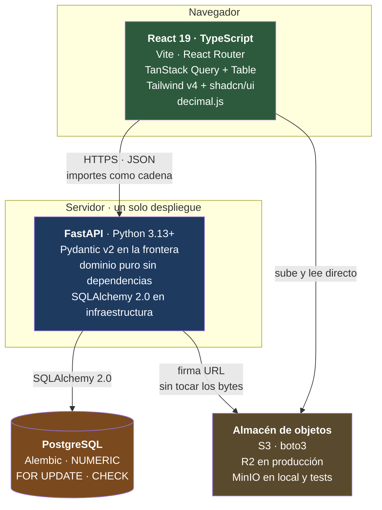

# CIMENTA · Stack tecnológico

> **Capa SDD:** *Plan · decisiones*. Concreta las herramientas con las que se construye la [arquitectura](02-arquitectura.md) y el [modelo de datos](03-modelo-datos.md).
>
> **Dónde empieza este documento.** El Paso 3 decidió la **forma** —monolito modular, capas con dominio puro, PostgreSQL— y dejó explícitamente para aquí las **herramientas**. La única decisión de stack tomada antes es el motor de base de datos, porque varias decisiones estructurales dependían de sus garantías ([ADR-002](adr/20260918-postgresql.md)).

---

## Índice

1. [Cómo se eligió](#1-cómo-se-eligió)
2. [Vista de conjunto](#2-vista-de-conjunto)
3. [Backend](#3-backend)
4. [Persistencia](#4-persistencia)
5. [Frontend](#5-frontend)
6. [Seguridad](#6-seguridad)
7. [Testing](#7-testing)
8. [Calidad y herramientas](#8-calidad-y-herramientas)
9. [Documentación](#9-documentación)
10. [Infraestructura](#10-infraestructura)
11. [Cada decisión de arquitectura y qué la sostiene](#11-cada-decisión-de-arquitectura-y-qué-la-sostiene)
12. [Lo que se descartó](#12-lo-que-se-descartó)
13. [Decisiones registradas](#13-decisiones-registradas)

---

## 1. Cómo se eligió

Cinco criterios, en orden de peso. No son genéricos: salen de las restricciones concretas de este proyecto.

**C1 · No contaminar el dominio.** [ADR-003](adr/20260918-dominio-puro.md) exige que las 25 reglas de negocio vivan en código sin dependencias de framework, ORM ni HTTP. Cualquier herramienta que imponga sus clases base o su patrón de persistencia en esa capa queda descartada de entrada, por buena que sea en todo lo demás.

**C2 · Sostener las garantías del motor.** La arquitectura se apoya en bloqueo pesimista de fila, aritmética decimal exacta y restricciones declarativas. Las herramientas tienen que exponer esas capacidades, no abstraerlas.

**C3 · Masa documental, porque buena parte del código lo escriben agentes.** Este criterio pesa más aquí que en un proyecto convencional. Una librería técnicamente superior pero poco documentada produce más alucinación que una buena y ubicua: el agente la reconstruye a partir de fragmentos y lo que no encuentra lo inventa. Ante dos opciones comparables, gana la que tiene más ejemplos públicos.

**C4 · Un solo desarrollador.** Nada que exija operar infraestructura que nadie va a mantener. Cada contenedor adicional se paga en atención.

**C5 · Verificable en integración continua.** Toda decisión de arquitectura que se pueda comprobar automáticamente debe tener una herramienta que la compruebe. Una regla de diseño que solo vive en un documento se erosiona; una que falla el pipeline, no.

---

## 2. Vista de conjunto



| Capa | Elección |
|---|---|
| **Lenguaje backend** | Python 3.13+ |
| **Framework HTTP** | FastAPI |
| **Validación y DTO** | Pydantic v2 |
| **ORM** | SQLAlchemy 2.0, **modo síncrono** |
| **Migraciones** | Alembic |
| **Base de datos** | PostgreSQL |
| **Lectura de Excel** | openpyxl |
| **Almacén de archivos** | Objetos compatibles con S3 vía `boto3` — Cloudflare R2 en producción, MinIO en local y tests |
| **Tipo real de archivo** | `puremagic` sobre los bytes, nunca la extensión · `defusedxml` y apertura del ZIP para lo que no tiene firma legible |
| **Contraseñas y sesión** | pwdlib con Argon2id · sesión con estado en tabla |
| **Configuración y secretos** | pydantic-settings, desde el entorno |
| **Lenguaje frontend** | TypeScript |
| **UI** | React 19 · Vite |
| **Estado de servidor** | TanStack Query |
| **Tablas de datos** | TanStack Table |
| **Estilos y componentes** | Tailwind CSS v4 · shadcn/ui |
| **Formularios** | React Hook Form · Zod |
| **Cliente de API** | openapi-typescript · openapi-fetch, generados del OpenAPI |
| **Testing backend** | pytest · testcontainers |
| **Testing frontend** | Vitest · Testing Library · Playwright |
| **Dependencias y entorno** | uv |
| **Lint y formato** | Ruff · ESLint |
| **Tipos** | mypy · TypeScript strict |
| **Fronteras de módulo** | import-linter |
| **Auditoría de dependencias** | pip-audit · npm audit · Dependabot |
| **Observabilidad** | structlog · Sentry |
| **CI** | GitHub Actions |

Las versiones exactas se fijan en TKT-001. Aquí se decide la línea mayor, que es lo que condiciona el diseño.

---

## 3. Backend

### 3.1. Python

**Python 3.13 como mínimo.** El entorno de desarrollo ya tiene 3.14. La versión importa poco para este proyecto salvo en un punto: `decimal.Decimal` es parte de la biblioteca estándar y su comportamiento es estable desde hace años, que es exactamente lo que se quiere para el tipo que sostiene todos los importes.

### 3.2. FastAPI

Es la capa HTTP, y solo eso.

**Por qué encaja con la arquitectura**

- **No impone un patrón de persistencia.** Es un enrutador con validación; no trae ORM ni opina sobre cómo se guardan las cosas. Eso permite que `dominio/` no tenga ninguna dependencia del framework, que es el criterio C1.
- **Pydantic en la frontera y solo en la frontera.** Los modelos de petición y respuesta son DTO explícitos; el dominio no los conoce. La conversión ocurre en `api/`.
- **Manejadores de excepción personalizables**, que es lo que hace viable el [contrato de error estructurado](02-arquitectura.md#73-contrato-de-error-de-regla-de-negocio): una excepción de dominio sube, un manejador global la traduce a la forma acordada con su regla, su detalle y sus acciones. Sin eso, cada endpoint tendría que construir el error a mano.
- **OpenAPI nativo**, sin paquete de terceros. La documentación de API se genera del código, que es lo que exige la capa *API* de `convenciones.md`.

**Por qué no Django**, que sería la elección por defecto para una aplicación de gestión en Python: su ORM es Active Record y su idiom es el *fat model*, con la lógica de negocio dentro de las clases de persistencia. Eso es exactamente lo contrario de [ADR-003](adr/20260918-dominio-puro.md). El detalle completo, incluido lo que se pierde al renunciar al admin de Django, está en [ADR-009](adr/20260918-fastapi.md).

### 3.3. Trabajos en segundo plano

**Dentro del proceso, con el estado en base de datos.** La importación de presupuestos es la única operación pesada —8 MB, 25 hojas, 5,988 filas— y su estado ya vive en las tablas `importacion` e `importacion_error`. FastAPI ejecuta la tarea en segundo plano y la interfaz consulta el progreso.

No hay cola externa ni trabajador separado. El umbral que obligaría a introducirlos está en [ADR-001](adr/20260918-monolito-modular.md): si la importación supera los cinco minutos o bloquea peticiones de usuario.

**Dos consecuencias de ejecutar dentro del proceso, y las dos tienen remedio barato:**

**El parseo se va a un proceso aparte.** openpyxl es Python puro y retiene el intérprete mientras lee; en un hilo del servidor, eso degrada la latencia de todo lo demás durante la importación. Se ejecuta en un `ProcessPoolExecutor` de un solo trabajador, que lo aísla sin introducir infraestructura. Es un cambio de dos líneas frente a montar una cola.

**Un reinicio no puede dejar la fila colgada** (`RNF-17`). El trabajo actualiza `importacion.latido` mientras analiza, y al arrancar la aplicación un barrido marca `CON_ERRORES` toda importación en `ANALIZANDO` con el latido vencido, añadiendo un `importacion_error` de tipo `PROCESO_INTERRUMPIDO`. Sin eso, un reinicio a mitad de análisis deja la obra sin poder importar de nuevo y sin nadie a quien reclamarle: la fase de análisis no escribe en el modelo real, así que el único daño posible es exactamente ese.

### 3.4. Autenticación

Sesión con estado en servidor, contraseñas con `pwdlib[argon2]` y límite de intentos. Como el resto de la superficie de seguridad hay que construirla a mano —es el coste aceptado en [ADR-009](adr/20260918-fastapi.md)—, las decisiones viven juntas en [§6](#6-seguridad) en lugar de repartidas por capa.

---

## 4. Persistencia

### 4.1. SQLAlchemy 2.0

**Es la pieza que hace posible la separación entre dominio y persistencia**, y por eso es la decisión más consecuente del backend después del framework.

| Lo que exige la arquitectura | Cómo lo cubre |
|---|---|
| Bloqueo pesimista ([ADR-004](adr/20260918-bloqueo-pesimista-presupuesto.md)) | `select(...).with_for_update()`, con `nowait`, `of` y `skip_locked` disponibles |
| Decimal exacto | `Numeric(18, 4)` mapea a `NUMERIC` de PostgreSQL y devuelve `decimal.Decimal`, nunca `float` |
| Consulta del semáforo con CTEs | Core expone `WITH`, `UNION ALL` y ventanas sin bajar a SQL en texto |
| Dominio sin dependencias | Patrón Data Mapper: los modelos de persistencia viven en `infraestructura/` y no aparecen en las firmas del dominio |

### 4.2. Síncrono, no asíncrono

**SQLAlchemy en modo síncrono, con rutas declaradas `def`**, que FastAPI ejecuta en su grupo de hilos. No `async def` ni `AsyncSession`.

Es una decisión que parece de estilo y no lo es: cambia cómo se escribe cada transacción, cada prueba de concurrencia y cada error posible. Dejarla sin decidir garantiza que el proyecto acabe con las dos formas mezcladas.

| Razón | Por qué pesa aquí |
|---|---|
| La operación central es `BEGIN … FOR UPDATE … COMMIT` | Una transacción con bloqueo pesimista se lee y se razona mejor sin `await` intercalado. El error que importa es *"¿se soltó el bloqueo antes de tiempo?"*, no *"¿cuántas peticiones simultáneas aguanta?"* |
| El test de TKT-022 necesita dos sesiones reales y simultáneas | Dos hilos con dos `Session` son cinco líneas deterministas. La versión asíncrona exige orquestar tareas, y un test de concurrencia que pasa por temporización en vez de por bloqueo es peor que no tenerlo |
| La carga son decenas de operaciones por hora | Async compra concurrencia de E/S. Aquí no hay E/S que solapar: hay cuatro filas que serializar a propósito |
| openpyxl es síncrono | La única operación pesada no se beneficiaría igualmente |

El riesgo que se evita es el clásico y no lo detecta ningún linter: una llamada bloqueante dentro de una ruta `async def` congela el bucle de eventos **entero**, y el síntoma es una aplicación lenta sin ningún error en el registro. Con un solo desarrollador y agentes escribiendo código, esa trampa se cierra por decisión, no por disciplina. Detalle en [ADR-013](adr/20260919-sqlalchemy-sincrono.md).

**Toda sesión declara sus tiempos máximos** (`RNF-16`): `lock_timeout` para no esperar un bloqueo indefinidamente y `statement_timeout` para no ejecutar indefinidamente. Se fijan en el rol de aplicación, así que aplican aunque una ruta nueva se olvide de pedirlos. El vencimiento de `lock_timeout` se traduce al contrato de error con la acción de reintentar: es información accionable, no un fallo interno.

### 4.3. Dónde vive cada cosa

Esta es la ambigüedad que más problemas causa en una arquitectura por capas, así que conviene fijarla:

```
dominio/
  valores.py      Dinero, Cantidad, Rendimiento, Porcentaje     ← decimal puro
  reglas.py       evaluar_disponibilidad(...) -> Resultado      ← funciones puras
  resultados.py   ResultadoEvaluacion, MotivoBloqueo            ← dataclasses

infraestructura/
  modelos.py      clases SQLAlchemy mapeadas a las tablas
  repositorios.py cargan, extraen valores y persisten
```

**Las reglas reciben objetos de valor, no entidades.** `evaluar_disponibilidad(presupuestado: Dinero, consumido: Dinero, solicitado: Dinero)` no sabe que existe una tabla, una sesión ni un modelo. La capa de aplicación carga lo que hace falta, extrae los valores, llama a la regla y persiste el resultado.

Esa firma es lo que permite que los 137 escenarios se ejecuten en milisegundos sin levantar nada, y es la razón concreta de elegir un Data Mapper sobre un Active Record.

### 4.4. Alembic

Migraciones versionadas en el repositorio, aplicables y reversibles. Los disparadores e invariantes que no son declarativos —el de inmutabilidad de la línea base, invariante 14— se escriben como SQL explícito dentro de la migración, no se autogeneran: son parte del diseño y deben leerse como tal.

**Los tres roles de PostgreSQL y sus permisos también se crean en la migración inicial**, no a mano en el servidor. Un permiso que solo existe en producción no se puede probar, y la inmutabilidad de la bitácora depende de él.

**Las pruebas construyen el esquema con `alembic upgrade head`**, nunca con `create_all()`. Es la diferencia entre probar el esquema que se va a desplegar y probar uno parecido: `create_all()` no ejecuta el SQL explícito de las migraciones, así que el disparador del invariante 14 y los permisos de la bitácora simplemente no existirían durante los tests. Las pruebas que los verifican pasarían por no tener nada que verificar.

### 4.5. Lectura de Excel: openpyxl

**Elegido porque está verificado contra los archivos reales del cliente**, no por catálogo. Durante la especificación se leyeron con él los seis archivos de `Doc de contexto/`, incluido el catálogo de 4,860 filas de Union Square.

Lo decisivo: en modo `data_only=True`, openpyxl devuelve el **valor en caché** de las celdas con fórmula rota, de modo que un `#REF!` llega como la cadena `#REF!` y no como `None`. Eso es precisamente lo que TKT-015 necesita para reportar el error fila a fila en lugar de fallar en bloque o, peor, importar celdas vacías como ceros.

En modo `read_only=True` el consumo de memoria es acotado incluso con el archivo de 8 MB.

> **Alternativa si el rendimiento apremia:** `python-calamine` es sensiblemente más rápido por estar escrito en Rust, pero habría que comprobar que expone los errores de fórmula con el mismo detalle. No se adopta ahora porque la importación es una operación excepcional, no una de cada día, y porque openpyxl ya está probado contra los datos reales.

### 4.6. Los archivos no viven en PostgreSQL

**Almacenamiento de objetos compatible con S3, accedido con `boto3`.** Un solo adaptador y dos destinos: **MinIO** en desarrollo y en las pruebas de integración, **Cloudflare R2** en producción. El razonamiento completo está en [ADR-016](adr/20261001-almacenamiento-de-objetos.md); aquí van las consecuencias de herramienta.

**Por qué `boto3` y no un cliente del proveedor.** Porque el API de S3 es lo que hace la decisión reversible: cambiar de destino es cambiar `endpoint_url`. Un SDK propietario ataría el código a quien se contrate hoy. Cuenta además el criterio **C3** —`boto3` es probablemente la librería de Python con más ejemplos públicos después de `requests`, y eso importa cuando buena parte del código lo escriben agentes.

**Por qué el API no sirve los bytes.** Las rutas son `def` y corren en el grupo de hilos de FastAPI ([ADR-013](adr/20260919-sqlalchemy-sincrono.md)). Servir un video de 200 MB a un teléfono con cobertura de obra retendría un hilo de ese grupo durante minutos, y el síntoma sería una aplicación lenta sin un solo error en el registro. Con URL prefirmadas el problema no se mitiga: no existe.

**El tipo se lee de los bytes, con `puremagic`.** No de la extensión ni del `Content-Type` que declare el cliente, que son dos cosas que escribe quien sube. La lista blanca es cerrada —JPEG, PNG, HEIC, WebP, MP4, PDF, XML y los dos formatos de hoja de cálculo— y **SVG queda fuera**: no es una imagen, es un documento con capacidad de ejecutar código, y un `.svg` servido en línea con la sesión del usuario delante es ejecución de código ajeno.

> **Se elige `puremagic` y no `python-magic` por una razón de entorno, no de calidad.** `python-magic` es una envoltura sobre `libmagic`, una biblioteca nativa que en Linux viene con el sistema y **en Windows hay que instalar aparte, con un paquete distinto**. El desarrollo ocurre en Windows y el pipeline en Linux: una dependencia que se instala diferente en cada uno es un *"en mi máquina funciona"* esperando a ocurrir. `puremagic` es Python puro, no tiene binario detrás y reconoce de sobra la lista blanca de arriba.

**Dos de la lista no tienen firma que leer, y eso cambia el código.** Un `.xlsx` es un ZIP —indistinguible de cualquier otro ZIP— y un `.xml` es texto sin firma ninguna. Para esos dos la comprobación es **estructural y no mágica**: abrir el ZIP y exigir la parte de libro de Excel en su `[Content_Types].xml`, y parsear el XML hasta la raíz con `defusedxml`. Si no abre, no entra.

Importa más de lo que parece: el ZIP que pasa esa puerta es el que openpyxl va a abrir después, y un archivo construido a propósito es la vía más barata de agotar la memoria de un despliegue que es un solo proceso.

> **La compresión de imagen ocurre en el cliente, antes de subir.** Una foto de teléfono actual son 3-8 MB y nada de lo que el sistema hace con ella necesita esa resolución. Comprimir en el navegador con `canvas` baja la subida a cientos de kilobytes sobre una conexión de obra y evita traer una dependencia de procesamiento de imagen al backend — que tendría que correr en el mismo proceso, con el mismo problema de hilos.

---

## 5. Frontend

### 5.1. Composición

| Pieza | Elección | Por qué esta |
|---|---|---|
| **Build** | Vite | Estándar de facto para React fuera de un metaframework; arranque en frío rápido |
| **Enrutado** | React Router v7 | Aplicación interna detrás de autenticación: no hay SEO ni necesidad de renderizado en servidor |
| **Estado de servidor** | TanStack Query | Invalidación de caché tras cada mutación. Es lo que hace que el semáforo refleje una entrada registrada hace un minuto sin recargar |
| **Tablas** | TanStack Table | La aplicación es mayoritariamente tablas: semáforo, explosión de insumos, catálogos, nómina, saldos pendientes |
| **Estilos** | Tailwind CSS v4 | |
| **Componentes** | shadcn/ui | Se copian al repositorio en lugar de instalarse. Importa para la *pantalla de bloqueo* de TKT-008, que es un componente propio del dominio y no un diálogo genérico |
| **Formularios** | React Hook Form + Zod | Validación de forma en el cliente para que el usuario no espere a un viaje de red. La validación autoritativa es siempre la del servidor |
| **Cliente de API** | `openapi-typescript` + `openapi-fetch` | Tipos generados del OpenAPI que FastAPI ya publica. Ver [§5.4](#54-el-contrato-de-api-no-se-replica-a-mano) |
| **Decimal** | decimal.js | Los importes llegan como cadena por el contrato de error; convertirlos con `Number` los degradaría |
| **Subida de archivos** | `<input type="file" capture>` · compresión y **normalización a JPEG** con `canvas` antes de subir · subida directa a la URL prefirmada | La cámara del teléfono se abre desde el navegador, sin aplicación nativa. Comprimir antes baja una foto de 4 MB a cientos de kilobytes sobre una conexión de obra, y los bytes no pasan por el API. Normalizar a JPEG resuelve el **HEIC del iPhone**, que Chrome y Firefox no saben mostrar — [ADR-016](adr/20261001-almacenamiento-de-objetos.md) |
| **Sin conexión** | `vite-plugin-pwa` (Workbox) · `@tanstack/query-persist-client` · `idb` | En obra no hay internet (`RNF-18`). El service worker sirve el paquete, la caché persistida da la lectura y la cola en IndexedDB guarda lo capturado hasta que haya señal — [ADR-015](adr/20260919-captura-diferida-sin-conexion.md) |

### 5.2. Sin renderizado en servidor

No hay Next.js ni Remix. Es una aplicación interna, detrás de autenticación, sin indexación ni primera carga que optimizar para usuarios anónimos. Un metaframework añadiría un modelo de renderizado dual y una capa de servidor que este producto no necesita, y el backend ya es Python: tener además un servidor Node duplicaría la superficie de despliegue.

### 5.3. El dinero también es exacto en el cliente

El contrato de error y las respuestas de la API transportan los importes **como cadena**. En el cliente se convierten con `decimal.js` y se formatean solo al presentar.

Un `Number` de JavaScript es un flotante de doble precisión: `0.1 + 0.2` da `0.30000000000000004`. Aceptar eso en la capa que muestra el costo de una obra anularía la exactitud que se protege en toda la cadena anterior.

### 5.4. El contrato de API no se replica a mano

**Los tipos del cliente se generan del OpenAPI que FastAPI publica.** No se escriben dos veces.

La razón es concreta y sale de la pieza anterior. Pydantic v2 serializa `Decimal` **como cadena** en modo JSON sin que haya que pedírselo, y lo declara como `string` en el esquema. Es decir: el OpenAPI que FastAPI genera **ya dice que los importes son cadenas**. Generar los tipos desde ahí hace que `decimal.js` reciba exactamente lo que espera y que el compilador avise si algún día un importe deja de serlo.

La alternativa —mantener esquemas Zod que espejen los modelos Pydantic— duplica el contrato en dos lenguajes que nadie obliga a coincidir. El día que un campo cambia de nombre en el servidor, el espejo sigue compilando y el error aparece en ejecución, en una pantalla, delante de alguien.

**Zod se queda, con otro trabajo.** Valida el formulario antes de enviarlo: campos obligatorios, formato, rangos. Eso es experiencia de usuario, es local y no tiene por qué parecerse a nada del servidor. Lo que no hace es definir la forma de lo que viaja.

> La regla en una línea: **Zod valida lo que el usuario escribe; el OpenAPI define lo que la API devuelve.** Cuando un esquema Zod empieza a describir una respuesta, hay un contrato duplicado.

---

## 6. Seguridad

Los requisitos son `RNF-01`…`RNF-09` del [PRD §9](01-descripcion-producto.md#9-requisitos-no-funcionales); las decisiones estructurales, la [arquitectura §7.6](02-arquitectura.md#76-seguridad-de-la-frontera). Aquí van las herramientas, y una tabla al final que dice cuáles se comprueban solas.

Conviene decir por qué esta sección existe. FastAPI no trae autenticación, ni sesión, ni límite de intentos: es la contrapartida de [ADR-009](adr/20260918-fastapi.md), que la aceptó a cambio de un dominio libre de framework. Lo que Django regala, aquí se elige pieza a pieza — y lo que se elige pieza a pieza se puede olvidar entero.

### 6.1. Contraseñas y sesión

**Contraseñas con `pwdlib[argon2]`**, usando `PasswordHash.recommended()`, que hoy resuelve a Argon2id con parámetros sensatos. Es lo que la documentación de FastAPI usa en su propio tutorial de seguridad, y ese detalle importa por el criterio **C3**: un agente que busque cómo hashear una contraseña en FastAPI va a encontrar exactamente este código.

> **No se usa `passlib`.** Es la opción que el ecosistema arrastra por costumbre y no ha publicado versión desde 2020. Con Argon2 funciona —delega en `argon2-cffi`— así que esto no es un fallo que corregir, sino una dependencia sin mantenimiento en la pieza que guarda las contraseñas de seis roles que autorizan gasto. `pwdlib` hace lo mismo, se mantiene y además coincide con los ejemplos públicos.

**El inicio de sesión verifica siempre un hash**, exista el usuario o no. Cuando el correo no está en la tabla se compara contra un hash de descarte. Sin eso, el tiempo de respuesta distingue *"esa cuenta no existe"* de *"esa contraseña no es"*, que es la primera mitad de un ataque dirigido — y con entre diez y treinta usuarios, saber quién tiene cuenta es saber a quién apuntar.

**La sesión vive en la tabla `sesion`** ([modelo de datos §10](03-modelo-datos.md#10-identidad-y-auditoría)). La cookie transporta un identificador opaco y nada más: `HttpOnly`, `Secure`, `SameSite=Lax`, con caducidad absoluta y por inactividad. Cerrar sesión, desactivar un usuario o quitarle un rol surte efecto en la petición siguiente, porque el permiso se resuelve contra la base de datos, no contra lo que el cliente presenta.

Esto es lo que descarta el JWT y también la cookie firmada sin estado, que es el mismo problema con otro nombre: las dos trasladan al cliente la verdad sobre quién eres, y revocarlas exige una lista de revocación que es una tabla de sesiones con más pasos. Detalle en [ADR-014](adr/20260919-sesion-con-estado.md).

### 6.2. La frontera HTTP

| Riesgo | Herramienta | Nota |
|---|---|---|
| **CSRF** | Token de doble envío verificado en todo método que muta estado | `SameSite=Lax` ya frena el formulario cruzado, pero no es defensa en profundidad y **no basta como único control**. Se elige `Lax` y no `Strict` a propósito: con `Strict`, abrir un enlace a una requisición desde el correo no manda la cookie y el usuario aparece desconectado sin entender por qué |
| **Fuerza bruta sobre el acceso** | `slowapi` por origen, más bloqueo temporal por cuenta tras `N` intentos, registrado en `intento_acceso` | Argon2 encarece cada intento **para el servidor también**: sin límite, el inicio de sesión es el punto más barato de tumbar de todo el sistema |
| **Cabeceras ausentes** | Middleware propio: `Content-Security-Policy`, `Strict-Transport-Security`, `X-Content-Type-Options`, `Referrer-Policy` | Son quince líneas. El artefacto único sirve la SPA y la API desde el mismo origen, así que una política restrictiva es viable sin excepciones |
| **Una ruta nueva que nace sin proteger** | Comprobación de rol en `api/` en **todas** las rutas, con una prueba que recorre el enrutador y falla si alguna queda sin dependencia de autenticación | TKT-006 ya lo pide en prosa; la prueba lo convierte en algo que no se puede olvidar al añadir la ruta número 41 |

### 6.3. Archivos y secretos

**Los archivos que sube el usuario** son seis flujos desde que existe la capacidad `C8`: el Excel de la línea base, la evidencia de mermas de `RN-09`, las fotos y el video del avance, la remisión del proveedor, el PDF con el XML de la factura y los documentos generales de la obra. Los seis entran por la misma puerta, y `RNF-06` la define:

- **El tipo se determina leyendo los bytes**, con `puremagic`, contra una lista blanca cerrada; XML y hoja de cálculo, que no tienen firma legible, se comprueban abriéndolos ([§4.6](#46-los-archivos-no-viven-en-postgresql)). Ni la extensión ni el `Content-Type` declarado cuentan: los escribe quien sube.
- **El nombre lo genera el sistema.** El original se conserva como dato que se muestra, **nunca como ruta**.
- **El tamaño se limita por tipo** — 15 MB por imagen, 50 MB por video, 25 MB por documento *(asumido, `PA-15`)*.
- **Se sirven desde un origen distinto al de la aplicación**, que es el que lleva la cookie de sesión. Desde ese origen aislado, imagen y video se muestran en línea; todo lo demás va con `Content-Disposition: attachment`.

> **`RNF-06` decía antes "siempre como descarga" y era incompatible con la evidencia.** Una galería de fotos de avance que no se puede ver no es evidencia. Lo que hacía peligroso mostrarla no era mostrarla: era hacerlo desde el origen de la SPA. Separar el origen permite las dos cosas, y es la razón por la que `img-src` y `media-src` de la política de contenido admiten el dominio del almacén de objetos y ningún otro. Detalle en [ADR-016](adr/20261001-almacenamiento-de-objetos.md).

openpyxl parsea un ZIP que viene de fuera. En modo `read_only` el consumo es acotado, pero el límite de tamaño es lo que impide que un archivo construido a propósito agote la memoria del proceso — que, siendo un despliegue único, es el proceso entero.

**Un archivo subido no se borra: se anula**, con autor y motivo, y el objeto permanece. Es el principio del libro mayor aplicado a la evidencia, y `RNF-19` lo complementa exigiendo que el **hash** de lo adjuntado quede asentado en la bitácora: sin él, *"se adjuntó esta foto"* es una referencia, no una prueba.

**Los secretos se leen del entorno** con `pydantic-settings`, que además valida que estén presentes al arrancar. Un despliegue al que le falta la credencial de base de datos o la semilla del token CSRF tiene que **no arrancar**, no arrancar con un valor por omisión. En el repositorio vive `.env.example` con las claves y sin los valores.

### 6.4. Dependencias

`pip-audit` para Python y `npm audit` para el frontend, **fallando el pipeline** ante severidad alta, más Dependabot para las actualizaciones y el escaneo de secretos de GitHub sobre el repositorio.

Es lo más barato de toda esta sección y responde a un riesgo propio de este proyecto: buena parte del código lo escriben agentes, y un agente añade una dependencia con la misma facilidad con la que escribe una función. Nadie va a auditar ese árbol a mano.

### 6.5. Privilegio mínimo en el motor

Los tres roles de PostgreSQL de la [arquitectura §7.6](02-arquitectura.md#76-seguridad-de-la-frontera) se crean en la migración inicial y las pruebas de integración **se conectan con el rol de aplicación**, no con el propietario. Es la única forma de que la prueba que intenta un `UPDATE` sobre la bitácora signifique algo: con el rol propietario, ese `UPDATE` funcionaría y la prueba quedaría verde por la razón equivocada.

El rol de solo lectura cierra el hueco que `import-linter` no puede cubrir. La herramienta comprueba **quién importa a quién**; que `analitica` no escriba es una propiedad de tiempo de ejecución que hasta ahora solo vivía en un diagrama.

### 6.6. Qué se comprueba solo

La tabla cubre los **diecinueve** requisitos no funcionales, no solo los de seguridad: vive aquí porque es en esta sección donde la pregunta *"¿y quién comprueba que esto se cumple?"* no tenía respuesta.

| Requisito | Cómo se verifica | ¿Falla el pipeline? |
|---|---|---|
| `RNF-01` sesión revocable | Prueba: desactivar un usuario con sesión abierta y comprobar que la siguiente petición responde `401` | ✅ |
| `RNF-02` credencial no legible | Prueba sobre las banderas de la cookie en la respuesta de inicio de sesión | ✅ |
| `RNF-03` derivación lenta | Prueba: el hash almacenado empieza por `$argon2id$` y no es el texto original | ✅ |
| `RNF-04` límite de intentos | Prueba: `N+1` intentos fallidos y el siguiente responde bloqueado, con asiento en `intento_acceso` | ✅ |
| `RNF-05` CSRF | Prueba: petición que muta estado sin token, rechazada | ✅ |
| `RNF-06` archivos | Pruebas: un `.svg` renombrado a `.jpg` se rechaza por su tipo **real**; un tamaño excedido se rechaza; la URL de lectura caduca; la respuesta de un PDF lleva `Content-Disposition: attachment` | ✅ |
| `RNF-07` secretos | La aplicación no arranca sin las variables obligatorias · escaneo de secretos del repositorio | ✅ |
| `RNF-08` dependencias | `pip-audit` y `npm audit` en CI | ✅ |
| `RNF-09` privilegio mínimo | Prueba: `UPDATE` sobre `bitacora` con el rol de aplicación falla a nivel de motor | ✅ |
| `RNF-10` respaldo | **No.** Depende del proveedor y del entorno | ❌ manual |
| `RNF-11` ensayo de restauración | **No.** Es un procedimiento con testigo, no una prueba | ❌ trimestral |
| `RNF-12` sin alta disponibilidad | **No es verificable porque no es una restricción**: es una renuncia declarada | — |
| `RNF-13` registro estructurado | Prueba: la respuesta de error lleva identificador de correlación y el registro lo contiene | ✅ |
| `RNF-14` agregación de errores | **No.** Depende de un servicio externo | ❌ manual |
| `RNF-15` semáforo < 2 s | Prueba de rendimiento con volumen sembrado | ✅ |
| `RNF-16` sin esperas indefinidas | Prueba: una transacción retiene el bloqueo, la segunda vence y responde con el contrato de error | ✅ |
| `RNF-17` trabajo interrumpido | Prueba: importación con latido vencido, barrida a `CON_ERRORES` | ✅ |
| `RNF-18` captura sin conexión | Prueba: se encola una captura sin red, se sincroniza y **no se duplica** al reenviarla; otra prueba encola una entrada que excede lo ordenado y verifica que vuelve con el contrato de error de `RN-07`, no aceptada | ✅ |
| `RNF-19` integridad de la evidencia | Prueba: un objeto cuyo hash no coincide con lo declarado **no pasa** a `DISPONIBLE`; el hash del adjunto confirmado aparece en el asiento de bitácora. **El respaldo del almacén de objetos, no**: es procedimiento, igual que `RNF-10` | ✅ parcial |

**Quince de diecinueve, automáticas.** Las cuatro que faltan dependen de un entorno que todavía no existe o de un servicio externo, y son las que TKT-058 convierte en procedimiento con fecha. `RNF-19` cuenta entre las automáticas por su mitad verificable —la integridad del adjunto—; su otra mitad, el respaldo del bucket, viaja con `RNF-10`.

Es la aplicación del criterio **C5** a una capa que hasta ahora no tenía ninguna verificación: una regla de seguridad que solo vive en un documento se erosiona igual que cualquier otra, y además en silencio.

---

## 7. Testing

### 7.1. Backend

| Nivel | Herramienta | Qué cubre |
|---|---|---|
| **Reglas de dominio** | pytest | Las 25 reglas. Sin base de datos, sin HTTP, en milisegundos |
| **Integración** | pytest + testcontainers | Casos de uso contra **PostgreSQL real**, nunca SQLite |
| **Concurrencia** | pytest con dos sesiones reales | El escenario de requisiciones simultáneas de HDU-002 |
| **API** | pytest + cliente de FastAPI | Contrato de error, códigos de estado, forma de la respuesta |
| **Seguridad** | pytest + cliente de FastAPI | Los nueve requisitos verificables de [§6.6](#66-qué-se-comprueba-solo). Se conectan con el **rol de aplicación**, no con el propietario |
| **Rendimiento** | pytest con volumen sembrado | `RNF-15`: el semáforo bajo ~4,900 conceptos responde en menos de 2 s. Falla el pipeline si se pasa |

**testcontainers levanta también MinIO**, por la misma razón por la que levanta PostgreSQL: un doble de prueba del almacén de objetos no verifica que la URL prefirmada se firme bien, que caduque, ni que el objeto subido tenga el hash que se declaró. Y como MinIO habla el API de S3, lo que pasa en el test es lo que pasará contra R2.

**testcontainers levanta PostgreSQL en Docker para la sesión de tests.** [ADR-002](adr/20260918-postgresql.md) prohíbe expresamente usar SQLite para "ir más rápido": probaría contra garantías distintas de las de producción. SQLite no tiene `SELECT … FOR UPDATE`, ni decimal exacto, ni restricciones diferidas, ni roles con permisos — y los invariantes 7, 10, 17, 20 y 21 viven exactamente ahí, además de todo el control de concurrencia y toda la aritmética de dinero.

El test de concurrencia de TKT-022 necesita **dos conexiones reales y simultáneas**. Con dobles de prueba no probaría nada: la garantía la da el motor, no el código.

### 7.2. Trazabilidad escenario ↔ test

La especificación tiene 137 escenarios en Gherkin. La pregunta es cómo se garantiza que cada uno tiene un test.

**No se usa pytest-bdd.** Los archivos `.feature` con definiciones de pasos añaden una capa de indirección que hay que mantener, y los agentes escriben pytest plano con mucha más fiabilidad que pytest-bdd. Se pierde la ejecución literal del Gherkin; se gana claridad y menos fricción.

**En su lugar, convención de nombres más un verificador en CI:**

```python
def test_hdu002_esc04_requisicion_excede_importe_presupuestado(...):
    """HDU-002 esc. 4 · RN-03 — la requisición queda BLOQUEADA con su excedente."""
```

Un script recorre `docs/04-historias-usuario.md`, extrae cada `HDU-XXX esc. N` y comprueba que existe al menos un test que lo nombra. **Si falta alguno, el pipeline falla.** Es la misma idea que ya se aplica a la documentación —validarla como si fuera código— llevada a la relación entre especificación y pruebas.

Resuelve además el problema que la regla de aceptación plantea: *"una historia se acepta solo si todos sus escenarios pasan en verde"* deja de ser una intención y pasa a ser comprobable.

### 7.3. Frontend

**Vitest + Testing Library** para componentes, **Playwright** para los recorridos completos. Los dos recorridos que justifican Playwright son los que cruzan varias pantallas y tienen consecuencia real: importar y congelar una línea base, y levantar una requisición que se bloquea y acaba autorizada.

---

## 8. Calidad y herramientas

| Herramienta | Función | Qué decisión sostiene |
|---|---|---|
| **uv** | Entorno, dependencias y bloqueo de versiones | — |
| **Ruff** | Lint y formato. Sustituye a flake8, isort y black | — |
| **mypy** | Tipos, en modo estricto sobre `dominio/` | Las reglas son el código que más caro sale equivocar |
| **import-linter** | Contratos de dependencia entre módulos | **TKT-002**: falla el pipeline si un módulo importa el `dominio/` o la `infraestructura/` de otro, o si `dominio/` importa el framework |
| **ESLint + TypeScript strict** | Frontend | — |

**`import-linter` es la herramienta que sostiene [ADR-001](adr/20260918-monolito-modular.md).** Sin ella, el monolito modular degenera en un monolito con carpetas en pocos sprints, porque la disciplina de fronteras depende de que nadie se despiste. Los contratos se declaran así:

```ini
[importlinter:contract:capas]
name = El dominio no conoce a nadie
type = layers
layers =
    api
    aplicacion
    dominio

[importlinter:contract:modulos]
name = Los módulos solo hablan por su interfaz publicada
type = forbidden
source_modules = cimenta.compras
forbidden_modules =
    cimenta.presupuesto.dominio
    cimenta.presupuesto.infraestructura
```

---

## 9. Documentación

Cierra la equivalencia que [`convenciones.md` §10](convenciones.md#10-validación-de-documentación-en-ci) dejó pendiente: el material del máster ejemplifica esta capa sobre TypeScript, y aquí van los equivalentes en Python.

| Capa | Material del máster (TypeScript) | **CIMENTA (Python)** |
|---|---|---|
| **API** | adonis-autoswagger + Scalar | **OpenAPI nativo de FastAPI + Scalar** |
| **Código** | TSDoc + TypeDoc | **Docstrings estilo Google + mkdocstrings sobre MkDocs Material** |
| **Cobertura de docs** | `typedoc --validation.notDocumented` | **interrogate**, con umbral por módulo |
| **Markdown** | markdownlint-cli2 | markdownlint-cli2 |
| **Prosa** | Vale | Vale |
| **Enlaces** | lychee | lychee |

**Scalar se conserva** porque es independiente del lenguaje: consume la especificación OpenAPI que FastAPI genera. La recomendación del material sigue siendo válida sin adaptación.

**`interrogate` es el equivalente de la validación de TypeDoc**: mide qué proporción del código público tiene docstring y falla por debajo de un umbral. Se empieza exigiéndolo en `aplicacion/` y `dominio/` —las capas que un agente necesita entender para trabajar— y se extiende después.

### Verificadores propios

Comprobaciones que no existen como herramienta de terceros. Viven en [`tools/`](../tools/README.md) y **ya están escritas y en uso**: detectaron un diagrama con sintaxis inválida, enlaces a documentos inexistentes y conteos de escenarios descuadrados tras una renumeración.

| Verificador | Qué detecta | Estado |
|---|---|---|
| `tools/verificar_docs.py` | Enlaces relativos, anclas internas, identificadores inexistentes (`RN`, `PA`, `F`, `HDU`, `TKT`, invariantes), ADRs sin índice, rangos de tickets rotos, aritmética de story points y conteo de escenarios frente a la Definition of Done | ✅ En uso |
| `tools/extraer_mermaid.py` | Diagramas con sintaxis inválida, que en GitHub se renderizan como bloque de error | ✅ En uso |
| Escenarios sin test | El verificador de §7.2, que sostiene la regla de aceptación | ⏳ TKT-009, cuando exista código que verificar |

Los tres entran en el pipeline de calidad documental de TKT-009. El de Mermaid se sustituirá allí por `@mermaid-js/mermaid-cli`, que hace lo mismo sin navegador.

---

## 10. Infraestructura

### Local

**Docker Compose** con dos servicios: PostgreSQL y **MinIO**, ambos con volumen persistente. El backend y el frontend corren en el anfitrión con uv y Vite. Meter la aplicación en un contenedor durante el desarrollo añadiría un ciclo de reconstrucción sin ganar nada a esta escala.

MinIO en local no es un doble ni una concesión: es el mismo API de S3 contra el que corre producción, con otro `endpoint_url`. Desarrollar contra un disco local y desplegar contra objetos habría dejado sin probar justo lo que falla —firmas, caducidad, cabeceras de respuesta.

### Integración continua

**GitHub Actions**, con los trabajos que TKT-009 enumera: tests de backend contra PostgreSQL real, tests de frontend, contratos de `import-linter`, calidad documental, **auditoría de dependencias** (`pip-audit` y `npm audit`) y la **prueba de rendimiento del semáforo**. Nivel de aviso en local, nivel de error en el pipeline.

### Despliegue

**Una imagen de Docker con el backend sirviendo también los estáticos del frontend ya compilado, más PostgreSQL gestionado.** Un solo artefacto que desplegar, coherente con el monolito modular y con el despliegue de un solo inquilino de [ADR-008](adr/20260918-despliegue-single-tenant.md).

El destino concreto —VPS con Compose, o una plataforma gestionada— se decide en entregas posteriores: la Entrega 1 es documentación y no hay nada que desplegar todavía. Lo que sí queda fijado es la forma del artefacto, porque condiciona cómo se construye.

**Dos restricciones que el destino tiene que cumplir**, y por eso se declaran ya:

- PostgreSQL gestionado **con recuperación a un punto en el tiempo** (`RNF-10`). Es el criterio que descarta un contenedor de PostgreSQL sobre un volumen de VPS sin más, que es la opción por omisión cuando nadie lo ha pensado.
- Un **bucket de objetos con versionado y ciclo de vida** (`RNF-19`). Es lo que hace que la imagen del backend siga sin estado: si los archivos acabaran en un volumen junto al contenedor, el artefacto deja de ser recreable y [ADR-008](adr/20260918-despliegue-single-tenant.md) se rompe por la puerta de atrás.

### Respaldo y recuperación

| | |
|---|---|
| **Mecanismo** | Recuperación a un punto en el tiempo del PostgreSQL gestionado, más un volcado lógico diario retenido aparte |
| **Objetivos** | ≤ 1 h de pérdida, ≤ 8 h de restauración **(asumido, `RNF-10`)**. Planteados a Dirección General como **PA-12**, sin responder todavía: fijan el precio de la base gestionada, así que la respuesta tiene que llegar antes de contratarla |
| **Los archivos también** (`RNF-19`) | Viven fuera de la base y ahora son el volumen dominante del sistema. **Versionado de objetos activado** en el bucket —que es lo que convierte un borrado propagado en algo reversible— y **política de ciclo de vida** declarada. Un respaldo que solo cubre la base deja la bitácora apuntando a evidencia que ya no existe |
| **Y se puede comprobar que son los mismos** | El hash SHA-256 asentado en la bitácora permite verificar, tras una restauración, que el objeto recuperado es el que se adjuntó. Un respaldo de archivos sin esa comprobación restaura bytes, no evidencia |
| **Ensayo** | Trimestral, sobre un entorno limpio, con el tiempo medido y anotado (`RNF-11`). **El ensayo incluye archivos**: restaurar la base y no los objetos deja el sistema coherente y vacío de pruebas |

> **El volcado lógico aparte no es redundancia por gusto.** La recuperación a un punto en el tiempo del proveedor protege del fallo de disco; no protege de que la cuenta del proveedor se pierda, ni de un borrado propagado. Son dos fallos distintos y el segundo es el que deja sin línea base a un sistema cuyo valor entero es tener una.

### Observabilidad

**Registro estructurado en JSON** con `structlog`, con identificador de correlación por petición que viaja también en la respuesta de error, para que un usuario pueda decir *"me salió este código"* y eso sea suficiente para encontrar la petición.

**Sentry** para agregar los errores no controlados (`RNF-14`). Es un servicio externo y tiene nivel gratuito suficiente a esta escala; si eso resultara inaceptable por la naturaleza de los datos, la alternativa es GlitchTip autoalojado, con el coste de operación que el criterio **C4** penaliza.

> **Esto no es la bitácora y no puede serlo.** La bitácora responde *quién autorizó qué y por qué*, se escribe en la transacción del cambio y es inmutable por diseño. El registro técnico responde *por qué falló la petición de las 11:42*, se escribe fuera de toda transacción y se rota. Meter trazas técnicas en la bitácora la llenaría de ruido; meter asientos de negocio en el registro técnico los haría desaparecer al rotar. Las dos preguntas son reales y necesitan dos sitios.

---

## 11. Cada decisión de arquitectura y qué la sostiene

La comprobación de que el stack sirve a la arquitectura y no al revés.

| Decisión de arquitectura | Qué la sostiene en el stack | ¿Verificable en CI? |
|---|---|---|
| Dominio sin dependencias ([ADR-003](adr/20260918-dominio-puro.md)) | SQLAlchemy Data Mapper · FastAPI como capa fina · mypy estricto | ✅ import-linter |
| Fronteras entre módulos ([ADR-001](adr/20260918-monolito-modular.md)) | import-linter con contratos declarados | ✅ import-linter |
| Bloqueo pesimista ([ADR-004](adr/20260918-bloqueo-pesimista-presupuesto.md)) | `with_for_update()` de SQLAlchemy 2.0 | ✅ test de concurrencia con dos sesiones reales |
| Decimal exacto | `Numeric` → `Decimal` · serialización a cadena · decimal.js en el cliente | ✅ test de `0.1 + 0.2` y de la explosión real |
| Contrato de error ([ADR-007](adr/20260918-contrato-error-negocio.md)) | Manejador global de excepciones de FastAPI | ✅ test de forma de respuesta |
| Libro mayor de inventario ([ADR-005](adr/20260918-ledger-inventario.md)) | Sin columna de existencia en el esquema | ✅ el esquema no la tiene |
| Línea base inmutable ([ADR-006](adr/20260918-snapshot-linea-base.md)) | Disparador en migración de Alembic | ✅ test que intenta el `UPDATE` y espera el fallo |
| 26 invariantes en base de datos | Restricciones y permisos declarados en migraciones | ✅ tests contra PostgreSQL real, con el rol de aplicación |
| Importación tolerante a archivos rotos | openpyxl con `data_only=True` | ✅ test contra el archivo real con `#REF!` |
| Un despliegue ([ADR-008](adr/20260918-despliegue-single-tenant.md)) | Una imagen con backend y estáticos | — |
| Todo escenario tiene test | Convención de nombres + verificador propio | ✅ falla el pipeline |
| Sesión revocable ([ADR-014](adr/20260919-sesion-con-estado.md)) | Tabla `sesion` · permiso resuelto contra la base en cada petición | ✅ test: desactivar usuario con sesión abierta → `401` |
| Ejecución síncrona ([ADR-013](adr/20260919-sqlalchemy-sincrono.md)) | `Session` de SQLAlchemy · rutas `def` | ✅ test que recorre el enrutador y falla si alguna ruta es `async def` |
| Ninguna espera indefinida (`RNF-16`) | `lock_timeout` y `statement_timeout` en el rol de aplicación | ✅ test: transacción que retiene el bloqueo → la segunda vence y devuelve el contrato de error |
| `analitica` solo lee | Rol de PostgreSQL de solo `SELECT` | ✅ test: un `INSERT` con ese rol falla a nivel de motor |
| Seguridad de la frontera (`RNF-01`…`RNF-09`) | pwdlib · sesión en tabla · CSRF · slowapi · cabeceras · pip-audit | ✅ nueve de nueve, [§6.6](#66-qué-se-comprueba-solo) |
| Recuperabilidad (`RNF-10`, `RNF-11`) | PostgreSQL gestionado con recuperación a punto en el tiempo | ❌ ensayo trimestral con testigo |
| Captura sin conexión ([ADR-015](adr/20260919-captura-diferida-sin-conexion.md)) | Service worker · caché persistida · cola en IndexedDB · sincronización idempotente por los mismos casos de uso | ✅ test de encolado, sincronización, no duplicación y rechazo por regla |
| Archivos fuera de la base ([ADR-016](adr/20261001-almacenamiento-de-objetos.md)) | `boto3` sobre S3 · URL prefirmadas · MinIO en testcontainers · tipo leído de los bytes | ✅ test de firma, caducidad, tipo falsificado y hash que no coincide |

**Diecinueve decisiones, diecisiete verificables automáticamente.** Es la aplicación del criterio C5: una regla de diseño que solo vive en un documento se erosiona.

Las dos que no se verifican solas son las dos que dependen de un entorno que todavía no existe. Cuando exista, `RNF-11` convierte la primera en un procedimiento con fecha; la segunda —un despliegue único— no es verificable porque no es una restricción, es una renuncia.

---

## 12. Lo que se descartó

| Opción | Por qué no |
|---|---|
| **Django** | ORM Active Record e idiom de *fat model*: la lógica de negocio acaba en las clases de persistencia, que es lo contrario de ADR-003. Se renuncia al admin, que habría ahorrado trabajo en catálogos, pero el admin no respeta reglas como la baja lógica bloqueada de HDU-007 |
| **Litestar** | Mejor diseñado que FastAPI en inyección de dependencias y capas. Se descarta por el criterio **C3**: mucha menos documentación pública, y un agente que escribe Litestar alucina más que uno que escribe FastAPI. Es una renuncia consciente de calidad técnica a cambio de fiabilidad de generación |
| **SQLModel** | Fusiona Pydantic y SQLAlchemy en una sola clase, **borrando la frontera entre DTO y entidad de persistencia**, que es justo la separación que este diseño protege |
| **Django ORM o Tortoise** | Active Record el primero; ecosistema pequeño el segundo |
| **MongoDB u otro documental** | El dominio es intensamente relacional y transaccional: jerarquía de cinco niveles, explosión de insumos, amortización de anticipos |
| **Next.js o Remix** | Aplicación interna tras autenticación: sin SEO ni necesidad de renderizado en servidor. Añadiría un servidor Node junto al backend Python |
| **JWT y la cookie firmada sin estado** | Son el mismo descarte con dos nombres: las dos trasladan al cliente la verdad sobre quién eres, y revocarlas exige una lista de revocación que es una tabla de sesiones con más pasos. Con seis roles que autorizan gasto, quitar un permiso tiene que surtir efecto ya — [ADR-014](adr/20260919-sesion-con-estado.md) |
| **`passlib`** | Sin versión nueva desde 2020 en la pieza que guarda las contraseñas. `pwdlib[argon2]` hace lo mismo, se mantiene y es lo que usan los ejemplos públicos de FastAPI, que por el criterio **C3** cuenta |
| **SQLAlchemy asíncrono** | No compra nada a decenas de operaciones por hora y añade un modo de fallo que ningún linter detecta: una llamada bloqueante en una ruta `async def` congela el bucle entero — [ADR-013](adr/20260919-sqlalchemy-sincrono.md) |
| **Esquemas Zod como espejo del contrato de API** | Duplicar el contrato en dos lenguajes que nadie obliga a coincidir. Los tipos se generan del OpenAPI; Zod se queda validando formularios, que es trabajo local |
| **Cola externa para la importación** *(revisitado)* | Sigue sin justificarse. Lo que faltaba no era una cola, sino que el trabajo sobreviva a un reinicio: eso se resuelve con un latido y un barrido |
| **`SameSite=Strict` como único control de CSRF** | Mitiga, pero no es defensa en profundidad, y rompe los enlaces entrantes: abrir una requisición desde el correo no manda la cookie y el usuario aparece desconectado. Se usa `Lax` con token de doble envío |
| **pytest-bdd** | Indirección de definiciones de pasos que hay que mantener; los agentes escriben pytest plano con más fiabilidad. La trazabilidad se consigue con convención de nombres y un verificador |
| **Celery o cola externa** | La única operación pesada es la importación, que es excepcional. Umbral de reconsideración en ADR-001 |
| **pandas para leer Excel** | Trae NumPy y convierte a flotante por omisión, que es exactamente lo que no puede pasar con importes. openpyxl devuelve `Decimal` o cadena |
| **Poetry** | uv lo cubre y además reemplaza pip, pip-tools y la gestión de entornos, del mismo equipo que Ruff |
| **Aplicación nativa o híbrida** para la captura en obra | Daría más capacidad sin conexión, a cambio de una segunda cadena de compilación, un segundo artefacto y distribución en dos tiendas. Contra el criterio **C4**: hay un desarrollador. La aplicación web instalable cubre el caso real — [ADR-015](adr/20260919-captura-diferida-sin-conexion.md) |
| **Archivos en el sistema de ficheros del servidor** | Rompe el artefacto sin estado de [ADR-008](adr/20260918-despliegue-single-tenant.md), deja el respaldo de `RNF-10` por construir entero, y mete los bytes en el grupo de hilos de [ADR-013](adr/20260919-sqlalchemy-sincrono.md): cada descarga de un video retendría un hilo mientras dura, con una aplicación lenta y ningún error en el registro como único síntoma |
| **Los bytes dentro de PostgreSQL** (`BYTEA` u objeto grande) | Sería transaccional, que es una ventaja real y por eso se nombra. Se descarta por el precio: decenas de gigabytes al año pasando por el WAL, la replicación y cada volcado lógico encarecen la recuperación a punto en el tiempo que `RNF-10` exige, y compiten por el motor del que `RNF-15` pide respuesta en menos de dos segundos. Con video es inviable |
| **MinIO autoalojado en producción** | Idéntico en código a lo elegido —el mismo `boto3`, el mismo API— y descartado solo por el criterio **C4**: un contenedor con estado más que actualizar, vigilar y respaldar, operado por quien escribe las reglas de negocio. Se queda como destino de desarrollo y pruebas, y como la salida si la nube pública resultara inaceptable |
| **Un SDK propietario del proveedor de objetos** | Ataría el código a quien se contrate hoy. Con `boto3` sobre el API de S3, cambiar de proveedor es cambiar `endpoint_url` |
| **Local-first con fusión automática** (CRDT, ElectricSQL) | Resuelve conflictos de **datos** concurrentes; aquí los conflictos son de **regla de negocio** —una entrada que excede lo ordenado, una medición duplicada— y ninguna estructura de datos sabe decidirlos. Fusionar produciría un estado consistente y equivocado |

---

## 13. Decisiones registradas

| ADR | Decisión |
|---|---|
| [ADR-009](adr/20260918-fastapi.md) | FastAPI como capa HTTP, en lugar de Django |
| [ADR-010](adr/20260918-sqlalchemy-data-mapper.md) | SQLAlchemy 2.0 con separación explícita entre dominio y persistencia |
| [ADR-011](adr/20260918-frontend-react-spa.md) | Aplicación de página única con React, sin metaframework |
| [ADR-012](adr/20260918-trazabilidad-escenario-test.md) | Trazabilidad escenario ↔ test por convención verificada, en lugar de pytest-bdd |
| [ADR-013](adr/20260919-sqlalchemy-sincrono.md) | SQLAlchemy síncrono con rutas `def`, en lugar de asíncrono |
| [ADR-014](adr/20260919-sesion-con-estado.md) | Sesión con estado en servidor, en lugar de credencial autocontenida |
| [ADR-015](adr/20260919-captura-diferida-sin-conexion.md) | Captura diferida sin conexión, en lugar de aplicación nativa o local-first con fusión automática |
| [ADR-016](adr/20261001-almacenamiento-de-objetos.md) | Almacenamiento de objetos compatible con S3, en lugar del disco del servidor o de la propia base de datos |
